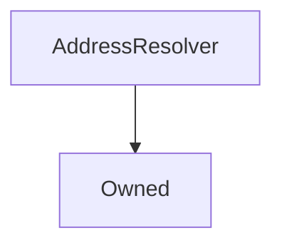

# AddressResolver

## Description

This contract is a type of Service Locator pattern that allows for easier interaction between multiple contracts. Instead of contract A needing references to contracts B and C (and updating ever release), contract A can refer to an `AddressResolver` and query for B and C at transaction time. Then, during a release, the AddressResolver is updated with the latest B and C contarct. Thus this ensures that contract A always has the latest B and C contracts.

**Source:** [contracts/AddressResolver.sol](https://github.com/Synthetixio/synthetix/tree/v2.21.15/contracts/AddressResolver.sol)

## Architecture

---
### Inheritance Graph

## Constructor

The constructor simply sets this contract as `Owned`.

??? example "Details"

    **Signature**
    
    `constructor(address _owner) public`
    
    **Superconstructors**
    
    * [`Owned(_owner)`](Owned.md#constructor)

## Views

---
### `getAddress`

Returns a single address by it's `bytes32` key.

??? example "Details"

    **Signature**
    
    `getAddress(bytes32 name) public view returns (address)`

## Variables

---
### `repository`

[Source](https://github.com/Synthetixio/synthetix/tree/v2.21.15/contracts/AddressResolver.sol#L12)

The mapping of contract name to address

**Type:** `mapping(bytes32 => address)`

## Function (Constructor)

---
### `constructor`

[Source](https://github.com/Synthetixio/synthetix/tree/v2.21.15/contracts/AddressResolver.sol#L14)

??? example "Details"

    **Signature**

    `(address _owner)`

    **State Mutability**

    `nonpayable`

    **Modifiers**

    * [Owned](#owned)

## Functions

---
### `getAddress`

[Source](https://github.com/Synthetixio/synthetix/tree/v2.21.15/contracts/AddressResolver.sol#L28)

??? example "Details"

    **Signature**

    `getAddress(bytes32 name)`

    **State Mutability**

    `view`

---
### `getSynth`

[Source](https://github.com/Synthetixio/synthetix/tree/v2.21.15/contracts/AddressResolver.sol#L38)

??? example "Details"

    **Signature**

    `getSynth(bytes32 key)`

    **State Mutability**

    `view`

    **Requires**

    * [require(..., Cannot find Synthetix address)](https://github.com/Synthetixio/synthetix/tree/v2.21.15/contracts/AddressResolver.sol#L40)

---
### `requireAndGetAddress`

[Source](https://github.com/Synthetixio/synthetix/tree/v2.21.15/contracts/AddressResolver.sol#L32)

??? example "Details"

    **Signature**

    `requireAndGetAddress(bytes32 name, string reason)`

    **State Mutability**

    `view`

    **Requires**

    * [require(..., calldata)](https://github.com/Synthetixio/synthetix/tree/v2.21.15/contracts/AddressResolver.sol#L34)

## Functions (onlyOwner)

---
### `importAddresses`

[Source](https://github.com/Synthetixio/synthetix/tree/v2.21.15/contracts/AddressResolver.sol#L18)

??? example "Details"

    **Signature**

    `importAddresses(bytes32[] names, address[] destinations)`

    **State Mutability**

    `nonpayable`

    **Requires**

    * [require(..., Input lengths must match)](https://github.com/Synthetixio/synthetix/tree/v2.21.15/contracts/AddressResolver.sol#L19)

    **Modifiers**

    * [onlyOwner](#onlyowner)

## Owner Functions

---
### `importAddresses`

Import one or more addresses into the system for the given keys. Note: this function will overrwite any previous entries with the same key names, allowing for inline updates.

??? example "Details"

    **Signature**
    
    `importAddresses(bytes32[] names, address[] destinations) public`
    
    **Modifiers**
    
    * [`Owned.onlyOwner`](Owned.md#onlyowner)
    
    **Preconditions**
    
    * The length of `names` must match the length of `destinations`

