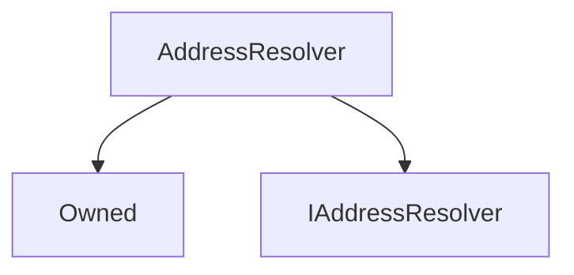

# AddressResolver

## Description

This contract is a type of Service Locator pattern that allows for easier interaction between multiple contracts. Instead of contract A needing references to contracts B and C (and updating ever release), contract A can refer to an AddressResolver and query for B and C at transaction time. Then, during a release, the AddressResolver is updated with the latest B and C contarct. Thus this ensures that contract A always has the latest B and C contracts.

**Source:** [contracts/AddressResolver.sol](https://github.com/Synthetixio/synthetix/tree/develop/contracts/AddressResolver.sol)

## Architecture

### Inheritance Graph

---

## Variables

---

### `repository`
[Source](https://github.com/Synthetixio/synthetix/tree/develop/contracts/AddressResolver.sol#L12)

**Type:** `mapping(bytes32 => address)`

## Functions

---

### `constructor`
[Source](https://github.com/Synthetixio/synthetix/tree/develop/contracts/AddressResolver.sol#L14)

??? example "Details"

    **Signature**

    `(address _owner) public`

    **Modifiers**

    * [Owned](#owned)

---

### `importAddresses`
[Source](https://github.com/Synthetixio/synthetix/tree/develop/contracts/AddressResolver.sol#L18)

??? example "Details"

    **Signature**

    `importAddresses(bytes32[] names, address[] destinations) external`

    **Requires**

    * [require(..., Input lengths must match)](https://github.com/Synthetixio/synthetix/tree/develop/contracts/AddressResolver.sol#L19)

    **Modifiers**

    * [onlyOwner](#onlyowner)

---

### `getAddress`
[Source](https://github.com/Synthetixio/synthetix/tree/develop/contracts/AddressResolver.sol#L28)

??? example "Details"

    **Signature**

    `getAddress(bytes32 name) external`

---

### `requireAndGetAddress`
[Source](https://github.com/Synthetixio/synthetix/tree/develop/contracts/AddressResolver.sol#L32)

??? example "Details"

    **Signature**

    `requireAndGetAddress(bytes32 name, string reason) external`

    **Requires**

    * [require(..., calldata)](https://github.com/Synthetixio/synthetix/tree/develop/contracts/AddressResolver.sol#L34)

---

### `getSynth`
[Source](https://github.com/Synthetixio/synthetix/tree/develop/contracts/AddressResolver.sol#L38)

??? example "Details"

    **Signature**

    `getSynth(bytes32 key) external`

    **Requires**

    * [require(..., Cannot find Synthetix address)](https://github.com/Synthetixio/synthetix/tree/develop/contracts/AddressResolver.sol#L40)

---

