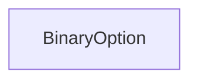
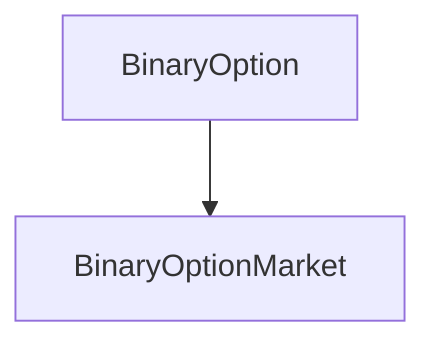

# BinaryOption

## Description

The BinaryOption contract provides ERC20 token functionality for the 
options in a [BinaryOptionMarket](BinaryOptionMarket.md), and an instance
is created for each of the long and short sides of the market. As such,
once claimed, binary options can be transferred around like
any other ERC20 token until they are exercised from their parent market.

This contract tracks the value on market throughout the entire lifecycle, 
handling both bid and option balances, and the basic operations of
converting between them. Whenever a bid is made or refunded, or an option
claimed or exercised, the balances in this contract are updated by the market.

**Source**: [contracts/BinaryOption.sol](https://github.com/Synthetixio/synthetix/blob/feature/sip-53/contracts/BinaryOption.sol)

## Architecture

---

### Inheritance Graph

---

### Related Contracts

??? example "Details"

    - [`BinaryOptionMarket`](BinaryOptionMarket.md): The parent contract of this binary option token.

---

## Constructor

The constructor initialises the parent market, as well and sets the initial bid on this option for the creator of the parent market.

??? example "Details"

    **Signature**

    `constructor(address initialBidder, uint initialBid) public`

    **Superconstructors**

    No inherited contracts

## Views

---

### `price`

Returns the current price of this option from the parent market.

??? example "Details"
    **Signature**
    `function price() public view returns (uint)`

### `claimableBy`

Returns the quantity of options claimable by an account at the current price.

??? example "Details"
    **Signature**
    `function claimableBy(address account) public view returns (uint)`

### `totalClaimable`

Returns the total supply of options claimable by all bidders.

??? example "Details"
    **Signature**
    `function totalClaimable() public view returns (uint)`

### `totalExercisable`

Returns the total supply of options that could potentially be exercised, including unclaimed options.

??? example "Details"
    **Signature**
    `function totalExercisable() external view returns (uint)`

## Constants

---

### `name`

The ERC20 name of this token.

**Type:** `string constant public`

---

### `symbol`

The ERC20 symbol of this token.

**Type:** `string constant public`

---

### `decimals`

The ERC20 number of decimals of this token.

**Type:** `uint8 constant public`

## Variables

---

### `market`

The parent market of this option.

**Type:** `BinaryOptionMarket public`

---

### `bidOf`

The current bid on this option made by each address.

**Type:** `mapping(address => uint) public`

---

### `totalBids`

The total of bids made by all addresses.

**Type:** `uint public`

---

### `balanceOf`

The ERC20 balance of this option for each account.

**Type:** `mapping(address => uint) public`

---

### `totalSupply`

The ERC20 total supply of this option.

**Type:** `uint public`

---

### `allowance`

The ERC20 allowances of this option. `allowance[owner][spender]` is the value of options `spender` is approved to transfer on behalf of `owner`.

**Type:** `mapping(address => mapping(address => uint)) public`

## Modifiers

---

### `onlyMarket`

Reverts the transaction if the message sender is not the [market](#market).

## Functions

---

### `bid`

Allows the parent market to increase the bid for a particular address.

??? example "Details"
    **Signature**
    `bid(address bidder, uint newBid)`
    
    **State Mutability**
    `external`
    
    **Modifiers**
    
    * [onlyMarket](#onlymarket)

---

### `refund`

Allows the parent market to decrease the bid for a particular address.
The transaction is reverted if the desired refund exceeds the current bid of the account.

??? example "Details"
    **Signature**
    `refund(address bidder, uint newRefund)`
    
    **State Mutability**
    `external`
    
    **Modifiers**
    
    * [onlyMarket](#onlymarket)

---

### `claim`

Allows the market to converts the entire claimable quantity for a given account into options.
On invocation, the bid is set to zero, while [`claimableBy(account)`](#claimableby) tokens are issued into the account.
The `Issued` event emitted is accompanied by a `Transfer` event from the zero address.

??? example "Details"
    **Signature**
    `function claim(address claimant) returns (uint optionsClaimed)`
    
    **State Mutability**
    `external`
    
    **Modifiers**
    
    * [onlyMarket](#onlymarket)
    
    **Emitted Events**
    
    * `Transfer`
    * `Issued`

---

### `exercise`

Allows the market to burn the entire token balance in a given account.
The `Burned` event emitted is accompanied by a `Transfer` event to the zero address.

??? example "Details"
    **Signature**
    `function exercise(address claimant)`
    
    **State Mutability**
    `external`
    
    **Modifiers**
    
    * [onlyMarket](#onlymarket)
    
    **Emitted Events**
    
    * `Transfer`
    * `Burned`

---

### `selfDestruct`

Allows the market to destroy this option contract.

??? example "Details"
    **Signature**
    `function selfDestruct(address payable beneficiary)`
 
    **State Mutability**
    `external`
    
    **Modifiers**
    
    * [onlyMarket](#onlymarket)

---

### `_internalTransfer

Implements the internal behaviour of the [`transfer`](#transfer) and [`transferFrom`](#transferfrom) functions.
Reverts if either sender or recipient is the zero account, or if the balance in the sending account is insufficient.

    function _internalTransfer(address _from, address _to, uint _value) internal returns (bool success) {

---

### `transfer`

Transfers a quantity of options between accounts.
Reverts if the balance in the sending account is insufficient, or if the destination address is the zero address.

??? example "Details"
    **Signature**
    `function transfer(address _to, uint _value) returns (bool success)`
    
    **State Mutability**
    `public`
    
---

### `transferFrom`

Allows an account to transfer a quantity of options on the behalf of another account.
Reverts if the either the balance or sender approval is insufficient, or if either the destination or 
sending addresses is the zero address.

??? example "Details"
    **Signature**
    `function transferFrom(address _from, address _to, uint _value) returns (bool success)`
    
    **State Mutability**
    `public`

---

### `approve`

Allows an account to approve another account to transfer tokens on its behalf.
Reverts if the designated spender is the zero account.

??? example "Details"
    **Signature**
    `function approve(address _spender, uint _value) returns (bool success)`
    
    **State Mutability**
    `public`

## Events

## `Issued`

A value of options was issued into the given account.

**Signature:** `Issued(address indexed account, uint value)`

---

### `Burned`

A value of options was burned from the given account.

**Signature:** `Burned(address indexed account, uint value)`

___

### `Transfer`

A value of options was transferred between accounts.

**Signature:** `Transfer(address indexed from, address indexed to, uint value)`

---

### `Approval`

A spending account was approved to transfer options by another account on its behalf.

**Signature:** `Approval(address indexed owner, address indexed spender, uint value)`
