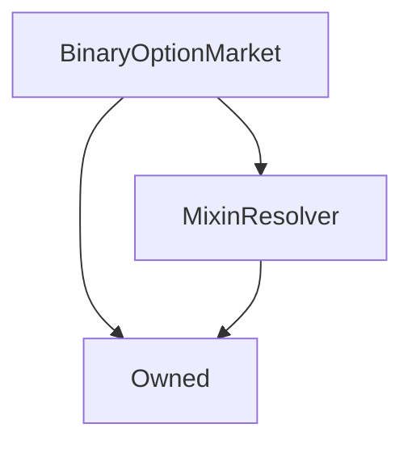

# BinaryOptionMarket

## Description

This contract manages a single binary option market, where users can speculate on the outcome of a future event
by buying options, each of which is an ERC20 token that pays out 1 sUSD if its corresponding outcome occurs.

Each binary option market has a specific underlying asset, and a target price for that asset at a specific
maturity date. If the reported price of the asset is lower than the target price at the maturity date, then
all the options on the short side of the market pay out 1 sUSD each, while if the price is higher than or equal
to the target price, then the options on the long side pay out 1 sUSD each.

This contract was proposed as part of [SIP-53](https://sips.synthetix.io/sips/sip-53). Further information on the
mechanism and its motivation can be found in the SIP.

### Market Lifecycle

A market goes through four major phases in its life. The phase a market is currently in
can be queried with the [`phase()`](#phase) function, and the times that it transitions
between these phases is held in the [`times`](#times) public variable.

#### Market Creation

A market can be created by anyone, as long as they can provide enough initial capital to ensure
the market is liquid. Upon creation markets will be
[tracked in the factory contract](BinaryOptionMarketFactory.md#_markets)
until they are eventually destroyed.

Market creators are incentivised to make markets by the collection of [fees](#fees),
which they share with the fee pool. These fees are released at the end of the market's life;
it is in the creator's interest, in order to maximise the fees they collect, to set
market parameters that attract the maximum demand over the lifetime of the market.

Binary option markets are created by calls to the [`BinaryOptionMarketFactory.createMarket`](BinaryOptionMarketFactory.md#createmarket)
function: see the documentation for that function for more details.

#### Bidding

During the bidding phase, the total supply of options and option prices are established.
During this period, users can bid on the long or short side of the market and refund their bids.
The option prices are determined during this phase according to the computations outlined in the
[`_updatePrices`](#_updateprices) function; the price on one side of the market is effectively the
fraction of bids on that side relative to all bids.

| Relevant Functions | Description |
| ------------------ | ----------- |
| [`bid`](#bid) | Places a bid. |
| [`refund`](#refund) | Refunds an existing bid, minus a [fee](#fees). |
| [`bidsOf`](#bidsof) / [`totalBids`](#totalbids) | Queries current bid balances. |
| [`claimableBy`](#claimableby) / [`totalClaimable`](#claimableby) | Queries the number of options that would be claimable if the market resolved at the current price. |
| [`prices`](#prices) | The current prices on the market. |
| [`oracleDetails`](#oracledetails) | The basic parameters of the market, including the underlying asset, target price, and maturity date. |

#### Trading

During the trading phase, bids and refunds are disabled and the final option prices are fixed, so options can be claimed and exchanged as ERC20 tokens.

| Relevant Functions | Description |
| ------------------ | ----------- |
| [`claimableBy`](#claimableby) / [`totalClaimable`](#claimableby) | Queries the actual number of options a user can claim. |
| [`claimOptions`](#claimoptions) | Claims the options owed to a user. |
| [`BinaryOption` ERC20 functions](BinaryOption.md) | Users can freely transfer any claimed options as ERC20 tokens. |
| [`balancesOf`](#balancesof) / [`totalSupplies`](#totalsupplies) | Returns a user's actual option balances. |

#### Maturity

After the end of the trading period, the market's maturity condition is evaluated and options can be exercised
according to the result. The maturity condition is ultimately resolved depending on the result of the
[`oraclePriceAndTimestamp`](#oraclepriceandtimestamp) function.

| Relevant Functions | Description |
| ------------------ | ----------- |
| [`canResolve`](#canresolve) | Indicates whether the market can be resolved yet. |
| [`resolve`](#resolve) | Queries the current price of the underlying asset from the oracle, compares it against the target price, and saves the final result. |
| [`resolved`](#resolved) | True if the market has been resolved |
| [`result`](#result) | Reports which side pays out, or which side would pay out if an unresolved market were resolved immediately. |
| [`exerciseOptions`](#exerciseoptions) | Transfers the payout owed to a user from the options they hold. |

#### Destruction

After a period the market can be destroyed by a call to
[`BinaryOptionMarketFactory.destroyMarket`](BinaryOptionMarketFactory.md#destroymarket).
At this time the collected [fees](#fees) are transferred to the fee pool and to whoever called the function.
The market is then destroyed and removed from the list of active markets on the factory.

For an exclusive period determined by
[`BinaryOptionMarketFactory.durations.creatorDestructionDuration`](BinaryOptionMarketFactory.md#durations),
only the [creator](#creator) of a market can destroy it, but after this time elapses, the reward is available for
anyone to claim in exchange for cleaning up the market.

| Relevant Functions | Description |
| ------------------ | ----------- |
| [`destructionReward`](#destructionreward) | The value of sUSD transferred to the market destroyer. |
| [`BinaryOptionMarketFactory.destroyMarket`](BinaryOptionMarketFactory.md#destroymarket) | Destroys a market and remits the destruction reward to the destroyer. |
| [`BinaryOptionMarketFactory.publiclyDestructibleTime`](BinaryOptionMarketFactory.md#publiclydestructibletime) | The timestamp after which a given market will be destructible by addresses other than its creator. |

## Architecture

---

### Inheritance Graph



---

### Related Contracts

```mermaid
graph TD
    BinaryOptionMarket[BinaryOptionMarket] --> BinaryOptionMarketFactory[BinaryOptionMarketFactory]
    BinaryOptionMarketFactory[BinaryOptionMarketFactory] --> BinaryOptionMarket[BinaryOptionMarket]
    BinaryOptionMarket[BinaryOptionMarket] --> BinaryOptionLong[BinaryOptionLong]
    BinaryOptionLong[BinaryOptionLong] --> BinaryOptionMarket[BinaryOptionMarket]
    BinaryOptionMarket[BinaryOptionMarket] --> BinaryOptionShort[BinaryOptionLong]
    BinaryOptionShort[BinaryOptionLong] --> BinaryOptionMarket[BinaryOptionMarket]
    BinaryOptionMarket[BinaryOptionMarket] --> SystemStatus[SystemStatus]
    BinaryOptionMarket[BinaryOptionMarket] --> ExchangeRates[ExchangeRates]
    BinaryOptionMarket[BinaryOptionMarket] --> Synth[Synth (sUSD)]
    BinaryOptionMarket[BinaryOptionMarket] --> FeePool[FeePool]
```

??? example "Details"

    * [`BinaryOptionLong`](BinaryOption.md): The `BinaryOption` instance for long options of this market. Holds relevant bids and balances, and converts between them.
    * [`BinaryOptionShort`](BinaryOption.md): The `BinaryOption` instance for short options of this market.
    * [`BinaryOptionMarketFactory`](BinaryOptionMarketFactory.md): The factory that created this market. The factory is queried for the pause status of the system, and to track the total deposited tokens.
    * [`SystemStatus`](SystemStatus.md): The market ceases to operate if the system is suspended from the `SystemStatus` contract.
    * [`ExchangeRates`](ExchangeRates.md): The final price at maturity of this market is queried from the `ExchangeRates` contract. As such, markets must be based on assets that the exchange rates contract knows. 
    * [`sUSD Synth`](Synth.md): All deposits and settlements are performed in terms of sUSD.
    * [`FeePool`](FeePool.md): Fees are remitted at the destruction of a market to the fee pool; the fee address is queried from the fee pool.

---

### Libraries

- [SafeMath](SafeMath.md) for `uint`
- [SafeDecimalMath](SafeDecimalMath.md) for `uint`

---

## Enums

---

### `Phase`

The phases the market proceeds through.

**Values**

| Value      | Description |
| ---------- | ----------- |
| `Bidding`  | Users can place and refund bids. |
| `Trading`  | Bidding is disabled, but options can be claimed and transferred as ERC20 tokens. |
| `Maturity` | The market has matured, and options can be exercised for a value of sUSD. |
| `Destruction` | The market is ready to be destroyed. |

---

### `Side`

The two sides of the market, each of which represents a particular event occurring.

| Value   | Description |
| ------- | ----------- |
| `Long`  | The event ath the asset price is higher than or equal to the target price at the maturity date. |
| `Short` | The event that the asset price is lower than the target price at the maturity date. |

## Structs

---

### `Options`

The addresses of the two [`BinaryOption`](BinaryOption.md) instances
for options on each side of the market.

| Field  | Type             | Description |
| ------ | ---------------- | ----------- |
| `long` | [`BinaryOption`](BinaryOption.md) | The address of the token contract for long options. |
| `short` | [`BinaryOption`](BinaryOption.md) | The address of the token contract for short options. |

---

### `Prices`

The prices of the options on each side of the market.

| Field  | Type             | Description |
| ------ | ---------------- | ----------- |
| `long` | `uint` ([18 decimals](SafeDecimalMath.md)) | The current price of long options. |
| `short` | `uint` ([18 decimals](SafeDecimalMath.md)) | The current price of short options. |

---
    
### `Times`

Timestamps of important dates.

| Field         | Type             | Description |
| ------------- | ---------------- | ----------- |
| `biddingEnd`  | `uint` (seconds) | The unix timestamp at which the bidding phase transitions to the trading phase. |
| `maturity`    | `uint` (seconds) | The unix timestamp at which the trading phase transitions to the maturity phase. |
| `destruction` | `uint` (seconds) | The unix timestamp at which the maturity phase transitions to the destruction phase. |

---

### `OracleDetails`

Oracle-relevant details used at the resolution of the market.

| Field            | Type                                       | Description |
| ---------------- | ------------------------------------------ | ----------- |
| `key`            | `bytes32`                                  | The key of the underlying asset of this market, as in the [`ExchangeRates`](ExchangeRates.md) contract. |
| `targetPrice`    | `uint` ([18 decimals](SafeDecimalMath.md)) | The threshold price of the underlying asset. |
| `finalPrice`     | `uint` ([18 decimals](SafeDecimalMath.md)) | The actual measured price of the underlying asset at the maturity date. |
| `maturityWindow` | `uint` (seconds)                           | If the last price update was received from the oracle less than `maturityWindow` seconds before the maturity date, the market can still be resolved. |

---
    
### `Fees`

The fee rates of this market. Note that the sum `poolFee + creatorFee` must be between 0 and 1 exclusive,
while `refundFee` must be no greater than 1.

`creatorFeesCollected` is a record of the actual fees collected, saved at the market's resolution time. The fees are
actually remitted upon the destruction of the market.  Since this quantity are computed as a fraction of the sUSD
deposited in the market when it matures, it must be saved explicitly, since the deposited quantity decreases as options
are exercised.

| Field                  | Type                                       | Description |
| ---------------------- | ------------------------------------------ | ----------- |
| `poolFee`              | `uint` ([18 decimals](SafeDecimalMath.md)) | The portion of the sUSD deposited in the market at resolution that is collected by the [fee pool](FeePool.md). |
| `creatorFee`           | `uint` ([18 decimals](SafeDecimalMath.md)) | The portion collected by the market's [creator](#creator) as a fee. |
| `refundFee`            | `uint` ([18 decimals](SafeDecimalMath.md)) | When a bid is refunded, this portion of its value is retained in the market to be paid out at maturity. This fee is intended to compensate the market for the toxic price signal that the bidder has sent, by increasing the payoff of the remaining bidders, and to discourage excessive price volatility at the end of bidding. |
| `creatorFeesCollected` | `uint` ([18 decimals](SafeDecimalMath.md)) | The value of sUSD to be transferred to the market's [creator](#creator) at the market's destruction. |

---

## Constructor

The constructor sets up all the static values for [fees](#fees), [timestamps](#times), [asset and target price](#oracledetails) among other parameters,
and checks that all of these settings are within acceptable ranges.

In addition, the market's [`BinaryOption`](BinaryOption.md) instances for each side of the market are instantiated,
and their initial prices are computed from the initial bids.

??? example "Details"
    **Signature**

    `constructor(address _resolver, address _creator, uint _longBid, uint _shortBid, uint _minimumInitialLiquidity, uint _biddingEnd, uint _maturity, uint _destruction, bytes32 _oracleKey, uint _targetOraclePrice, uint _oracleMaturityWindow, uint _poolFee, uint _creatorFee, uint _refundFee) public`
    
    **Superconstructors**
    
    * [`Owned`](Owned.md)
    * [`MixinResolver`](MixinResolver.md)

## Views

---

### `phase`

Returns the current [phase](#phase) the market is in.

??? example "Details"
    **Signature**

    `function phase() returns (Phase)`
    
    **State Mutability**
    
    `external view`

---

### `oraclePriceAndTimestamp`

Returns the current price of this market's [underlying asset](#oracledetails) at the [`ExchangeRates`](ExchangeRates.md)
contract, along with the time it was updated.

??? example "Details"
    **Signature**
    
    `function oraclePriceAndTimestamp() returns (uint price, uint updatedAt)`
    
    **State Mutability**
    
    `public view`

---

### `canResolve`

Returns true if the market can currently be resolved, which is the case when:

* The market has not already resolved.
* The [maturity date](#times) is in the past;
* The [oracle price was last updated](#oraclepriceandtimestamp) within the [maturity window](#times).

??? example "Details"
    **Signature**
    
    `function canResolve() returns (bool)`
    
    **State Mutability**
    
    `external view`

---

### `result`

If the market has not resolved, returns the side of the market that would pay out if it was resolved
at the current price.
Otherwise, if the market has resolved, the function returns the value that the market resolved to when
[`resolve()`](#resolve) was successfully called.

Note that no check is performed that the underlying asset price was updated within the [maturity window](#times).

??? example "Details"
    **Signature**

    `function result() returns (Side)`
    
    **State Mutability**
    `public view`

---

### `destructionReward`

Returns the value of sUSD that will be paid to the caller if they successfully
[destroy](#selfdestruct) this market. If the market is not destructible, this function
returns 0. Otherwise the destruction reward is the [collected creator fees](#feescollected) plus
the value of any unexercised options.

Since there is [a creator-exclusive destruction period](BinaryOptionMarketFactory.md#publiclydestructibletime),
this means that market creators can recover their initial bids here if they were never exercised.

Note that, due to rounding errors, if the [pool fee rate](#fees) is zero, under some circumstances the remaining
deposits in the pool may be a few wei less than the computed creator fees. 
In most cases, any rounding error is simply deducted from the pool's fee take, which is simply the remaining
funds in the market after the destruction reward has been deducted.

??? example "Details"
    **Signature**
    
    `function destructionReward() returns (uint)`
    
    **State Mutability**
    
    `public view`

---

### `senderPrice`

Used by this market's [`BinaryOption` instances](#options) to retrieve their own prices.
If called by the long option, this function returns the long price; if by the short option, the short price;
if it is called by any other address, the transaction is reverted.

??? example "Details"
    **Signature**
    
    `function senderPrice() returns (uint)`
    
    **State Mutability**
    
    `external view`
        
---

### `bidsOf`

Returns the current [bids](BinaryOption.md#bidof) on each side of the market of the message sender.

??? example "Details"
    **Signature**

    `function bidsOf(address account) returns (uint long, uint short)`
    
    **State Mutability**
    
    `public view`

---

### `totalBids`

Returns the [total value of bids](BinaryOption.md#totalbids) on each side of the market.

??? example "Details"
    **Signature**
    
    `function totalBids() returns (uint long, uint short)`
    
    **State Mutability**
    
    `public view`

---

### `claimableBy`

Returns balance of options on each side of the market that [would be claimable](BinaryOption.md#claimableby)
by the message sender at the [current prices](#prices).

Note that this function still operates during bidding, and only reflects the actually-claimable quantities after the
market has transitioned to the [trading phase](#phase).

??? example "Details"
    **Signature**

    `function claimableBy(address account) returns (uint long, uint short)`
    
    **State Mutability**
    
    `public view`

---

### `totalClaimable`

Returns the [total balance of options claimable](BinaryOption.md#totalclaimable)
from the [current total of bids](BinaryOption.md#totalbids) on each side of the market.

Note that due to rounding, these may not predict exactly the quantities which will actually claimed in the end.
Like [`claimableBy`](#claimableby), this function still operates during the [bidding phase](#phase),
but will not attain its correct value until bidding has ended.

??? example "Details"
    **Signature**

    `function totalClaimable() returns (uint long, uint short)`

    **State Mutability**
    
    `external view`

---

### `balancesOf`

Returns the [option balances](BinaryOption.md#balanceof) of the message sender on each side of the market.

??? example "Details"
    **Signature**
    
    `function balancesOf(address account) returns (uint long, uint short)`
    
    **State Mutability**
    
    `public view`

---

### `totalSupplies`

Returns the [total supply of options](BinaryOption.md#totalsupply) on each side of the market.

??? example "Details"
    **Signature**
    
    `function totalSupplies() returns (uint long, uint short)`
    
    **State Mutability**
    
    `external view`

---

### `totalExercisable`

Return the [total supply of options that could be ultimately be exercised](BinaryOption.md#totalexercisable),
which is equal to the total supply of currently-circulating options plus the total supply yet to be claimed.

??? example "Details"
    **Signature**
    
    `function totalExercisable() returns (uint long, uint short)`
    
    **State Mutability**
    
    `external view`

## Views (Internal)

---

### `_systemStatus`

Retrieves the [cached](MixinResolver.md) address of the [`SystemStatus`](SystemStatus.md) contract.

??? example "Details"
    **Signature**
    
    `function _systemStatus() returns (ISystemStatus)`
    
    **State Mutability**
    
    `internal view`
    
---

### `_exchangeRates`

Retrieves the [cached](MixinResolver.md) address of the [`ExchangeRates`](ExchangeRates.md) instance.

??? example "Details"
    **Signature**
    
    `function _exchangeRates() returns (ISystemStatus)`
    
    **State Mutability**
    
    `internal view`
    
---

### `_sUSD`

Retrieves the [cached](MixinResolver.md) address of the sUSD [`Synth`](Synth.md) instance.

??? example "Details"
    **Signature**
    
    `function _sUSD() returns (ISynth)`
    
    **State Mutability**
    
    `internal view`
 
---

### `_feePool`

Retrieves the [cached](MixinResolver.md) address of the [`FeePool`](FeePool.md) instance.

??? example "Details"
    **Signature**
    
    `function _feePool() returns (ISynth)`
    
    **State Mutability**
    
    `internal view` 

---

### `_factory`

Returns the address of the [`BinaryOptionMarketFactory`](BinaryOptionMarketFactory.md) which tracks this market.
Note that this address is also this contract's [owner](Owned.md#owner).

??? example "Details"
    **Signature**
    
    `function _factory() returns (BinaryOptionMarketFactory)`
    
    **State Mutability**
    
    `internal view`

---

### `_biddingEnded`

Returns true if the bidding phase has ended (the [end of bidding](#times) is not in the future), and false otherwise.

??? example "Details"
    **Signature**
    
    `function _biddingEnded() returns (bool)`
    
    **State Mutability**
    
    `internal view`

---

### `_matured`

True if the market has matured (if the [maturity date](#times) is not in the future), and false otherwise.

??? example "Details"
    **Signature**
    
    `function _matured() returns (bool)`
    
    **State Mutability**
    
    `internal view`
    
---

### `_destructible`

True if the market can be [self-destructed](#selfdestruct) (if the [destruction date](#times) is not in the future), and false otherwise.

??? example "Details"
    **Signature**
    
    `function _destructible() returns (bool)`
    
    **State Mutability**
    
    `internal view`

---

### `_withinMaturityWindow`

True if a given timestamp is within the [maturity window](#times), false otherwise;
a price which was updated at a time for which this function is true is acceptable for resolving the market.

??? example "Details"
    **Signature**
    
    `function _withinMaturityWindow(uint timestamp) returns (bool)`
    
    **State Mutability**
    
    `internal view`

---

### `_destructionReward`

See [`destructionReward()`](#destructionreward) for details. This is the internal implementation of that function. 

??? example "Details"
    **Signature**
    
    `function _destructionReward(uint _deposited) returns (uint)`
    
    **State Mutability**
    
    `internal view`

---

### `_chooseSide` 

Chooses a value depending on whether the first input is [long or short](#side).
If the first input was `Side.Long`, return the long value, otherwise return the short value.

??? example "Details"
    **Signature**
    
    `function _chooseSide(Side side, uint longValue, uint shortValue) returns (uint)`
    
    **State Mutability**
    
    `internal pure`

---

### `_option` 
  
Returns the appropriate [option contract address](#options) for a given side of the market.

??? example "Details" 
    **Signature**
    
    `function _option(Side side) returns (BinaryOption)`
    
    **State Mutability**
    
    `internal view`

## Variables

---

### `creator`

The initial creator of the market, who contributed the initial capital and market parameters, and is entitled
to the creator fee.

**Type:** `address public`

---

### `options`

The [addresses](#options) of this market's `BinaryOption` instances.

**Type:** `Options public`
    
---

### `prices`

The long and short option [prices](#prices) of this market.

**Type:** `Prices public`
    
---

### `times`

The [unix timestamps](#times) at which this market transitions between [phases](#phase).

**Type:** `Times public`
    
---

### `oracleDetails`

The [oracle parameters](#oracledetails) of this market, including the underlying asset and target price.

**Type:** `OracleDetails public`

---

### `fees`

The [fee rates](#fees) charged in this market and the fees collected on behalf of the creator.

**Type:** `Fees public`
    
---

### `deposited`

The sum of open bids on both sides of the market, plus any sUSD witheld for refund fees.
We store this explicitly in case any tokens are transferred to this contract directly, as in that
case querying the contract's sUSD token balance would throw off several calculations.

**Type:** `uint public`
    
---

### `minimumInitialLiquidity`

The minimum liquidity that the market's [creator](#creator) must maintain in the market until the end of
bidding. The market's initial bids must be at least this value, and the creator may not submit refunds that
would reduce their open bids to a value less than this minimum.

**Type:** `uint public`
    
---

### `resolved`

True if the market has been [resolved](#resolve), and false otherwise.

**Type:** `bool public`

---

### `_feeMultiplier`

Equal to $1 - (\text{creatorFee} + \text{poolFee})$, which is a denominating factor in [price calculations](#_updateprices).
Storing this saves recomputing it on each bid or refund.

**Type:** `uint private`

## Modifiers

---

### `onlyDuringBidding`

Reverts the transaction if [bidding has ended](#_biddingended).

---

### `onlyAfterBidding`

Reverts the transaction if [bidding has not ended](#_biddingended).

---

### `onlyAfterMaturity`

Reverts the transaction if the market [has not matured](#_matured).

---

### `factoryNotPaused`

Reverts the transaction if the [factory contract](BinaryOptionMarketFactory.md) has [paused](Paused.md#paused) binary option operations.

## Functions

---

### `bid`

Allows a user to place an sUSD bid on one or the other side of the market.

To process a bid, the market increments the user's [bid balance](#bidsof) on the appropriate option contract,
as well as incrementing the total value deposited both [in this market](#deposited) and in the
[factory contract](BinaryOptionMarketFactory.md#totaldeposited). The deposit quantities having been updated,
the option prices are [recomputed](#_updateprices) to reflect the changed odds.

The value of the bid is withdrawn from the message sender's sUSD balance by a call to
`ERC20.transferFrom`, so the caller must have ensured that
they have granted the market sufficient approval and that they have enough
sUSD to support the bid.

The transaction reverts if this function is called outside the bidding period, if the system is suspended,
or if the factory contract is paused.

??? example "Details"
    **Signature**
    
    `function bid(Side side, uint value)`
    
    **State Mutability**
    
    `external`
    
    **Modifiers**
    
    * [`onlyDuringBidding`](#onlyduringbidding)
   
    **Emitted Events**  
    
    * [`Bid(side, msg.sender, value)`](#bid)

---

### `refund`

Refunds an existing bid, remitting the refund value minus a percentage determined by the [refund fee rate](#fees) as sUSD.
The function returns the value refunded as sUSD.

The full value of the refund is deducted from the caller's balance, while this value minus the refund fee
is actually remitted as sUSD. The deposited quantity in [the market](#deposited)
and in the [factory contract](BinaryOptionMarketFactory.md#totaldeposited) are decremented by the transferred
value. The deposit quantities having been updated, the option prices are [recomputed](#_updateprices) to reflect the
changed odds.

The refund fee, which will eventually be paid out to option-holders, is retained in the pot,
although not on either side's bid total. As such, refunds effectively discount option
prices for those remaining in the market.

If the message sender is the market's [creator](#creator), then a refund transaction will revert
if it would either violate the [minimum liquidity requirement](#minimuminitialliquidity), or if
it would refund their entire position on either side of the market.

The transaction reverts if this function is called outside the bidding period, if the system is suspended,
or if the factory contract is paused.

??? example "Details"
    **Signature**

    `function refund(Side side, uint value) returns (uint refundMinusFee)`
 
    **State Mutability**
    
    `external`
    
    **Modifiers**
    
    * [`onlyDuringBidding`](#onlyduringbidding)
   
    **Emitted Events**  
    
    * [`Refund(side, msg.sender, refundSansFee, fee)`](#refund)

---

### `resolve`

This function allows anyone to resolve the market, as long as it satisfies the conditions
of [`canResolve()`](#canresolve).

Market resolution requires fetching the latest price of this market's underlying asset, checking
that it was last updated within the oracle maturity window, and then computing and saving
the fees that were collected. After a successful invocation, the variable [`resolved`](#resolved)
will be true. The final oracle price is saved and can be queried from
[`oracleDetails.finalPrice`](#oracledetails).

This function reverts the transaction if the system is suspended or the factory contract is paused.

??? example "Details"
    **Signature**

    `function resolve()`
    
    **State Mutability**
    
    `public`
    
    **Modifiers**
    
    * [`onlyAfterMaturity`](#onlyaftermaturity)
    * [`factoryNotPaused`](#factorynotpaused)
    
    **Emitted Events**
    
    * [`MarketResolved(result(), price, updatedAt)`](#marketresolved)

---

### `claimOptions`

This function claims all options [owing](#claimableby) to the message sender on both sides of the market.
The number of options owed is simply the user's [bid balances](#bidsof), divided by the
[current option prices](#prices). The caller's bid balances are set to zero, while the appropriate number
of options are credited to their wallet.

This function reverts the transaction if the system is suspended or the factory contract is paused.

??? example "Details"
    **Signature**

    `function claimOptions() returns (uint longClaimed, uint shortClaimed)`
    
    **State Mutability**
    
    `public`
    
    **Modifiers**
    
    * [`onlyAfterBidding`](#onlyafterbidding)
    * [`factoryNotPaused`](#factorynotpaused)
   
    **Emitted Events**
    
    * [`OptionsClaimed(msg.sender, longOptions, shortOptions)`](#optionsclaimed)

---

### `exerciseOptions`

`exerciseOptions` allows a user to claim any sUSD owed to them after their options have matured.
This function will exercise any options held by the message sender on either side of the market,
zeroing out their option balances. If the caller holds $n$ options on the winning side of the market,
they will be transferred $n$ sUSD. Any options held on the losing side of the market will yield no
payout. Upon exercising options, the quantity of sUSD paid to the called will be deducted from
the tracked totals [here](#deposited), and in the [factory contract](BinaryOptionMarketFactory.md#totaldeposited).

If the market is unresolved at call time, it will be resolved if it can be. If the caller
has unclaimed options, they will be claimed before they are exercised.

This function reverts the transaction if the system is suspended or the factory contract is paused.

??? example "Details"
    **Signature**

    `function exerciseOptions() returns (uint)`
    
    **State Mutability**
    
    `external`
    
    **Emitted Events**
    
    * [`OptionsExercised(msg.sender, payout)`](#optionsexercised)

---

### `selfDestruct`

This function allows the factory to destroy this market at the end of its life.
Upon destruction, the [destruction reward](#destructionreward)
is computed and paid to the beneficiary
(whoever [initiated destruction in the factory contract](BinaryOptionMarketFactory.md#destroymarket)),
and any remaining tokens are sent to the [fee pool](FeePool.md#fee_address), and these quantities
will be deducted from the total tracked in the [factory](BinaryOptionMarketFactory.md#totaldeposited).
The market will also destroy its child [`BinaryOption`](#options) instances before it destroys itself.

The function will revert if the caller is not the owner, if the market is not [resolved](#resolved), or if
it is not yet [destructible](#_destructible), if the factory is paused, or the system is suspended.

??? example "Details"
    **Signature**
    `function selfDestruct(address payable beneficiary) external onlyOwner`
    
    **State Mutability**
    `external`
    
    **Modifiers**
    
    * [`onlyOwner`](Owned.md#onlyowner)
    
## Functions (Internal)

---

### `_updatePrices`

Updates the current [prices](#prices) from the long and short bid quantities, and the total deposited
value in the contract.

The prices are computed approximately as follows:

    longPrice  = longBids  / (feeMultiplier * deposited)
    shortPrice = shortBids / (feeMultiplier * deposited)

Interpreting [`/`](SafeDecimalMath.md#dividedecimalround) and [`*`](SafeDecimalMath.md#multiplydecimalround)
as [fixed point math operators (with rounding)](SafeDecimalMath.md).

Note that the denominator `feeMultiplier * deposited` is the total value of options awarded to each side of the market,
and `deposited` is equal to `longBids + shortBids + refundFeesCollected`.

If either the long or short bids are zero, then the transaction is reverted, as 
this would lead to a zero price, and hence divisions-by-zero when computing claimable option
quantities. This means that the initial bids cannot both be zero, nor can the entire balance
on either side of the market be refunded.

??? example "Details"
    **Signature**

    `function _updatePrices(uint longBids, uint shortBids, uint _deposited)`
    
    **State Mutability**
    
    `internal`
    
    **Emitted Events**  
    
    * [`PricesUpdated(longPrice, shortPrice)`](#pricesupdated)

## Events

---

### `Bid`

A bid was made.

**Signature:** `Bid(Side side, address indexed account, uint value)`
    
---

### `Refund`

A refund was processed. The `value` argument is the quantity of sUSD actually refunded, without the fee.

**Signature:** `Refund(Side side, address indexed account, uint value, uint fee)`
    
---

### `PricesUpdated`

The option prices were updated.

**Signature:** `PricesUpdated(uint longPrice, uint shortPrice)`
    
---

### `MarketResolved`

The market was resolved.

**Signature:** `MarketResolved(Side result, uint oraclePrice, uint oracleTimestamp)`
    
---

### `OptionsClaimed`

A quantity of options was claimed.

**Signature:** `OptionsClaimed(address indexed account, uint longOptions, uint shortOptions)`
    
---

### `OptionsExercised`

A quantity of options was exercised.

**Signature:** `OptionsExercised(address indexed account, uint value)`

