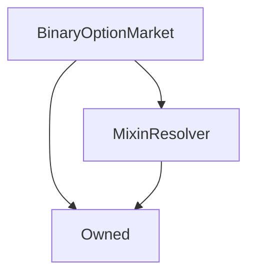

# BinaryOptionMarket

## Description

## Architecture

---

### Inheritance Graph



---

### Related Contracts

```mermaid
graph TD
    BinaryOptionMarket[BinaryOptionMarket] --> BinaryOptionMarketFactory[BinaryOptionMarketFactory]
    BinaryOptionMarketFactory[BinaryOptionMarketFactory] --> BinaryOptionMarket[BinaryOptionMarket]
    BinaryOptionMarket[BinaryOptionMarket] --> BinaryOptionLong[BinaryOptionLong]
    BinaryOptionLong[BinaryOptionLong] --> BinaryOptionMarket[BinaryOptionMarket]
    BinaryOptionMarket[BinaryOptionMarket] --> BinaryOptionShort[BinaryOptionLong]
    BinaryOptionShort[BinaryOptionLong] --> BinaryOptionMarket[BinaryOptionMarket]
    BinaryOptionMarket[BinaryOptionMarket] --> SystemStatus[SystemStatus]
    BinaryOptionMarket[BinaryOptionMarket] --> ExchangeRates[ExchangeRates]
    BinaryOptionMarket[BinaryOptionMarket] --> Synth[Synth (sUSD)]
    BinaryOptionMarket[BinaryOptionMarket] --> FeePool[FeePool]
```

??? example "Details"

    * [`BinaryOptionLong`](BinaryOption.md): The `BinaryOption` instance for long options of this market. Holds relevant bids and balances, and converts between them.
    * [`BinaryOptionShort`](BinaryOption.md): The `BinaryOption` instance for short options of this market.
    * [`BinaryOptionMarketFactory`](BinaryOptionMarketFactory.md): The factory that created this market. The factory is queried for the pause status of the system, and to track the total deposited tokens.
    * [`SystemStatus`](SystemStatus.md): The market ceases to operate if the system is suspended from the `SystemStatus` contract.
    * [`ExchangeRates`](ExchangeRates.md): The final price at maturity of this market is queried from the `ExchangeRates` contract. As such, markets must be based on assets that the exchange rates contract knows. 
    * [`sUSD Synth`](Synth.md): All deposits and settlements are performed in terms of sUSD.
    * [`FeePool`](FeePool.md): Fees are remitted at the destruction of a market to the fee pool; the fee address is queried from the fee pool.

---

### Libraries

- [SafeMath](SafeMath.md) for `uint`
- [SafeDecimalMath](SafeDecimalMath.md) for `uint`

---

## Enums

---

### `Phase`

The phases the market proceeds through.

**Values**

| Value      | Description |
| ---------- | ----------- |
| `Bidding`  | Users can place and refund bids. |
| `Trading`  | Bidding is disabled, but options can be claimed and transferred as ERC20 tokens. |
| `Maturity` | The market has matured, and options can be exercised for a value of sUSD. |
| `Destruction` | The market is ready to be destroyed. |

---

### `Side`

The two sides of the market, each of which represents a particular event occurring.

| Value   | Description |
| ------- | ----------- |
| `Long`  | The event ath the asset price is higher than or equal to the target price at the maturity date. |
| `Short` | The event that the asset price is lower than the target price at the maturity date. |

## Structs

---

### `Options`

The addresses of the two [`BinaryOption`](BinaryOption.md) instances
for options on each side of the market.

| Field  | Type             | Description |
| ------ | ---------------- | ----------- |
| `long` | [`BinaryOption`](BinaryOption.md) | The address of the token contract for long options. |
| `short` | [`BinaryOption`](BinaryOption.md) | The address of the token contract for short options. |

---

### `Prices`

The prices of the options on each side of the market.

| Field  | Type             | Description |
| ------ | ---------------- | ----------- |
| `long` | `uint` ([18 decimals](SafeDecimalMath.md)) | The current price of long options. |
| `short` | `uint` ([18 decimals](SafeDecimalMath.md)) | The current price of short options. |

---
    
### `Times`

Timestamps of important dates.

| Field         | Type             | Description |
| ------------- | ---------------- | ----------- |
| `biddingEnd`  | `uint` (seconds) | The unix timestamp at which the bidding phase transitions to the trading phase. |
| `maturity`    | `uint` (seconds) | The unix timestamp at which the trading phase transitions to the maturity phase. |
| `destruction` | `uint` (seconds) | The unix timestamp at which the maturity phase transitions to the destruction. |

---

### `OracleDetails`

Oracle-relevant details used at the resolution of the market.

| Field            | Type                                       | Description |
| ---------------- | ------------------------------------------ | ----------- |
| `key`            | `bytes32`                                  | The key of the underlying asset of this market, as in the [`ExchangeRates`](ExchangeRates.md) contract. |
| `targetPrice`    | `uint` ([18 decimals](SafeDecimalMath.md)) | The threshold price of the underlying asset. |
| `finalPrice`     | `uint` ([18 decimals](SafeDecimalMath.md)) | The actual measured price of the underlying asset at the maturity date. |
| `maturityWindow` | `uint` (seconds)                           | If the last price update was received from the oracle less than `maturityWindow` seconds before the maturity date, the market can still be resolved. |

---
    
### `Fees`

The fee rates of this market. Note that the sum `poolFee + creatorFee` must be between 0 and 1 exclusive,
while `refundFee` must be no greater than 1.

| Field         | Type                                       | Description |
| ------------- | ------------------------------------------ | ----------- |
| `poolFee`     | `uint` ([18 decimals](SafeDecimalMath.md)) | The portion of the sUSD deposited in the market at resolution that is collected by the [fee pool](FeePool.md). |
| `creatorFee`  | `uint` ([18 decimals](SafeDecimalMath.md)) | The portion collected by the market's [creator](#creator) as a fee. |
| `refundFee`   | `uint` ([18 decimals](SafeDecimalMath.md)) | When a bid is refunded, this portion of its value is retained in the market to be paid out at maturity. This fee is intended to compensate the market for the toxic price signal that the bidder has sent, by increasing the payoff of the remaining bidders, and to discourage excessive price volatility at the end of bidding. |

---

### `FeesCollected`

A record of the actual fees collected, saved at the market's resolution time.
The fees are actually remitted upon the destruction of the market. 
Since these quantities are computed as a fraction of the sUSD deposited in the market when it
matures, they must be saved explicitly, since the deposited quantity decreases as options are exercised.

| Field   | Type                                       | Description |
| ------- | ------------------------------------------ | ----------- |
| pool    | `uint` ([18 decimals](SafeDecimalMath.md)) | The value of sUSD to be transferred to the [fee pool](FeePool.md) at the market's destruction. |
| creator | `uint` ([18 decimals](SafeDecimalMath.md)) | The value of sUSD to be transferred to the market's [creator](#creator) at the market's destruction. |
    
---

## Constructor

The constructor sets up all the static values for [fees](#fees), [timestamps](#times), [asset and target price](#oracledetails) among other parameters,
and checks that all of these settings are within acceptable ranges.

In addition, the market's [`BinaryOption`](BinaryOption.md) instances for each side of the market are instantiated,
and their initial prices are computed from the initial bids.

??? example "Details"
    **Signature**

    `constructor(address _resolver, address _creator, uint _longBid, uint _shortBid, uint _minimumInitialLiquidity, uint _biddingEnd, uint _maturity, uint _destruction, bytes32 _oracleKey, uint _targetOraclePrice, uint _oracleMaturityWindow, uint _poolFee, uint _creatorFee, uint _refundFee) public`
    
    **Superconstructors**
    
    * [`Owned`](Owned.md)
    * [`MixinResolver`](MixinResolver.md)

## Views

---

### `phase`

Returns the current [phase](#phase) the market is in.

??? example "Details"
    **Signature**

    `function phase() returns (Phase)`
    
    **State Mutability**
    
    `external view`

---

### `oraclePriceAndTimestamp`

Returns the current price of this market's [underlying asset](#oracledetails) at the [`ExchangeRates`](ExchangeRates.md)
contract, along with the time it was updated.

??? example "Details"
    **Signature**
    
    `function oraclePriceAndTimestamp() returns (uint price, uint updatedAt)`
    
    **State Mutability**
    
    `public view`

---

### `canResolve`

Returns true if the market can currently be resolved, which is the case when:

* The market has not already resolved.
* The [maturity date](#times) is in the past;
* The [oracle price was last updated](#oraclepriceandtimestamp) within the [maturity window](#times).

??? example "Details"
    **Signature**
    
    `function canResolve() returns (bool)`
    
    **State Mutability**
    
    `external view`

---

### `result`

If the market has not resolved, returns the side of the market that would pay out if it was resolved
at the current price.
Otherwise, if the market has resolved, the function returns the value that the market resolved to when [`resolve()`][#resolve]
was called at maturity.

Note that no check is performed that the price was updated within the [maturity window](#times).

??? example "Details"
    **Signature**

    `function result() returns (Side)`
    
    **State Mutability**
    `public view`

---

### `destructionReward`

Returns the value of sUSD that will be paid to the caller if they successfully
[destroy](#selfdestruct) this market. If the market is not destructible, this function
returns 0. Otherwise the destruction reward is the [collected creator fees](#feescollected) plus
any unexercised options.

Since there is [a creator-exclusive destruction period](BinaryOptionMarketFactory.md#publiclydestructibletime),
this means that market creators can recover their initial bids here if they were never exercised.

Note that, due to rounding errors, if the [pool fee rate](#fees) is zero, under some circumstances the remaining
deposits in the pool may be a few wei less than the computed creator fees. 
In most cases, any rounding error is simply deducted from the pool's fee take, which is simply the remaining
funds in the market after the destruction reward has been deducted.

??? example "Details"
    **Signature**
    
    `function destructionReward() returns (uint)`
    
    **State Mutability**
    
    `public view`

---

### `senderPrice`

Used by this market's [`BinaryOption` instances](#options) to retrieve their own prices.
If called by the long option, this function returns the long price; if by the short option, the short price;
if it is called by any other address, the transaction is reverted.

??? example "Details"
    **Signature**
    
    `function senderPrice() returns (uint)`
    
    **State Mutability**
    
    `external view`
        
---

### `bidsOf`

Returns the current [bids](BinaryOption.md#bidof) on each side of the market of the message sender.

??? example "Details"
    **Signature**

    `function bidsOf(address account) returns (uint long, uint short)`
    
    **State Mutability**
    
    `public view`

---

### `totalBids`

Returns the [total value of bids](BinaryOption.md#totalbids) on each side of the market.

??? example "Details"
    **Signature**
    
    `function totalBids() returns (uint long, uint short)`
    
    **State Mutability**
    
    `public view`

---

### `claimableBids`

Returns balance of options on each side of the market that [would be claimable](BinaryOption.md#claimableby)
by the message sender at the [current prices](#prices).

Note that this function still operates during bidding, and only reflects the actually-claimable quantities after the
market has transitioned to the [trading phase](#phase).

??? example "Details"
    **Signature**

    `function claimableBy(address account) returns (uint long, uint short)`
    
    **State Mutability**
    
    `public view`

---

### `totalClaimable`

Returns the [total balance of options claimable](BinaryOption.md#totalclaimable)
from the [current total of bids](BinaryOption.md#totalbids) on each side of the market.

Note that due to rounding, these may not be exactly the quantities which are actually claimed in the end.
Like [`claimableBids`](#claimablebids), this function still operates during the [bidding phase](#phase),
but will not attain its correct value until bidding has ended.

??? example "Details"
    **Signature**

    `function totalClaimable() returns (uint long, uint short)`

    **State Mutability**
    
    `external view`

---

### `balancesOf`

Returns the [option balances](BinaryOption.md#balanceof) of the message sender on each side of the market.

??? example "Details"
    **Signature**
    
    `function balancesOf(address account) returns (uint long, uint short)`
    
    **State Mutability**
    
    `public view`

---

### `totalSupplies`

Returns the [total supply of options](BinaryOption.md#totalsupply) on each side of the market.

??? example "Details"
    **Signature**
    
    `function totalSupplies() returns (uint long, uint short)`
    
    **State Mutability**
    
    `external view`

---

### `totalExercisable`

Return the [total supply of options that could be ultimately be exercised](BinaryOption.md#totalexercisable),
which is equal to the total supply of currently-circulating options plus the total supply yet to be claimed.

??? example "Details"
    **Signature**
    
    `function totalExercisable() returns (uint long, uint short)`
    
    **State Mutability**
    
    `external view`

## Views (Internal)

---

### `_systemStatus`

Retrieves the [cached](MixinResolver.md) address of the [`SystemStatus`](SystemStatus.md) contract.

??? example "Details"
    **Signature**
    
    `function _systemStatus() returns (ISystemStatus)`
    
    **State Mutability**
    
    `internal view`
    
---

### `_exchangeRates`

Retrieves the [cached](MixinResolver.md) address of the [`ExchangeRates`](ExchangeRates.md) instance.

??? example "Details"
    **Signature**
    
    `function _exchangeRates() returns (ISystemStatus)`
    
    **State Mutability**
    
    `internal view`
    
---

### `_sUSD`

Retrieves the [cached](MixinResolver.md) address of the sUSD [`Synth`](Synth.md) instance.

??? example "Details"
    **Signature**
    
    `function _sUSD() returns (ISynth)`
    
    **State Mutability**
    
    `internal view`
 
---

### `_feePool`

Retrieves the [cached](MixinResolver.md) address of the [`FeePool`](FeePool.md) instance.

??? example "Details"
    **Signature**
    
    `function _feePool() returns (ISynth)`
    
    **State Mutability**
    
    `internal view` 

---

### `_factory`

Returns the address of the [`BinaryOptionMarketFactory`](BinaryOptionMarketFactory.md) which tracks this market.
Note that this address is also this contract's [owner](Owned.md#owner).

??? example "Details"
    **Signature**
    
    `function _factory() returns (BinaryOptionMarketFactory)`
    
    **State Mutability**
    
    `internal view`

---

### `_biddingEnded`

Returns true if the bidding phase has ended (the [end of bidding](#times) is not in the future), and false otherwise.

??? example "Details"
    **Signature**
    
    `function _biddingEnded() returns (bool)`
    
    **State Mutability**
    
    `internal view`

---

### `_matured`

True if the market has matured (if the [maturity date](#times) is not in the future), and false otherwise.

??? example "Details"
    **Signature**
    
    `function _matured() returns (bool)`
    
    **State Mutability**
    
    `internal view`
    
---

### `_destructible`

True if the market can be [self-destructed](#selfdestruct) (if the [destruction date](#times) is not in the future), and false otherwise.

??? example "Details"
    **Signature**
    
    `function _destructible() returns (bool)`
    
    **State Mutability**
    
    `internal view`

---

### `_withinMaturityWindow`

True if a given timestamp is within the [maturity window](#times), false otherwise;
a price which was updated at a time for which this function is true is acceptable for resolving the market.

??? example "Details"
    **Signature**
    
    `function _withinMaturityWindow(uint timestamp) returns (bool)`
    
    **State Mutability**
    
    `internal view`

---

### `_destructionReward`

See [`destructionReward()`](#destructionreward) for details. This is the internal implementation of that function. 

??? example "Details"
    **Signature**
    
    `function _destructionReward(uint _deposited) returns (uint)`
    
    **State Mutability**
    
    `internal view`

---

### `_chooseSide` 

Chooses a value depending on whether the first input is [long or short](#side).
If the first input was `Side.Long`, return the long value, otherwise return the short value.

??? example "Details"
    **Signature**
    
    `function _chooseSide(Side side, uint longValue, uint shortValue) returns (uint)`
    
    **State Mutability**
    
    `internal pure`

---

### `_option` 
  
Returns the appropriate [option contract address](#options) for a given side of the market.

??? example "Details" 
    **Signature**
    
    `function _option(Side side) returns (BinaryOption)`
    
    **State Mutability**
    
    `internal view`

## Variables

---

### `creator`

The initial creator of the market, who contributed the initial capital and market parameters, and is entitled
to the creator fee.

**Type:** `address public`

---

### `options`

The [addresses](#options) of this market's `BinaryOption` instances.

**Type:** `Options public`
    
---

### `prices`

The long and short option [prices](#prices) of this market.

**Type:** `Prices public`
    
---

### `times`

The [unix timestamps](#times) at which this market transitions between [phases](#phase).

**Type:** `Times public`
    
---

### `oracleDetails`

The [oracle parameters](#oracledetails) of this market, including the underlying asset and target price.

**Type:** `OracleDetails public`

---

### `fees`

The [fee rates](#fees) charged in this market.

**Type:** `Fees public`
    
---

### `feesCollected`

The [quantity of fees](#feescollected) collected on behalf of the creator and fee pool.

**Type:** `FeesCollected public`

---

### `deposited`

The sum of open bids on both sides of the market, plus any sUSD witheld for refund fees.
We store this explicitly in case any tokens are transferred to this contract directly, as in that
case querying the contract's sUSD token balance would throw off several calculations.

**Type:** `uint public`
    
---

### `minimumInitialLiquidity`

The minimum liquidity that the market's [creator](#creator) must maintain in the market until the end of
bidding. The market's initial bids must be at least this value, and the creator may not submit refunds that
would reduce their open bids to a value less than this minimum.

**Type:** `uint public`
    
---

### `resolved`

True if the market has been [resolved](#resolve), and false otherwise.

**Type:** `bool public`

---

### `_feeMultiplier`

Equal to `1 - (creatorFee + poolFee)`, which is a denominating factor in [price calculations](#_updateprices).
Storing this saves recomputing it on each bid or refund.

**Type:** `uint private`

## Modifiers

---

### `onlyDuringBidding`

Reverts the transaction if [bidding has ended](#_biddingended).

---

### `onlyAfterBidding`

Reverts the transaction if [bidding has not ended](#_biddingended).

---

### `onlyAfterMaturity`

Reverts the transaction if the market [has not matured](#_matured).

---

### `factoryNotPaused`

Reverts the transaction if the [factory contract](BinaryOptionMarketFactory.md) has [paused](Paused.md#paused) binary option operations.

## Functions

---

### `bid`

Allows a user to place an sUSD bid on one or the other side of the market.
To process the bid, the market increments the user's [bid balance](#bidsof) on the appropriate option contract,
as well as incrementing the total value deposited both [here](#deposited) and in the
[factory contract](BinaryOptionMarketFactory.md#totaldeposited). The bid quantities having been updated,
the option prices are [updated](#_updateprices) to reflect the changed odds.

The sUSD quantity is withdrawn from the message sender's wallet by a call to
[BinaryOption.transferFrom](BinaryOption.md#transferfrom), so the caller must have ensured that
they have granted the market sufficient [approval](BinaryOption.md#approve) and that they possess a sufficient
sUSD balance to support the bid.

The transaction reverts if this function is called outside the bidding period.

??? example "Details"
    **Signature**
    
    `function bid(Side side, uint value)`
    
    **State Mutability**
    
    `external`
    
    **Modifiers**
    
    * [`onlyDuringBidding`](#onlyduringbidding)
   
    **Emitted Events**  
    
    * [`Bid(side, msg.sender, value)`](#bid)

---

### `refund`

    function refund(Side side, uint value) external onlyDuringBidding returns (uint refundMinusFee) {
        if (value == 0) {
            return 0;
        }

        // Require the market creator to leave sufficient capital in the market.
        if (msg.sender == creator) {
            (uint longBid, uint shortBid) = bidsOf(msg.sender);
            uint creatorCapital = longBid.add(shortBid);
            require(minimumInitialLiquidity <= creatorCapital.sub(value), "Minimum creator capital requirement violated.");

            uint thisBid = _chooseSide(side, longBid, shortBid);
            require(value < thisBid, "Cannot refund entire creator position.");
        }

        // Safe subtraction here and in related contracts will fail if either the
        // total supply, deposits, or wallet balance are too small to support the refund.
        uint refundSansFee = value.multiplyDecimalRound(SafeDecimalMath.unit().sub(fees.refundFee));

        _option(side).refund(msg.sender, value);
        emit Refund(side, msg.sender, refundSansFee, value.sub(refundSansFee));

        uint _deposited = deposited.sub(refundSansFee);
        deposited = _deposited;
        _factory().decrementTotalDeposited(refundSansFee);
        _sUSD().transfer(msg.sender, refundSansFee);

        (uint longTotalBids, uint shortTotalBids) = totalBids();
        _updatePrices(longTotalBids, shortTotalBids, _deposited);
        return refundSansFee;
    }

---

### `resolve`

    function resolve() public onlyAfterMaturity factoryNotPaused {
        require(!resolved, "The market has already resolved.");
        _systemStatus().requireSystemActive();

        // We don't need to perform stale price checks, so long as the price was
        // last updated after the maturity date.
        (uint price, uint updatedAt) = oraclePriceAndTimestamp();
        require(_withinMaturityWindow(updatedAt), "The price was last updated before the maturity window.");

        oracleDetails.finalPrice = price;
        resolved = true;

        // Save the fees collected since payouts will be made, meaning
        // the fee take will no longer be computable from the current deposits.
        uint _deposited = deposited;
        feesCollected.pool = _deposited.multiplyDecimalRound(fees.poolFee);
        feesCollected.creator = _deposited.multiplyDecimalRound(fees.creatorFee);

        emit MarketResolved(result(), price, updatedAt);
    }

---

### `claimOptions`

    function claimOptions() public onlyAfterBidding factoryNotPaused returns (uint longClaimed, uint shortClaimed) {
        _systemStatus().requireSystemActive();

        uint longOptions = options.long.claim(msg.sender);
        uint shortOptions = options.short.claim(msg.sender);

        if (longOptions != 0 || shortOptions != 0) {
            emit OptionsClaimed(msg.sender, longOptions, shortOptions);
        }

        return (longOptions, shortOptions);
    }

---

### `exerciseOptions`

    function exerciseOptions() external returns (uint) {
        // The market must be resolved if it has not been.
        if (!resolved) {
            resolve();
        }

        // If there are options to be claimed, claim them and proceed.
        (uint claimableLong, uint claimableShort) = claimableBy(msg.sender);
        if (claimableLong != 0 || claimableShort != 0) {
            claimOptions();
        }

        // If the account holds no options, do nothing.
        (uint longBalance, uint shortBalance) = balancesOf(msg.sender);
        if (longBalance == 0 && shortBalance == 0) {
            return 0;
        }

        // Each option only need to be exercised if the account holds any of it.
        if (longBalance != 0) {
            options.long.exercise(msg.sender);
        }
        if (shortBalance != 0) {
            options.short.exercise(msg.sender);
        }

        // Only pay out the side that won.
        uint payout = _chooseSide(result(), longBalance, shortBalance);
        emit OptionsExercised(msg.sender, payout);
        if (payout != 0) {
            deposited = deposited.sub(payout);
            _factory().decrementTotalDeposited(payout);
            _sUSD().transfer(msg.sender, payout);
        }
        return payout;
    }

---

### `selfDestruct`

    function selfDestruct(address payable beneficiary) external onlyOwner {
        require(resolved, "Market unresolved.");
        require(_destructible(), "Market cannot be destroyed yet.");

        uint _deposited = deposited;
        _factory().decrementTotalDeposited(_deposited);
        // And the self destruction implies the corresponding `deposited = 0;`

        // The creator fee, along with any unclaimed funds, will go to the beneficiary.
        // If the quantity remaining is too small or large due to rounding errors or direct transfers,
        // this will affect the pool's fee take.
        ISynth synth = _sUSD();
        synth.transfer(beneficiary, _destructionReward(_deposited));

        // Transfer the balance rather than the deposit value in case any synths have been sent directly.
        synth.transfer(_feePool().FEE_ADDRESS(), synth.balanceOf(address(this)));

        // Destroy the option tokens before destroying the market itself.
        options.long.selfDestruct(beneficiary);
        options.short.selfDestruct(beneficiary);

        // Good night
        selfdestruct(beneficiary);
    }

## Functions (Internal)

---

### `_updatePrices`

    function _updatePrices(uint longBids, uint shortBids, uint _deposited) internal {
        require(longBids != 0 && shortBids != 0, "Bids on each side must be nonzero.");
        uint optionsPerSide = _deposited.multiplyDecimalRound(_feeMultiplier);

        // The math library rounds up on an exact half-increment -- the price on one side may be an increment too high,
        // but this only implies a tiny extra quantity will go to fees.
        uint longPrice = longBids.divideDecimalRound(optionsPerSide);
        uint shortPrice = shortBids.divideDecimalRound(optionsPerSide);

        prices = Prices(longPrice, shortPrice);
        emit PricesUpdated(longPrice, shortPrice);
    }

## Events

---

### `Bid`

    event Bid(Side side, address indexed account, uint value);
    
---

### `Refund`

    event Refund(Side side, address indexed account, uint value, uint fee);
    
---

### `PricesUpdated`

    event PricesUpdated(uint longPrice, uint shortPrice);
    
---

### `MarketResolved`

    event MarketResolved(Side result, uint oraclePrice, uint oracleTimestamp);
    
---

### `OptionsClaimed`

    event OptionsClaimed(address indexed account, uint longOptions, uint shortOptions);
    
---

### `OptionsExercised`

    event OptionsExercised(address indexed account, uint value);

