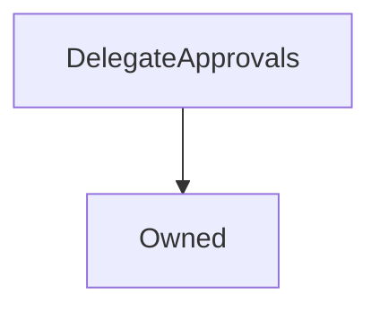

# DelegateApprovals

!!! Warning "Needs Update"


```
This contract documentation is out of date and requires updating
```

## Description

This contract is used by the [`FeePool`](FeePool.md) to enable users to permit other addresses to withdraw fees for them. In Synthetix this was intended to allow mobile wallets to claim fees for a cold storage wallet.


In principle it is generic, as the approver just marks a number of delegates as authorised to perform some action on their behalf, with no reference to what that action is, or who the delegates are.


**Source:** [contracts/DelegateApprovals.sol](https://github.com/Synthetixio/synthetix/tree/develop/contracts/DelegateApprovals.sol)

## Architecture


---
### Inheritance Graph




---
### Related Contracts

<centered-image>
    
</centered-image>


??? example "Details"


```
* [`FeePool`](FeePool.md): This contract allows the fee pool to delegate fee withdrawal approvals.
```

## Functions


---
### `constructor`

<sub>[Source](https://github.com/Synthetixio/synthetix/tree/develop/contracts/DelegateApprovals.sol#L30)</sub>


Initialises the inherited [`State`](State.md) instance.


??? example "Details"

    **Signature**

    `(address _owner, contract EternalStorage _eternalStorage) public`

    **Modifiers**

    * [Owned](#owned)


---
### `canBurnFor`

<sub>[Source](https://github.com/Synthetixio/synthetix/tree/develop/contracts/DelegateApprovals.sol#L48)</sub>


??? example "Details"

    **Signature**

    `canBurnFor(address authoriser, address delegate) external`


---
### `canIssueFor`

<sub>[Source](https://github.com/Synthetixio/synthetix/tree/develop/contracts/DelegateApprovals.sol#L52)</sub>


??? example "Details"

    **Signature**

    `canIssueFor(address authoriser, address delegate) external`


---
### `canClaimFor`

<sub>[Source](https://github.com/Synthetixio/synthetix/tree/develop/contracts/DelegateApprovals.sol#L56)</sub>


??? example "Details"

    **Signature**

    `canClaimFor(address authoriser, address delegate) external`


---
### `canExchangeFor`

<sub>[Source](https://github.com/Synthetixio/synthetix/tree/develop/contracts/DelegateApprovals.sol#L60)</sub>


??? example "Details"

    **Signature**

    `canExchangeFor(address authoriser, address delegate) external`


---
### `approvedAll`

<sub>[Source](https://github.com/Synthetixio/synthetix/tree/develop/contracts/DelegateApprovals.sol#L64)</sub>


??? example "Details"

    **Signature**

    `approvedAll(address authoriser, address delegate) public`


---
### `approveAllDelegatePowers`

<sub>[Source](https://github.com/Synthetixio/synthetix/tree/develop/contracts/DelegateApprovals.sol#L84)</sub>


??? example "Details"

    **Signature**

    `approveAllDelegatePowers(address delegate) external`


---
### `removeAllDelegatePowers`

<sub>[Source](https://github.com/Synthetixio/synthetix/tree/develop/contracts/DelegateApprovals.sol#L89)</sub>


??? example "Details"

    **Signature**

    `removeAllDelegatePowers(address delegate) external`


---
### `approveBurnOnBehalf`

<sub>[Source](https://github.com/Synthetixio/synthetix/tree/develop/contracts/DelegateApprovals.sol#L96)</sub>


??? example "Details"

    **Signature**

    `approveBurnOnBehalf(address delegate) external`


---
### `removeBurnOnBehalf`

<sub>[Source](https://github.com/Synthetixio/synthetix/tree/develop/contracts/DelegateApprovals.sol#L100)</sub>


??? example "Details"

    **Signature**

    `removeBurnOnBehalf(address delegate) external`


---
### `approveIssueOnBehalf`

<sub>[Source](https://github.com/Synthetixio/synthetix/tree/develop/contracts/DelegateApprovals.sol#L105)</sub>


??? example "Details"

    **Signature**

    `approveIssueOnBehalf(address delegate) external`


---
### `removeIssueOnBehalf`

<sub>[Source](https://github.com/Synthetixio/synthetix/tree/develop/contracts/DelegateApprovals.sol#L109)</sub>


??? example "Details"

    **Signature**

    `removeIssueOnBehalf(address delegate) external`


---
### `approveClaimOnBehalf`

<sub>[Source](https://github.com/Synthetixio/synthetix/tree/develop/contracts/DelegateApprovals.sol#L114)</sub>


??? example "Details"

    **Signature**

    `approveClaimOnBehalf(address delegate) external`


---
### `removeClaimOnBehalf`

<sub>[Source](https://github.com/Synthetixio/synthetix/tree/develop/contracts/DelegateApprovals.sol#L118)</sub>


??? example "Details"

    **Signature**

    `removeClaimOnBehalf(address delegate) external`


---
### `approveExchangeOnBehalf`

<sub>[Source](https://github.com/Synthetixio/synthetix/tree/develop/contracts/DelegateApprovals.sol#L123)</sub>


??? example "Details"

    **Signature**

    `approveExchangeOnBehalf(address delegate) external`


---
### `removeExchangeOnBehalf`

<sub>[Source](https://github.com/Synthetixio/synthetix/tree/develop/contracts/DelegateApprovals.sol#L127)</sub>


??? example "Details"

    **Signature**

    `removeExchangeOnBehalf(address delegate) external`


---
### `setEternalStorage`

<sub>[Source](https://github.com/Synthetixio/synthetix/tree/develop/contracts/DelegateApprovals.sol#L153)</sub>


??? example "Details"

    **Signature**

    `setEternalStorage(contract EternalStorage _eternalStorage) external`

    **Requires**

    * [require(..., Can't set eternalStorage to address(0))](https://github.com/Synthetixio/synthetix/tree/develop/contracts/DelegateApprovals.sol#L154)

    **Modifiers**

    * [onlyOwner](#onlyowner)

    **Emits**

    * [EternalStorageUpdated](#eternalstorageupdated)

## Events


---
### `Approval`

<sub>[Source](https://github.com/Synthetixio/synthetix/tree/develop/contracts/DelegateApprovals.sol#L160)</sub>


The delegate was approved to act on the authoriser's behalf for the given action.


**Signature:** `Approval(address indexed authoriser, address delegate, bytes32 action)`


- `(address authoriser, address delegate, bytes32 action)`


---
### `WithdrawApproval`

<sub>[Source](https://github.com/Synthetixio/synthetix/tree/develop/contracts/DelegateApprovals.sol#L161)</sub>


The delegate was disapproved to act on the authoriser's behalf.


**Signature:** `WithdrawApproval(address indexed authoriser, address delegate, bytes32 action)`


- `(address authoriser, address delegate, bytes32 action)`


---
### `EternalStorageUpdated`

<sub>[Source](https://github.com/Synthetixio/synthetix/tree/develop/contracts/DelegateApprovals.sol#L162)</sub>


The address of the eternal storage contract has changed.


**Signature:** `EternalStorageUpdated(address newEternalStorage)`


- `(address newEternalStorage)`

## Variables


---
### `BURN_FOR_ADDRESS`

<sub>[Source](https://github.com/Synthetixio/synthetix/tree/develop/contracts/DelegateApprovals.sol#L13)</sub>


**Type:** `bytes32`


---
### `ISSUE_FOR_ADDRESS`

<sub>[Source](https://github.com/Synthetixio/synthetix/tree/develop/contracts/DelegateApprovals.sol#L14)</sub>


**Type:** `bytes32`


---
### `CLAIM_FOR_ADDRESS`

<sub>[Source](https://github.com/Synthetixio/synthetix/tree/develop/contracts/DelegateApprovals.sol#L15)</sub>


**Type:** `bytes32`


---
### `EXCHANGE_FOR_ADDRESS`

<sub>[Source](https://github.com/Synthetixio/synthetix/tree/develop/contracts/DelegateApprovals.sol#L16)</sub>


**Type:** `bytes32`


---
### `APPROVE_ALL`

<sub>[Source](https://github.com/Synthetixio/synthetix/tree/develop/contracts/DelegateApprovals.sol#L17)</sub>


**Type:** `bytes32`


---
### `eternalStorage`

<sub>[Source](https://github.com/Synthetixio/synthetix/tree/develop/contracts/DelegateApprovals.sol#L28)</sub>


**Type:** `contract EternalStorage`

