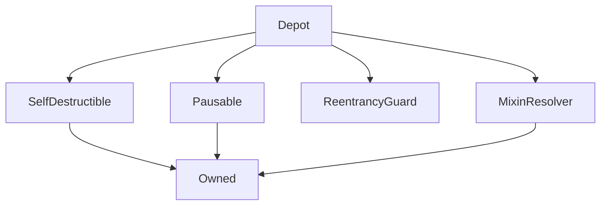

# Depot

## Description

Allows anyone with sUSD to deposit their sUSD and users to exchange ETH for sUSD.

sUSD Deposits are put into a FIFO queue which will the depositor will recieve ETH at the ETH rate at the time of the exchange.

Throughout, the contract assumes that sUSD is always worth exactly US\$1. So: a) this will only work with `sUSD`. b) there's a profit opportunity if the `sUSD` is off its peg.

!!! SNX exchange functionality has been deprecated on MAINNET and is now used as a SNX faucet on the testnets only.

**Source:** [contracts/Depot.sol](https://github.com/Synthetixio/synthetix/tree/develop/contracts/Depot.sol)

## Architecture

### Inheritance Graph

---

### Some Title

Some description

---

### Related Contracts

 - [`AddressResolver`](AddressResolver.md)
    

---

### Libraries

 - [`SafeMath`](SafeMath.md)
    

---

## Structs

---

### SynthDepositEntry
[Source](https://github.com/Synthetixio/synthetix/tree/develop/contracts/Depot.sol#L35)

| Field | Type | Description |
| ------ | ------ | ------ |
| user | address payable | The depositor |
| amount | uint256 | The quantity of sUSD deposited |

---

## Variables

---

### `SNX`
[Source](https://github.com/Synthetixio/synthetix/tree/develop/contracts/Depot.sol#L24)

**Type:** `bytes32`

---

### `ETH`
[Source](https://github.com/Synthetixio/synthetix/tree/develop/contracts/Depot.sol#L25)

**Type:** `bytes32`

---

### `fundsWallet`
[Source](https://github.com/Synthetixio/synthetix/tree/develop/contracts/Depot.sol#L32)

The address where ether and synths raised by selling SNX are sent.

It is also where ether is sent if the proceeds of a sale of synths could not be transferred because the recipient is a non-payable contract.

**Type:** `address payable`

---

### `deposits`
[Source](https://github.com/Synthetixio/synthetix/tree/develop/contracts/Depot.sol#L53)

**Type:** `mapping(uint256 => struct Depot.SynthDepositEntry)`

---

### `depositStartIndex`
[Source](https://github.com/Synthetixio/synthetix/tree/develop/contracts/Depot.sol#L55)

**Type:** `uint256`

---

### `depositEndIndex`
[Source](https://github.com/Synthetixio/synthetix/tree/develop/contracts/Depot.sol#L57)

**Type:** `uint256`

---

### `totalSellableDeposits`
[Source](https://github.com/Synthetixio/synthetix/tree/develop/contracts/Depot.sol#L62)

**Type:** `uint256`

---

### `minimumDepositAmount`
[Source](https://github.com/Synthetixio/synthetix/tree/develop/contracts/Depot.sol#L65)

**Type:** `uint256`

---

### `maxEthPurchase`
[Source](https://github.com/Synthetixio/synthetix/tree/develop/contracts/Depot.sol#L68)

**Type:** `uint256`

---

### `smallDeposits`
[Source](https://github.com/Synthetixio/synthetix/tree/develop/contracts/Depot.sol#L73)

**Type:** `mapping(address => uint256)`

---

## Functions

---

### `constructor`
[Source](https://github.com/Synthetixio/synthetix/tree/develop/contracts/Depot.sol#L85)

??? example "Details"

    **Signature**

    `(address _owner, address payable _fundsWallet, address _resolver) public`

    **Modifiers**

    * [Owned](#owned)

    * [SelfDestructible](#selfdestructible)

    * [Pausable](#pausable)

    * [MixinResolver](#mixinresolver)

---

### `setMaxEthPurchase`
[Source](https://github.com/Synthetixio/synthetix/tree/develop/contracts/Depot.sol#L95)

??? example "Details"

    **Signature**

    `setMaxEthPurchase(uint256 _maxEthPurchase) external`

    **Modifiers**

    * [onlyOwner](#onlyowner)

    **Emits**

    * [MaxEthPurchaseUpdated](#maxethpurchaseupdated)

---

### `setFundsWallet`
[Source](https://github.com/Synthetixio/synthetix/tree/develop/contracts/Depot.sol#L104)

??? example "Details"

    **Signature**

    `setFundsWallet(address payable _fundsWallet) external`

    **Modifiers**

    * [onlyOwner](#onlyowner)

    **Emits**

    * [FundsWalletUpdated](#fundswalletupdated)

---

### `setMinimumDepositAmount`
[Source](https://github.com/Synthetixio/synthetix/tree/develop/contracts/Depot.sol#L113)

??? example "Details"

    **Signature**

    `setMinimumDepositAmount(uint256 _amount) external`

    **Requires**

    * [require(..., Minimum deposit amount must be greater than UNIT)](https://github.com/Synthetixio/synthetix/tree/develop/contracts/Depot.sol#L115)

    **Modifiers**

    * [onlyOwner](#onlyowner)

    **Emits**

    * [MinimumDepositAmountUpdated](#minimumdepositamountupdated)

---

### `fallback`
[Source](https://github.com/Synthetixio/synthetix/tree/develop/contracts/Depot.sol#L125)

??? example "Details"

    **Signature**

    `() external`

    **Modifiers**

    * [nonReentrant](#nonreentrant)

    * [rateNotStale](#ratenotstale)

    * [notPaused](#notpaused)

---

### `exchangeEtherForSynths`
[Source](https://github.com/Synthetixio/synthetix/tree/develop/contracts/Depot.sol#L133)

??? example "Details"

    **Signature**

    `exchangeEtherForSynths() external`

    **Modifiers**

    * [nonReentrant](#nonreentrant)

    * [rateNotStale](#ratenotstale)

    * [notPaused](#notpaused)

---

### `exchangeEtherForSynthsAtRate`
[Source](https://github.com/Synthetixio/synthetix/tree/develop/contracts/Depot.sol#L264)

??? example "Details"

    **Signature**

    `exchangeEtherForSynthsAtRate(uint256 guaranteedRate) external`

    **Requires**

    * [require(..., Guaranteed rate would not be received)](https://github.com/Synthetixio/synthetix/tree/develop/contracts/Depot.sol#L273)

    **Modifiers**

    * [rateNotStale](#ratenotstale)

    * [notPaused](#notpaused)

---

### `exchangeEtherForSNX`
[Source](https://github.com/Synthetixio/synthetix/tree/develop/contracts/Depot.sol#L296)

??? example "Details"

    **Signature**

    `exchangeEtherForSNX() external`

    **Modifiers**

    * [rateNotStale](#ratenotstale)

    * [rateNotStale](#ratenotstale)

    * [notPaused](#notpaused)

---

### `exchangeEtherForSNXAtRate`
[Source](https://github.com/Synthetixio/synthetix/tree/develop/contracts/Depot.sol#L315)

??? example "Details"

    **Signature**

    `exchangeEtherForSNXAtRate(uint256 guaranteedEtherRate, uint256 guaranteedSynthetixRate) external`

    **Requires**

    * [require(..., Guaranteed ether rate would not be received)](https://github.com/Synthetixio/synthetix/tree/develop/contracts/Depot.sol#L325)

    * [require(..., Guaranteed synthetix rate would not be received)](https://github.com/Synthetixio/synthetix/tree/develop/contracts/Depot.sol#L326)

    **Modifiers**

    * [rateNotStale](#ratenotstale)

    * [rateNotStale](#ratenotstale)

    * [notPaused](#notpaused)

---

### `exchangeSynthsForSNX`
[Source](https://github.com/Synthetixio/synthetix/tree/develop/contracts/Depot.sol#L355)

??? example "Details"

    **Signature**

    `exchangeSynthsForSNX(uint256 synthAmount) external`

    **Modifiers**

    * [rateNotStale](#ratenotstale)

    * [notPaused](#notpaused)

---

### `exchangeSynthsForSNXAtRate`
[Source](https://github.com/Synthetixio/synthetix/tree/develop/contracts/Depot.sol#L372)

??? example "Details"

    **Signature**

    `exchangeSynthsForSNXAtRate(uint256 synthAmount, uint256 guaranteedRate) external`

    **Requires**

    * [require(..., Guaranteed rate would not be received)](https://github.com/Synthetixio/synthetix/tree/develop/contracts/Depot.sol#L380)

    **Modifiers**

    * [rateNotStale](#ratenotstale)

    * [notPaused](#notpaused)

---

### `withdrawSynthetix`
[Source](https://github.com/Synthetixio/synthetix/tree/develop/contracts/Depot.sol#L389)

??? example "Details"

    **Signature**

    `withdrawSynthetix(uint256 amount) external`

    **Modifiers**

    * [onlyOwner](#onlyowner)

---

### `withdrawMyDepositedSynths`
[Source](https://github.com/Synthetixio/synthetix/tree/develop/contracts/Depot.sol#L405)

??? example "Details"

    **Signature**

    `withdrawMyDepositedSynths() external`

    **Requires**

    * [require(..., You have no deposits to withdraw.)](https://github.com/Synthetixio/synthetix/tree/develop/contracts/Depot.sol#L430)

    **Emits**

    * [SynthWithdrawal](#synthwithdrawal)

---

### `depositSynths`
[Source](https://github.com/Synthetixio/synthetix/tree/develop/contracts/Depot.sol#L442)

??? example "Details"

    **Signature**

    `depositSynths(uint256 amount) external`

---

### `synthetixReceivedForSynths`
[Source](https://github.com/Synthetixio/synthetix/tree/develop/contracts/Depot.sol#L474)

??? example "Details"

    **Signature**

    `synthetixReceivedForSynths(uint256 amount) public`

---

### `synthetixReceivedForEther`
[Source](https://github.com/Synthetixio/synthetix/tree/develop/contracts/Depot.sol#L484)

??? example "Details"

    **Signature**

    `synthetixReceivedForEther(uint256 amount) public`

---

### `synthsReceivedForEther`
[Source](https://github.com/Synthetixio/synthetix/tree/develop/contracts/Depot.sol#L497)

??? example "Details"

    **Signature**

    `synthsReceivedForEther(uint256 amount) public`

---

## Modifiers

---

### `rateNotStale`
[Source](https://github.com/Synthetixio/synthetix/tree/develop/contracts/Depot.sol#L518)

---

## Events

---

### `MaxEthPurchaseUpdated`
[Source](https://github.com/Synthetixio/synthetix/tree/develop/contracts/Depot.sol#L525)

- `(uint256 amount)`

---

### `FundsWalletUpdated`
[Source](https://github.com/Synthetixio/synthetix/tree/develop/contracts/Depot.sol#L526)

- `(address newFundsWallet)`

---

### `Exchange`
[Source](https://github.com/Synthetixio/synthetix/tree/develop/contracts/Depot.sol#L527)

- `(string fromCurrency, uint256 fromAmount, string toCurrency, uint256 toAmount)`

---

### `SynthWithdrawal`
[Source](https://github.com/Synthetixio/synthetix/tree/develop/contracts/Depot.sol#L528)

- `(address user, uint256 amount)`

---

### `SynthDeposit`
[Source](https://github.com/Synthetixio/synthetix/tree/develop/contracts/Depot.sol#L529)

- `(address user, uint256 amount, uint256 depositIndex)`

---

### `SynthDepositRemoved`
[Source](https://github.com/Synthetixio/synthetix/tree/develop/contracts/Depot.sol#L530)

- `(address user, uint256 amount, uint256 depositIndex)`

---

### `SynthDepositNotAccepted`
[Source](https://github.com/Synthetixio/synthetix/tree/develop/contracts/Depot.sol#L531)

- `(address user, uint256 amount, uint256 minimum)`

---

### `MinimumDepositAmountUpdated`
[Source](https://github.com/Synthetixio/synthetix/tree/develop/contracts/Depot.sol#L532)

- `(uint256 amount)`

---

### `NonPayableContract`
[Source](https://github.com/Synthetixio/synthetix/tree/develop/contracts/Depot.sol#L533)

- `(address receiver, uint256 amount)`

---

### `ClearedDeposit`
[Source](https://github.com/Synthetixio/synthetix/tree/develop/contracts/Depot.sol#L534)

- `(address fromAddress, address toAddress, uint256 fromETHAmount, uint256 toAmount, uint256 depositIndex)`

---

