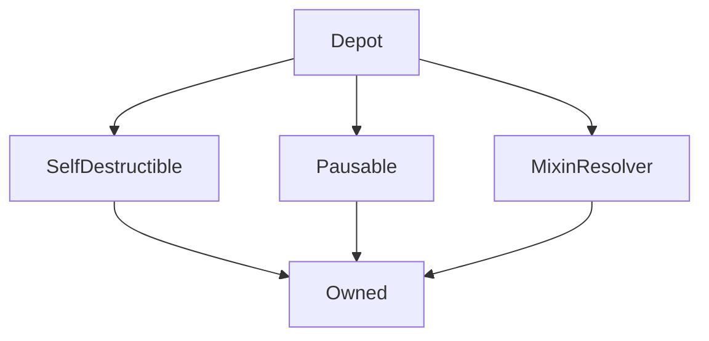

# Depot

## Description

Allows anyone with sUSD to deposit their sUSD and users to exchange ETH for sUSD.

sUSD Deposits are put into a FIFO queue which will the depositor will recieve ETH at the ETH rate at the time of the exchange.

Throughout, the contract assumes that sUSD is always worth exactly US\$1. So: a) this will only work with `sUSD`. b) there's a profit opportunity if the `sUSD` is off its peg.

!!! SNX exchange functionality has been deprecated on MAINNET and is now used as a SNX faucet on the testnets only.

**Source:** [contracts/Depot.sol](https://github.com/Synthetixio/synthetix/tree/v2.21.15/contracts/Depot.sol)

## Architecture

---
### Inheritance Graph

---
### Related Contracts

- [Synthetix](Synthetix.md)
- [Synth](Synth.md)
- [ExchangeRates](ExchangeRates.md)
- [AddressResolver](AddressResolver.md)

---
### Libraries

- [SafeMath](/libraries/SafeMath) for `uint`
- [SafeDecimalMath](/libraries/SafeDecimalMath) for `uint`

## Constants

---
### `CONTRACT_EXRATES`

[Source](https://github.com/Synthetixio/synthetix/tree/v2.21.15/contracts/Depot.sol#L78)

**Type:** `bytes32`

---
### `CONTRACT_SYNTHETIX`

[Source](https://github.com/Synthetixio/synthetix/tree/v2.21.15/contracts/Depot.sol#L79)

**Type:** `bytes32`

---
### `CONTRACT_SYNTHSUSD`

[Source](https://github.com/Synthetixio/synthetix/tree/v2.21.15/contracts/Depot.sol#L77)

**Type:** `bytes32`

---
### `ETH`

[Source](https://github.com/Synthetixio/synthetix/tree/v2.21.15/contracts/Depot.sol#L25)

**Type:** `bytes32`

---
### `SNX`

[Source](https://github.com/Synthetixio/synthetix/tree/v2.21.15/contracts/Depot.sol#L24)

**Type:** `bytes32`

## Variables

---
### `addressesToCache`

[Source](https://github.com/Synthetixio/synthetix/tree/v2.21.15/contracts/Depot.sol#L81)

**Type:** `bytes32[24]`

---
### `depositEndIndex`

[Source](https://github.com/Synthetixio/synthetix/tree/v2.21.15/contracts/Depot.sol#L57)

The index one past the last deposit in the [`deposits`](#deposits) queue.

**Type:** `uint256`

---
### `deposits`

[Source](https://github.com/Synthetixio/synthetix/tree/v2.21.15/contracts/Depot.sol#L53)

Users can deposit sUSD to be sold on the depot. This variable holds the queue of open deposits, which are sold in the order they were deposited.

This queue is stored as an "array" within a mapping: the keys are array indices. Deposits are stored by a contiguous block of keys between [`depositStartIndex`](#depositstartindex) (inclusive) and [`depositEndIndex`](#depositendindex) (exclusive).

A mapping is used instead of an array in order to avoid having to copy entries around when deposits are deleted, which saves on gas. When a deposit is made it is added to the end of the list, and when a deposit is filled, it is removed from the start of the list. Thus over time the list of deposits slides down the set of array indexes, but the address space of the mapping is large enough that it will never be filled.

**Type:** `mapping(uint256 => struct Depot.SynthDepositEntry)`

---
### `depositStartIndex`

[Source](https://github.com/Synthetixio/synthetix/tree/v2.21.15/contracts/Depot.sol#L55)

The index of the next deposit to be processed in the [`deposits`](#deposits) queue.

**Type:** `uint256`

---
### `fundsWallet`

[Source](https://github.com/Synthetixio/synthetix/tree/v2.21.15/contracts/Depot.sol#L32)

The address where ether and synths raised by selling SNX are sent.

It is also where ether is sent if the proceeds of a sale of synths could not be transferred because the recipient is a non-payable contract.

**Type:** `address payable`

---
### `maxEthPurchase`

[Source](https://github.com/Synthetixio/synthetix/tree/v2.21.15/contracts/Depot.sol#L68)

**Type:** `uint256`

---
### `minimumDepositAmount`

[Source](https://github.com/Synthetixio/synthetix/tree/v2.21.15/contracts/Depot.sol#L65)

The minimum sUSD quantity required for a deposit to be added to the queue. Initialised to 50.0.

**Type:** `uint256`

---
### `smallDeposits`

[Source](https://github.com/Synthetixio/synthetix/tree/v2.21.15/contracts/Depot.sol#L73)

Deposits of less than [`minimumDepositAmount`](#minimumdepositamount) sUSD are not placed on the [`deposits`](#deposits) queue. Instead, they are kept here so that the depositor can withdraw them.

**Type:** `mapping(address => uint256)`

---
### `totalSellableDeposits`

[Source](https://github.com/Synthetixio/synthetix/tree/v2.21.15/contracts/Depot.sol#L62)

The total quantity of sUSD currently in the [`deposits`](#deposits) queue to be purchased.

**Type:** `uint256`

## Structs

---
### `SynthDepositEntry`

[Source](https://github.com/Synthetixio/synthetix/tree/v2.21.15/contracts/Depot.sol#L35)

| Field | Type | Description |
| ------ | ------ | ------ |
| user | address payable | TBA |
| amount | uint256 | TBA |

## Modifiers

---
### `onlySynth`

Reverts the transaction if `msg.sender` is not the [`synth`](#synth) address.

---
### `rateNotStale`

[Source](https://github.com/Synthetixio/synthetix/tree/v2.21.15/contracts/Depot.sol#L518)

## Function (Constructor)

---
### `constructor`

[Source](https://github.com/Synthetixio/synthetix/tree/v2.21.15/contracts/Depot.sol#L85)

??? example "Details"

    **Signature**

    `(address _owner, address payable _fundsWallet, address _resolver)`

    **State Mutability**

    `nonpayable`

    **Modifiers**

    * [Owned](#owned)

    * [SelfDestructible](#selfdestructible)

    * [Pausable](#pausable)

    * [MixinResolver](#mixinresolver)

## Function (Fallback)

---
### `() (fallback function)`

[Source](https://github.com/Synthetixio/synthetix/tree/v2.21.15/contracts/Depot.sol#L125)

??? example "Details"

    **Signature**

    `()`

    **State Mutability**

    `payable`

    **Modifiers**

    * [nonReentrant](#nonreentrant)

    * [rateNotStale](#ratenotstale)

    * [notPaused](#notpaused)

## Functions

---
### `depositSynths`

[Source](https://github.com/Synthetixio/synthetix/tree/v2.21.15/contracts/Depot.sol#L442)

- `depositSynths(uint amount)`: Just an alias to `synth.transferFrom(msg.sender, this, amount)`. This requires the sender to have approved the deposit.

??? example "Details"

    **Signature**

    `depositSynths(uint256 amount)`

    **State Mutability**

    `nonpayable`

---
### `exchangeEtherForSNX`

[Source](https://github.com/Synthetixio/synthetix/tree/v2.21.15/contracts/Depot.sol#L296)

- `exchangeEtherForSNX() returns (uint)`: Requires that the contract is not paused, and that the prices are not stale. Converts the received ether to a quantity of SNX with `synthetixReceivedForEther`. Sends the ether to `fundsWallet`, sends the converted quantity of SNX to the message sender from the contract's own reserves. Returns the SNX quantity sent. If the contract has insufficient SNX, then the transfer will fail and the transaction will revert.

??? example "Details"

    **Signature**

    `exchangeEtherForSNX()`

    **State Mutability**

    `payable`

    **Modifiers**

    * [rateNotStale](#ratenotstale)

    * [rateNotStale](#ratenotstale)

    * [notPaused](#notpaused)

---
### `exchangeEtherForSNXAtRate`

[Source](https://github.com/Synthetixio/synthetix/tree/v2.21.15/contracts/Depot.sol#L315)

- `exchangeEtherForSNXAtRate(uint guaranteedEtherRate, uint guaranteedSynthetixRate) returns (uint)`: As `exchangeEtherForSynthsAtRate` is to `exchangeEtherForSynths`, this is to `exchangeEtherForSNX`.

??? example "Details"

    **Signature**

    `exchangeEtherForSNXAtRate(uint256 guaranteedEtherRate, uint256 guaranteedSynthetixRate)`

    **State Mutability**

    `payable`

    **Requires**

    * [require(..., Guaranteed ether rate would not be received)](https://github.com/Synthetixio/synthetix/tree/v2.21.15/contracts/Depot.sol#L325)

    * [require(..., Guaranteed synthetix rate would not be received)](https://github.com/Synthetixio/synthetix/tree/v2.21.15/contracts/Depot.sol#L326)

    **Modifiers**

    * [rateNotStale](#ratenotstale)

    * [rateNotStale](#ratenotstale)

    * [notPaused](#notpaused)

---
### `exchangeEtherForSynths`

[Source](https://github.com/Synthetixio/synthetix/tree/v2.21.15/contracts/Depot.sol#L133)

Sells sUSD to callers who send ether. The synths are sold from the [`deposits`](#deposits) queue in the order they were deposited.

Purchased quantity: msg.value \* usdToEthPrice

Each deposit is sold in turn until the full
This function if invoked with a

Requires that the contract is not paused, and that the prices are not stale.

Returns the number of sUSD exchanged. Converts any ether sent to the contract to a quantity of synths at current prices. Fulfils this quantity by iterating through the deposit queue until the entire quantity is found. If a given deposit is insufficient to cover the entire requested amount, it is exhausted and removed from the queue. For each deposit found, the proper quantity of ether is sent to the depositor. If the quantity could not be sent because the target is a non-payable contract, then it is remitted to `fundsWallet`. Then send the Synths to the recipient. If the whole quantity could not be fulfilled, then the remaining ether is refunded to the purchaser.

- `exchangeEtherForSynths() returns (uint)`:

??? example "Details"

    **Signature**

    `exchangeEtherForSynths()`

    **State Mutability**

    `payable`

    **Modifiers**

    * [nonReentrant](#nonreentrant)

    * [rateNotStale](#ratenotstale)

    * [notPaused](#notpaused)

---
### `exchangeEtherForSynthsAtRate`

[Source](https://github.com/Synthetixio/synthetix/tree/v2.21.15/contracts/Depot.sol#L264)

- `exchangeEtherForSynthsAtRate(uint guaranteedRate) returns (uint)`: Allows the caller to specify the current price, and then calls to `exchangeEtherForSynths`. Reverts if the current price does not match the price provided as an argument. This is intended as a protection against front-running by the contract owner, or otherwise a case where a price update is in flight at the invocation time.

??? example "Details"

    **Signature**

    `exchangeEtherForSynthsAtRate(uint256 guaranteedRate)`

    **State Mutability**

    `payable`

    **Requires**

    * [require(..., Guaranteed rate would not be received)](https://github.com/Synthetixio/synthetix/tree/v2.21.15/contracts/Depot.sol#L273)

    **Modifiers**

    * [rateNotStale](#ratenotstale)

    * [notPaused](#notpaused)

---
### `exchangeSynthsForSNX`

[Source](https://github.com/Synthetixio/synthetix/tree/v2.21.15/contracts/Depot.sol#L355)

- `exchangeSynthsForSNX(uint synthAmount) returns (uint)`: Identical to `exchangeEtherForSNX`, but perform the price conversion with `synthetixReceivedForSynths`. The amount of synths to send is provided as a function argument, and then transferred to `fundsWallet` with `transferFrom`, so this function requires the caller to have approved the depot contract to make such a withdrawal. Note that this assumes that sUSD is worth exactly one dollar.

??? example "Details"

    **Signature**

    `exchangeSynthsForSNX(uint256 synthAmount)`

    **State Mutability**

    `nonpayable`

    **Modifiers**

    * [rateNotStale](#ratenotstale)

    * [notPaused](#notpaused)

---
### `exchangeSynthsForSNXAtRate`

[Source](https://github.com/Synthetixio/synthetix/tree/v2.21.15/contracts/Depot.sol#L372)

- `exchangeSynthsForSNXAtRate(uint synthAmount, uint guaranteedRate) returns (uint)`: As per `exchangeEtherForSNXAtRate`.

??? example "Details"

    **Signature**

    `exchangeSynthsForSNXAtRate(uint256 synthAmount, uint256 guaranteedRate)`

    **State Mutability**

    `nonpayable`

    **Requires**

    * [require(..., Guaranteed rate would not be received)](https://github.com/Synthetixio/synthetix/tree/v2.21.15/contracts/Depot.sol#L380)

    **Modifiers**

    * [rateNotStale](#ratenotstale)

    * [notPaused](#notpaused)

---
### `synthetixReceivedForEther`

[Source](https://github.com/Synthetixio/synthetix/tree/v2.21.15/contracts/Depot.sol#L484)

Computes the quantity of SNX received in exchange for a given quantity of Ether at current prices. This is equivalent to:

$$
Q_\text{SNX} = Q_\text{ETH} \times \frac{\pi_\text{ETH}}{\pi_\text{SNX}}
$$

??? example "Details"

    **Signature**

    `synthetixReceivedForEther(uint256 amount)`

    **State Mutability**

    `view`

---
### `synthetixReceivedForSynths`

[Source](https://github.com/Synthetixio/synthetix/tree/v2.21.15/contracts/Depot.sol#L474)

Computes the quantity of SNX received in exchange for a given quantity of sUSD at current prices, assuming sUSD are worth \$1. This is equivalent to:

$$
Q_\text{SNX} = Q_\text{sUSD} \times \frac{1}{\pi_\text{SNX}}
$$

??? example "Details"

    **Signature**

    `synthetixReceivedForSynths(uint256 amount)`

    **State Mutability**

    `view`

---
### `synthsReceivedForEther`

[Source](https://github.com/Synthetixio/synthetix/tree/v2.21.15/contracts/Depot.sol#L497)

Computes the quantity of sUSD received in exchange for a given quantity of ETH at current prices. This is equivalent to:

$$
Q_\text{sUSD} = Q_\text{ETH} \times \pi_\text{SNX}
$$

??? example "Details"

    **Signature**

    `synthsReceivedForEther(uint256 amount)`

    **State Mutability**

    `view`

---
### `withdrawMyDepositedSynths`

[Source](https://github.com/Synthetixio/synthetix/tree/v2.21.15/contracts/Depot.sol#L405)

- `withdrawMyDepositedSynths()`: Withdraws all Synths deposited by the message sender. Iterates through the entire deposit queue; if for a given entry the message sender is the depositor, delete that deposit and and add the deposited quantity of tokens to the pile to be remitted. Then transfer this quantity back to the message sender, along with any tokens in `smallDeposits`.

??? example "Details"

    **Signature**

    `withdrawMyDepositedSynths()`

    **State Mutability**

    `nonpayable`

    **Requires**

    * [require(..., You have no deposits to withdraw.)](https://github.com/Synthetixio/synthetix/tree/v2.21.15/contracts/Depot.sol#L430)

    **Emits**

    * [SynthWithdrawal](#synthwithdrawal)

## Functions (Internal)

---
### `_exchangeEtherForSNX`

[Source](https://github.com/Synthetixio/synthetix/tree/v2.21.15/contracts/Depot.sol#L278)

??? example "Details"

    **Signature**

    `_exchangeEtherForSNX()`

    **State Mutability**

    `nonpayable`

    **Emits**

    * [Exchange](#exchange)

---
### `_exchangeEtherForSynths`

[Source](https://github.com/Synthetixio/synthetix/tree/v2.21.15/contracts/Depot.sol#L146)

??? example "Details"

    **Signature**

    `_exchangeEtherForSynths()`

    **State Mutability**

    `nonpayable`

    **Requires**

    * [require(..., ETH amount above maxEthPurchase limit)](https://github.com/Synthetixio/synthetix/tree/v2.21.15/contracts/Depot.sol#L147)

---
### `_exchangeSynthsForSNX`

[Source](https://github.com/Synthetixio/synthetix/tree/v2.21.15/contracts/Depot.sol#L334)

??? example "Details"

    **Signature**

    `_exchangeSynthsForSNX(uint256 synthAmount)`

    **State Mutability**

    `nonpayable`

    **Emits**

    * [Exchange](#exchange)

---
### `exchangeRates`

[Source](https://github.com/Synthetixio/synthetix/tree/v2.21.15/contracts/Depot.sol#L512)

??? example "Details"

    **Signature**

    `exchangeRates()`

    **State Mutability**

    `view`

---
### `synthetix`

[Source](https://github.com/Synthetixio/synthetix/tree/v2.21.15/contracts/Depot.sol#L508)

??? example "Details"

    **Signature**

    `synthetix()`

    **State Mutability**

    `view`

---
### `synthsUSD`

[Source](https://github.com/Synthetixio/synthetix/tree/v2.21.15/contracts/Depot.sol#L504)

??? example "Details"

    **Signature**

    `synthsUSD()`

    **State Mutability**

    `view`

## Functions (onlyOwner)

---
### `setFundsWallet`

[Source](https://github.com/Synthetixio/synthetix/tree/v2.21.15/contracts/Depot.sol#L104)

??? example "Details"

    **Signature**

    `setFundsWallet(address payable _fundsWallet)`

    **State Mutability**

    `nonpayable`

    **Modifiers**

    * [onlyOwner](#onlyowner)

    **Emits**

    * [FundsWalletUpdated](#fundswalletupdated)

---
### `setMaxEthPurchase`

[Source](https://github.com/Synthetixio/synthetix/tree/v2.21.15/contracts/Depot.sol#L95)

??? example "Details"

    **Signature**

    `setMaxEthPurchase(uint256 _maxEthPurchase)`

    **State Mutability**

    `nonpayable`

    **Modifiers**

    * [onlyOwner](#onlyowner)

    **Emits**

    * [MaxEthPurchaseUpdated](#maxethpurchaseupdated)

---
### `setMinimumDepositAmount`

[Source](https://github.com/Synthetixio/synthetix/tree/v2.21.15/contracts/Depot.sol#L113)

??? example "Details"

    **Signature**

    `setMinimumDepositAmount(uint256 _amount)`

    **State Mutability**

    `nonpayable`

    **Requires**

    * [require(..., Minimum deposit amount must be greater than UNIT)](https://github.com/Synthetixio/synthetix/tree/v2.21.15/contracts/Depot.sol#L115)

    **Modifiers**

    * [onlyOwner](#onlyowner)

    **Emits**

    * [MinimumDepositAmountUpdated](#minimumdepositamountupdated)

---
### `withdrawSynthetix`

[Source](https://github.com/Synthetixio/synthetix/tree/v2.21.15/contracts/Depot.sol#L389)

??? example "Details"

    **Signature**

    `withdrawSynthetix(uint256 amount)`

    **State Mutability**

    `nonpayable`

    **Modifiers**

    * [onlyOwner](#onlyowner)

## Events

---
### `ClearedDeposit`

[Source](https://github.com/Synthetixio/synthetix/tree/v2.21.15/contracts/Depot.sol#L534)

- `(address fromAddress, address toAddress, uint256 fromETHAmount, uint256 toAmount, uint256 depositIndex)`

---
### `Exchange`

[Source](https://github.com/Synthetixio/synthetix/tree/v2.21.15/contracts/Depot.sol#L527)

- `(string fromCurrency, uint256 fromAmount, string toCurrency, uint256 toAmount)`

---
### `FundsWalletUpdated`

[Source](https://github.com/Synthetixio/synthetix/tree/v2.21.15/contracts/Depot.sol#L526)

- `(address newFundsWallet)`

---
### `MaxEthPurchaseUpdated`

[Source](https://github.com/Synthetixio/synthetix/tree/v2.21.15/contracts/Depot.sol#L525)

- `(uint256 amount)`

---
### `MinimumDepositAmountUpdated`

[Source](https://github.com/Synthetixio/synthetix/tree/v2.21.15/contracts/Depot.sol#L532)

- `(uint256 amount)`

---
### `NonPayableContract`

[Source](https://github.com/Synthetixio/synthetix/tree/v2.21.15/contracts/Depot.sol#L533)

- `(address receiver, uint256 amount)`

---
### `SynthDeposit`

[Source](https://github.com/Synthetixio/synthetix/tree/v2.21.15/contracts/Depot.sol#L529)

- `(address user, uint256 amount, uint256 depositIndex)`

---
### `SynthDepositAmountUpdated`

- `MinimumDepositAmountUpdated(uint amount)`

---
### `SynthDepositNotAccepted`

[Source](https://github.com/Synthetixio/synthetix/tree/v2.21.15/contracts/Depot.sol#L531)

- `(address user, uint256 amount, uint256 minimum)`

---
### `SynthDepositRemoved`

[Source](https://github.com/Synthetixio/synthetix/tree/v2.21.15/contracts/Depot.sol#L530)

- `(address user, uint256 amount, uint256 depositIndex)`

---
### `SynthetixUpdated`

- `SynthetixUpdated(Synthetix newSynthetixContract)`

---
### `SynthUpdated`

- `SynthUpdated(Synth newSynthContract)`

---
### `SynthWithdrawal`

[Source](https://github.com/Synthetixio/synthetix/tree/v2.21.15/contracts/Depot.sol#L528)

- `(address user, uint256 amount)`

