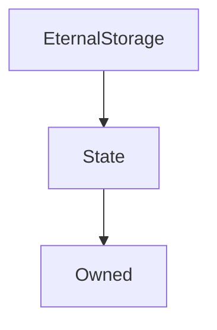

# EternalStorage

## Description

This is an implementation of the well-known eternal storage smart contract pattern, described in more detail [here](https://fravoll.github.io/solidity-patterns/eternal_storage.html) and [here](https://medium.com/rocket-pool/upgradable-solidity-contract-design-54789205276d).

In short, it is a key-value store for variables which are retrieved by a byte string, typically a hash of their name and an index.

The contract is architected this way so that the access pattern is uniform and the memory layout is not dependent on implementation or compilation details. In this way, smart contracts can retain state between updates while minimising the difficulty and expense of migrating this information.

Each type of variable has its own mapping, along with getters and setters. As this entails some replication, this document will express functions and variables generically with the type variable 𝕋, where 𝕋 $\in$ {`uint`, `string`, `address`, `bytes`, `bytes32`, `bool`, `int`}. This notation is used slightly abusively, standing in for both names and types; in the former case, substitution is in camelCase. More complex types, such as structs and nested mappings, are not supported.

**Source:** [contracts/EternalStorage.sol](https://github.com/Synthetixio/synthetix/tree/develop/contracts/EternalStorage.sol)

## Architecture

---
### Inheritance Graph

## Variables

---
### `UIntStorage`

[Source](https://github.com/Synthetixio/synthetix/tree/develop/contracts/EternalStorage.sol#L20)

**Type:** `mapping(bytes32 => uint256)`

---
### `StringStorage`

[Source](https://github.com/Synthetixio/synthetix/tree/develop/contracts/EternalStorage.sol#L21)

**Type:** `mapping(bytes32 => string)`

---
### `AddressStorage`

[Source](https://github.com/Synthetixio/synthetix/tree/develop/contracts/EternalStorage.sol#L22)

**Type:** `mapping(bytes32 => address)`

---
### `BytesStorage`

[Source](https://github.com/Synthetixio/synthetix/tree/develop/contracts/EternalStorage.sol#L23)

**Type:** `mapping(bytes32 => bytes)`

---
### `Bytes32Storage`

[Source](https://github.com/Synthetixio/synthetix/tree/develop/contracts/EternalStorage.sol#L24)

**Type:** `mapping(bytes32 => bytes32)`

---
### `BooleanStorage`

[Source](https://github.com/Synthetixio/synthetix/tree/develop/contracts/EternalStorage.sol#L25)

**Type:** `mapping(bytes32 => bool)`

---
### `IntStorage`

[Source](https://github.com/Synthetixio/synthetix/tree/develop/contracts/EternalStorage.sol#L26)

**Type:** `mapping(bytes32 => int256)`

## Functions

---
### `constructor`

[Source](https://github.com/Synthetixio/synthetix/tree/develop/contracts/EternalStorage.sol#L17)

Initialises the inherited [`State`](State.md) instance.

??? example "Details"

    **Signature**

    `(address _owner, address _associatedContract) public`

    **Modifiers**

    * [Owned](#owned)

    * [State](#state)

---
### `getUIntValue`

[Source](https://github.com/Synthetixio/synthetix/tree/develop/contracts/EternalStorage.sol#L29)

??? example "Details"

    **Signature**

    `getUIntValue(bytes32 record) external`

---
### `setUIntValue`

[Source](https://github.com/Synthetixio/synthetix/tree/develop/contracts/EternalStorage.sol#L33)

??? example "Details"

    **Signature**

    `setUIntValue(bytes32 record, uint256 value) external`

    **Modifiers**

    * [onlyAssociatedContract](#onlyassociatedcontract)

---
### `deleteUIntValue`

[Source](https://github.com/Synthetixio/synthetix/tree/develop/contracts/EternalStorage.sol#L37)

??? example "Details"

    **Signature**

    `deleteUIntValue(bytes32 record) external`

    **Modifiers**

    * [onlyAssociatedContract](#onlyassociatedcontract)

---
### `getStringValue`

[Source](https://github.com/Synthetixio/synthetix/tree/develop/contracts/EternalStorage.sol#L42)

??? example "Details"

    **Signature**

    `getStringValue(bytes32 record) external`

---
### `setStringValue`

[Source](https://github.com/Synthetixio/synthetix/tree/develop/contracts/EternalStorage.sol#L46)

??? example "Details"

    **Signature**

    `setStringValue(bytes32 record, string value) external`

    **Modifiers**

    * [onlyAssociatedContract](#onlyassociatedcontract)

---
### `deleteStringValue`

[Source](https://github.com/Synthetixio/synthetix/tree/develop/contracts/EternalStorage.sol#L50)

??? example "Details"

    **Signature**

    `deleteStringValue(bytes32 record) external`

    **Modifiers**

    * [onlyAssociatedContract](#onlyassociatedcontract)

---
### `getAddressValue`

[Source](https://github.com/Synthetixio/synthetix/tree/develop/contracts/EternalStorage.sol#L55)

??? example "Details"

    **Signature**

    `getAddressValue(bytes32 record) external`

---
### `setAddressValue`

[Source](https://github.com/Synthetixio/synthetix/tree/develop/contracts/EternalStorage.sol#L59)

??? example "Details"

    **Signature**

    `setAddressValue(bytes32 record, address value) external`

    **Modifiers**

    * [onlyAssociatedContract](#onlyassociatedcontract)

---
### `deleteAddressValue`

[Source](https://github.com/Synthetixio/synthetix/tree/develop/contracts/EternalStorage.sol#L63)

??? example "Details"

    **Signature**

    `deleteAddressValue(bytes32 record) external`

    **Modifiers**

    * [onlyAssociatedContract](#onlyassociatedcontract)

---
### `getBytesValue`

[Source](https://github.com/Synthetixio/synthetix/tree/develop/contracts/EternalStorage.sol#L68)

??? example "Details"

    **Signature**

    `getBytesValue(bytes32 record) external`

---
### `setBytesValue`

[Source](https://github.com/Synthetixio/synthetix/tree/develop/contracts/EternalStorage.sol#L72)

??? example "Details"

    **Signature**

    `setBytesValue(bytes32 record, bytes value) external`

    **Modifiers**

    * [onlyAssociatedContract](#onlyassociatedcontract)

---
### `deleteBytesValue`

[Source](https://github.com/Synthetixio/synthetix/tree/develop/contracts/EternalStorage.sol#L76)

??? example "Details"

    **Signature**

    `deleteBytesValue(bytes32 record) external`

    **Modifiers**

    * [onlyAssociatedContract](#onlyassociatedcontract)

---
### `getBytes32Value`

[Source](https://github.com/Synthetixio/synthetix/tree/develop/contracts/EternalStorage.sol#L81)

??? example "Details"

    **Signature**

    `getBytes32Value(bytes32 record) external`

---
### `setBytes32Value`

[Source](https://github.com/Synthetixio/synthetix/tree/develop/contracts/EternalStorage.sol#L85)

??? example "Details"

    **Signature**

    `setBytes32Value(bytes32 record, bytes32 value) external`

    **Modifiers**

    * [onlyAssociatedContract](#onlyassociatedcontract)

---
### `deleteBytes32Value`

[Source](https://github.com/Synthetixio/synthetix/tree/develop/contracts/EternalStorage.sol#L89)

??? example "Details"

    **Signature**

    `deleteBytes32Value(bytes32 record) external`

    **Modifiers**

    * [onlyAssociatedContract](#onlyassociatedcontract)

---
### `getBooleanValue`

[Source](https://github.com/Synthetixio/synthetix/tree/develop/contracts/EternalStorage.sol#L94)

??? example "Details"

    **Signature**

    `getBooleanValue(bytes32 record) external`

---
### `setBooleanValue`

[Source](https://github.com/Synthetixio/synthetix/tree/develop/contracts/EternalStorage.sol#L98)

??? example "Details"

    **Signature**

    `setBooleanValue(bytes32 record, bool value) external`

    **Modifiers**

    * [onlyAssociatedContract](#onlyassociatedcontract)

---
### `deleteBooleanValue`

[Source](https://github.com/Synthetixio/synthetix/tree/develop/contracts/EternalStorage.sol#L102)

??? example "Details"

    **Signature**

    `deleteBooleanValue(bytes32 record) external`

    **Modifiers**

    * [onlyAssociatedContract](#onlyassociatedcontract)

---
### `getIntValue`

[Source](https://github.com/Synthetixio/synthetix/tree/develop/contracts/EternalStorage.sol#L107)

??? example "Details"

    **Signature**

    `getIntValue(bytes32 record) external`

---
### `setIntValue`

[Source](https://github.com/Synthetixio/synthetix/tree/develop/contracts/EternalStorage.sol#L111)

??? example "Details"

    **Signature**

    `setIntValue(bytes32 record, int256 value) external`

    **Modifiers**

    * [onlyAssociatedContract](#onlyassociatedcontract)

---
### `deleteIntValue`

[Source](https://github.com/Synthetixio/synthetix/tree/develop/contracts/EternalStorage.sol#L115)

??? example "Details"

    **Signature**

    `deleteIntValue(bytes32 record) external`

    **Modifiers**

    * [onlyAssociatedContract](#onlyassociatedcontract)

