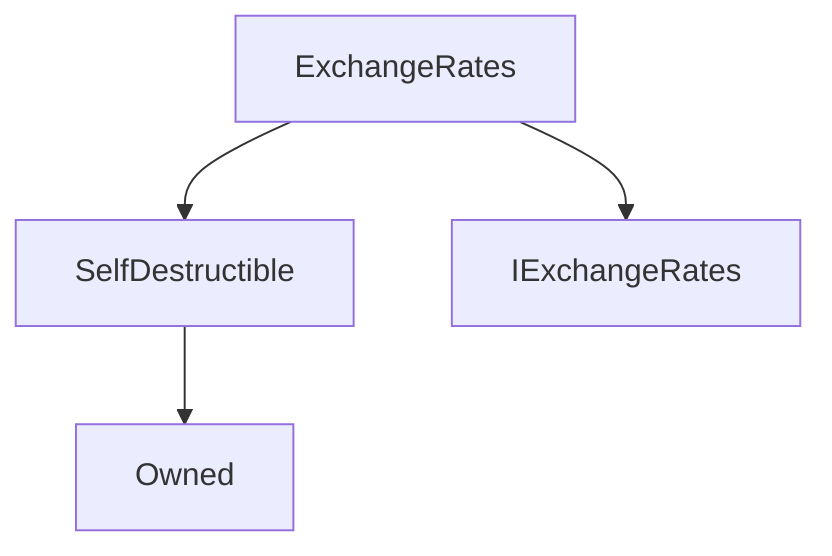

# ExchangeRates

**Source:** [contracts/ExchangeRates.sol](https://github.com/Synthetixio/synthetix/tree/develop/contracts/ExchangeRates.sol)

## Architecture

### Inheritance Graph

---

## Structs

---

### RateAndUpdatedTime
[Source](https://github.com/Synthetixio/synthetix/tree/develop/contracts/ExchangeRates.sol#L21)

| Field | Type | Description |
| ------ | ------ | ------ |
| rate | uint216 | TBA |
| time | uint40 | TBA |

---

### InversePricing
[Source](https://github.com/Synthetixio/synthetix/tree/develop/contracts/ExchangeRates.sol#L45)

| Field | Type | Description |
| ------ | ------ | ------ |
| entryPoint | uint256 | TBA |
| upperLimit | uint256 | TBA |
| lowerLimit | uint256 | TBA |
| frozen | bool | TBA |

---

## Variables

---

### `oracle`
[Source](https://github.com/Synthetixio/synthetix/tree/develop/contracts/ExchangeRates.sol#L30)

**Type:** `address`

---

### `aggregators`
[Source](https://github.com/Synthetixio/synthetix/tree/develop/contracts/ExchangeRates.sol#L33)

**Type:** `mapping(bytes32 => contract AggregatorInterface)`

---

### `aggregatorKeys`
[Source](https://github.com/Synthetixio/synthetix/tree/develop/contracts/ExchangeRates.sol#L36)

**Type:** `bytes32[]`

---

### `rateStalePeriod`
[Source](https://github.com/Synthetixio/synthetix/tree/develop/contracts/ExchangeRates.sol#L42)

**Type:** `uint256`

---

### `inversePricing`
[Source](https://github.com/Synthetixio/synthetix/tree/develop/contracts/ExchangeRates.sol#L51)

**Type:** `mapping(bytes32 => struct ExchangeRates.InversePricing)`

---

### `invertedKeys`
[Source](https://github.com/Synthetixio/synthetix/tree/develop/contracts/ExchangeRates.sol#L52)

**Type:** `bytes32[]`

---

### `currentRoundForRate`
[Source](https://github.com/Synthetixio/synthetix/tree/develop/contracts/ExchangeRates.sol#L54)

**Type:** `mapping(bytes32 => uint256)`

---

## Functions

---

### `constructor`
[Source](https://github.com/Synthetixio/synthetix/tree/develop/contracts/ExchangeRates.sol#L59)

??? example "Details"

    **Signature**

    `(address _owner, address _oracle, bytes32[] _currencyKeys, uint256[] _newRates) public`

    **Modifiers**

    * [Owned](#owned)

    * [SelfDestructible](#selfdestructible)

---

### `setOracle`
[Source](https://github.com/Synthetixio/synthetix/tree/develop/contracts/ExchangeRates.sol#L77)

??? example "Details"

    **Signature**

    `setOracle(address _oracle) external`

    **Modifiers**

    * [onlyOwner](#onlyowner)

    **Emits**

    * [OracleUpdated](#oracleupdated)

---

### `setRateStalePeriod`
[Source](https://github.com/Synthetixio/synthetix/tree/develop/contracts/ExchangeRates.sol#L82)

??? example "Details"

    **Signature**

    `setRateStalePeriod(uint256 _time) external`

    **Modifiers**

    * [onlyOwner](#onlyowner)

    **Emits**

    * [RateStalePeriodUpdated](#ratestaleperiodupdated)

---

### `updateRates`
[Source](https://github.com/Synthetixio/synthetix/tree/develop/contracts/ExchangeRates.sol#L97)

??? example "Details"

    **Signature**

    `updateRates(bytes32[] currencyKeys, uint256[] newRates, uint256 timeSent) external`

    **Modifiers**

    * [onlyOracle](#onlyoracle)

---

### `deleteRate`
[Source](https://github.com/Synthetixio/synthetix/tree/develop/contracts/ExchangeRates.sol#L109)

??? example "Details"

    **Signature**

    `deleteRate(bytes32 currencyKey) external`

    **Modifiers**

    * [onlyOracle](#onlyoracle)

    **Emits**

    * [RateDeleted](#ratedeleted)

---

### `setInversePricing`
[Source](https://github.com/Synthetixio/synthetix/tree/develop/contracts/ExchangeRates.sol#L135)

??? example "Details"

    **Signature**

    `setInversePricing(bytes32 currencyKey, uint256 entryPoint, uint256 upperLimit, uint256 lowerLimit, bool freeze, bool freezeAtUpperLimit) external`

    **Modifiers**

    * [onlyOwner](#onlyowner)

    **Emits**

    * [InversePriceConfigured](#inversepriceconfigured)

---

### `removeInversePricing`
[Source](https://github.com/Synthetixio/synthetix/tree/develop/contracts/ExchangeRates.sol#L174)

??? example "Details"

    **Signature**

    `removeInversePricing(bytes32 currencyKey) external`

    **Modifiers**

    * [onlyOwner](#onlyowner)

---

### `addAggregator`
[Source](https://github.com/Synthetixio/synthetix/tree/develop/contracts/ExchangeRates.sol#L194)

??? example "Details"

    **Signature**

    `addAggregator(bytes32 currencyKey, address aggregatorAddress) external`

    **Modifiers**

    * [onlyOwner](#onlyowner)

    **Emits**

    * [AggregatorAdded](#aggregatoradded)

---

### `removeAggregator`
[Source](https://github.com/Synthetixio/synthetix/tree/develop/contracts/ExchangeRates.sol#L208)

??? example "Details"

    **Signature**

    `removeAggregator(bytes32 currencyKey) external`

    **Modifiers**

    * [onlyOwner](#onlyowner)

---

### `getLastRoundIdBeforeElapsedSecs`
[Source](https://github.com/Synthetixio/synthetix/tree/develop/contracts/ExchangeRates.sol#L220)

??? example "Details"

    **Signature**

    `getLastRoundIdBeforeElapsedSecs(bytes32 currencyKey, uint256 startingRoundId, uint256 startingTimestamp, uint256 timediff) external`

---

### `getCurrentRoundId`
[Source](https://github.com/Synthetixio/synthetix/tree/develop/contracts/ExchangeRates.sol#L239)

??? example "Details"

    **Signature**

    `getCurrentRoundId(bytes32 currencyKey) external`

---

### `effectiveValueAtRound`
[Source](https://github.com/Synthetixio/synthetix/tree/develop/contracts/ExchangeRates.sol#L248)

??? example "Details"

    **Signature**

    `effectiveValueAtRound(bytes32 sourceCurrencyKey, uint256 sourceAmount, bytes32 destinationCurrencyKey, uint256 roundIdForSrc, uint256 roundIdForDest) external`

    **Modifiers**

    * [rateNotStale](#ratenotstale)

    * [rateNotStale](#ratenotstale)

---

### `rateAndTimestampAtRound`
[Source](https://github.com/Synthetixio/synthetix/tree/develop/contracts/ExchangeRates.sol#L264)

??? example "Details"

    **Signature**

    `rateAndTimestampAtRound(bytes32 currencyKey, uint256 roundId) external`

---

### `lastRateUpdateTimes`
[Source](https://github.com/Synthetixio/synthetix/tree/develop/contracts/ExchangeRates.sol#L273)

??? example "Details"

    **Signature**

    `lastRateUpdateTimes(bytes32 currencyKey) public`

---

### `lastRateUpdateTimesForCurrencies`
[Source](https://github.com/Synthetixio/synthetix/tree/develop/contracts/ExchangeRates.sol#L280)

??? example "Details"

    **Signature**

    `lastRateUpdateTimesForCurrencies(bytes32[] currencyKeys) public`

---

### `effectiveValue`
[Source](https://github.com/Synthetixio/synthetix/tree/develop/contracts/ExchangeRates.sol#L296)

??? example "Details"

    **Signature**

    `effectiveValue(bytes32 sourceCurrencyKey, uint256 sourceAmount, bytes32 destinationCurrencyKey) public`

    **Modifiers**

    * [rateNotStale](#ratenotstale)

    * [rateNotStale](#ratenotstale)

---

### `rateForCurrency`
[Source](https://github.com/Synthetixio/synthetix/tree/develop/contracts/ExchangeRates.sol#L314)

??? example "Details"

    **Signature**

    `rateForCurrency(bytes32 currencyKey) external`

---

### `ratesForCurrencies`
[Source](https://github.com/Synthetixio/synthetix/tree/develop/contracts/ExchangeRates.sol#L321)

??? example "Details"

    **Signature**

    `ratesForCurrencies(bytes32[] currencyKeys) external`

---

### `ratesAndStaleForCurrencies`
[Source](https://github.com/Synthetixio/synthetix/tree/develop/contracts/ExchangeRates.sol#L334)

??? example "Details"

    **Signature**

    `ratesAndStaleForCurrencies(bytes32[] currencyKeys) external`

---

### `rateIsStale`
[Source](https://github.com/Synthetixio/synthetix/tree/develop/contracts/ExchangeRates.sol#L353)

??? example "Details"

    **Signature**

    `rateIsStale(bytes32 currencyKey) public`

---

### `rateIsFrozen`
[Source](https://github.com/Synthetixio/synthetix/tree/develop/contracts/ExchangeRates.sol#L363)

??? example "Details"

    **Signature**

    `rateIsFrozen(bytes32 currencyKey) external`

---

### `anyRateIsStale`
[Source](https://github.com/Synthetixio/synthetix/tree/develop/contracts/ExchangeRates.sol#L370)

??? example "Details"

    **Signature**

    `anyRateIsStale(bytes32[] currencyKeys) external`

---

## Modifiers

---

### `rateNotStale`
[Source](https://github.com/Synthetixio/synthetix/tree/develop/contracts/ExchangeRates.sol#L559)

---

### `onlyOracle`
[Source](https://github.com/Synthetixio/synthetix/tree/develop/contracts/ExchangeRates.sol#L564)

---

## Events

---

### `OracleUpdated`
[Source](https://github.com/Synthetixio/synthetix/tree/develop/contracts/ExchangeRates.sol#L571)

- `(address newOracle)`

---

### `RateStalePeriodUpdated`
[Source](https://github.com/Synthetixio/synthetix/tree/develop/contracts/ExchangeRates.sol#L572)

- `(uint256 rateStalePeriod)`

---

### `RatesUpdated`
[Source](https://github.com/Synthetixio/synthetix/tree/develop/contracts/ExchangeRates.sol#L573)

- `(bytes32[] currencyKeys, uint256[] newRates)`

---

### `RateDeleted`
[Source](https://github.com/Synthetixio/synthetix/tree/develop/contracts/ExchangeRates.sol#L574)

- `(bytes32 currencyKey)`

---

### `InversePriceConfigured`
[Source](https://github.com/Synthetixio/synthetix/tree/develop/contracts/ExchangeRates.sol#L575)

- `(bytes32 currencyKey, uint256 entryPoint, uint256 upperLimit, uint256 lowerLimit)`

---

### `InversePriceFrozen`
[Source](https://github.com/Synthetixio/synthetix/tree/develop/contracts/ExchangeRates.sol#L576)

- `(bytes32 currencyKey)`

---

### `AggregatorAdded`
[Source](https://github.com/Synthetixio/synthetix/tree/develop/contracts/ExchangeRates.sol#L577)

- `(bytes32 currencyKey, address aggregator)`

---

### `AggregatorRemoved`
[Source](https://github.com/Synthetixio/synthetix/tree/develop/contracts/ExchangeRates.sol#L578)

- `(bytes32 currencyKey, address aggregator)`

---

