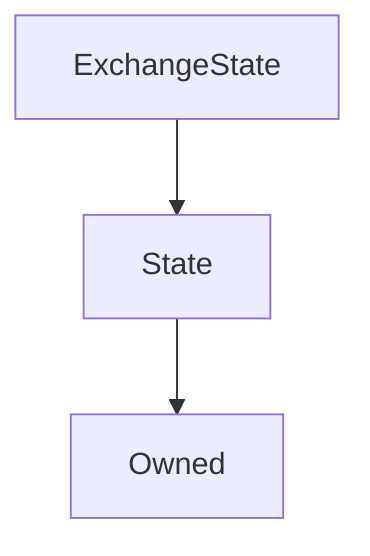

# ExchangeState

**Source:** [ExchangeState.sol](https://github.com/Synthetixio/synthetix/blob/master/contracts/ExchangeState.sol)

!!! todo "Work in Progress"

    This needs filling in

## Description

... todo.

**Source:** [contracts/ExchangeState.sol](https://github.com/Synthetixio/synthetix/tree/v2.21.15/contracts/ExchangeState.sol)

## Architecture

... todo.

<!--centered-image>
    
</centered-image-->

---
### Inheritance Graph

---
### Related Contracts

- ?

## Views

## Variables

---
### `exchanges`

[Source](https://github.com/Synthetixio/synthetix/tree/v2.21.15/contracts/ExchangeState.sol#L22)

**Type:** `mapping(address => mapping(bytes32 => struct ExchangeState.ExchangeEntry[]))`

---
### `maxEntriesInQueue`

[Source](https://github.com/Synthetixio/synthetix/tree/v2.21.15/contracts/ExchangeState.sol#L24)

**Type:** `uint256`

## Structs

---
### `ExchangeEntry`

[Source](https://github.com/Synthetixio/synthetix/tree/v2.21.15/contracts/ExchangeState.sol#L11)

| Field | Type | Description |
| ------ | ------ | ------ |
| src | bytes32 | TBA |
| amount | uint256 | TBA |
| dest | bytes32 | TBA |
| amountReceived | uint256 | TBA |
| exchangeFeeRate | uint256 | TBA |
| timestamp | uint256 | TBA |
| roundIdForSrc | uint256 | TBA |
| roundIdForDest | uint256 | TBA |

## Function (Constructor)

---
### `constructor`

[Source](https://github.com/Synthetixio/synthetix/tree/v2.21.15/contracts/ExchangeState.sol#L26)

??? example "Details"

    **Signature**

    `(address _owner, address _associatedContract)`

    **State Mutability**

    `nonpayable`

    **Modifiers**

    * [Owned](#owned)

    * [State](#state)

## Functions

---
### `appendExchangeEntry`

[Source](https://github.com/Synthetixio/synthetix/tree/v2.21.15/contracts/ExchangeState.sol#L36)

??? example "Details"

    **Signature**

    `appendExchangeEntry(address account, bytes32 src, uint256 amount, bytes32 dest, uint256 amountReceived, uint256 exchangeFeeRate, uint256 timestamp, uint256 roundIdForSrc, uint256 roundIdForDest)`

    **State Mutability**

    `nonpayable`

    **Requires**

    * [require(..., Max queue length reached)](https://github.com/Synthetixio/synthetix/tree/v2.21.15/contracts/ExchangeState.sol#L47)

    **Modifiers**

    * [onlyAssociatedContract](#onlyassociatedcontract)

---
### `getEntryAt`

[Source](https://github.com/Synthetixio/synthetix/tree/v2.21.15/contracts/ExchangeState.sol#L73)

??? example "Details"

    **Signature**

    `getEntryAt(address account, bytes32 currencyKey, uint256 index)`

    **State Mutability**

    `view`

---
### `getLengthOfEntries`

[Source](https://github.com/Synthetixio/synthetix/tree/v2.21.15/contracts/ExchangeState.sol#L69)

??? example "Details"

    **Signature**

    `getLengthOfEntries(address account, bytes32 currencyKey)`

    **State Mutability**

    `view`

---
### `getMaxTimestamp`

[Source](https://github.com/Synthetixio/synthetix/tree/v2.21.15/contracts/ExchangeState.sol#L104)

??? example "Details"

    **Signature**

    `getMaxTimestamp(address account, bytes32 currencyKey)`

    **State Mutability**

    `view`

---
### `removeEntries`

[Source](https://github.com/Synthetixio/synthetix/tree/v2.21.15/contracts/ExchangeState.sol#L63)

??? example "Details"

    **Signature**

    `removeEntries(address account, bytes32 currencyKey)`

    **State Mutability**

    `nonpayable`

    **Modifiers**

    * [onlyAssociatedContract](#onlyassociatedcontract)

## Functions (onlyOwner)

---
### `setMaxEntriesInQueue`

[Source](https://github.com/Synthetixio/synthetix/tree/v2.21.15/contracts/ExchangeState.sol#L30)

??? example "Details"

    **Signature**

    `setMaxEntriesInQueue(uint256 _maxEntriesInQueue)`

    **State Mutability**

    `nonpayable`

    **Modifiers**

    * [onlyOwner](#onlyowner)

## Internal & Restricted Mutative Functions

## Owner Mutative Functions

## Public Mutative Functions

