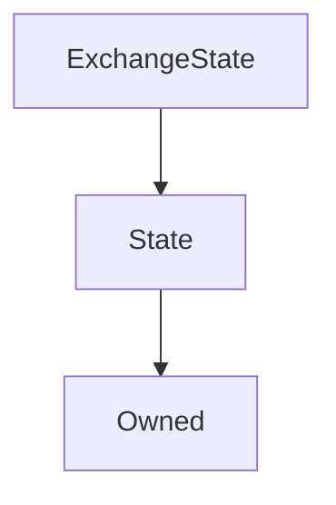

# ExchangeState

**Source:** [ExchangeState.sol](https://github.com/Synthetixio/synthetix/blob/master/contracts/ExchangeState.sol)


!!! todo "Work in Progress"


```
This needs filling in
```

## Description

... todo.


**Source:** [contracts/ExchangeState.sol](https://github.com/Synthetixio/synthetix/tree/develop/contracts/ExchangeState.sol)

## Architecture

... todo.


<!--centered-image>
    
</centered-image-->


---
### Inheritance Graph




---
### Related Contracts

- ?

## Constants

## Variables


---
### `exchanges`

<sub>[Source](https://github.com/Synthetixio/synthetix/tree/develop/contracts/ExchangeState.sol#L22)</sub>


**Type:** `mapping(address => mapping(bytes32 => struct ExchangeState.ExchangeEntry[]))`


---
### `maxEntriesInQueue`

<sub>[Source](https://github.com/Synthetixio/synthetix/tree/develop/contracts/ExchangeState.sol#L24)</sub>


**Type:** `uint256`

## Views

## Public Mutative Functions

## Owner Mutative Functions

## Internal & Restricted Mutative Functions

## Structs


---
### `ExchangeEntry`

<sub>[Source](https://github.com/Synthetixio/synthetix/tree/develop/contracts/ExchangeState.sol#L11)</sub>


| Field | Type |
| ------ | ------ |
| src | bytes32 |
| amount | uint256 |
| dest | bytes32 |
| amountReceived | uint256 |
| exchangeFeeRate | uint256 |
| timestamp | uint256 |
| roundIdForSrc | uint256 |
| roundIdForDest | uint256 |


## Functions


---
### `constructor`

<sub>[Source](https://github.com/Synthetixio/synthetix/tree/develop/contracts/ExchangeState.sol#L26)</sub>


??? example "Details"

    **Signature**

    `(address _owner, address _associatedContract) public`

    **Modifiers**

    * [Owned](#owned)

    * [State](#state)


---
### `setMaxEntriesInQueue`

<sub>[Source](https://github.com/Synthetixio/synthetix/tree/develop/contracts/ExchangeState.sol#L30)</sub>


??? example "Details"

    **Signature**

    `setMaxEntriesInQueue(uint256 _maxEntriesInQueue) external`

    **Modifiers**

    * [onlyOwner](#onlyowner)


---
### `appendExchangeEntry`

<sub>[Source](https://github.com/Synthetixio/synthetix/tree/develop/contracts/ExchangeState.sol#L36)</sub>


??? example "Details"

    **Signature**

    `appendExchangeEntry(address account, bytes32 src, uint256 amount, bytes32 dest, uint256 amountReceived, uint256 exchangeFeeRate, uint256 timestamp, uint256 roundIdForSrc, uint256 roundIdForDest) external`

    **Requires**

    * [require(..., Max queue length reached)](https://github.com/Synthetixio/synthetix/tree/develop/contracts/ExchangeState.sol#L47)

    **Modifiers**

    * [onlyAssociatedContract](#onlyassociatedcontract)


---
### `removeEntries`

<sub>[Source](https://github.com/Synthetixio/synthetix/tree/develop/contracts/ExchangeState.sol#L63)</sub>


??? example "Details"

    **Signature**

    `removeEntries(address account, bytes32 currencyKey) external`

    **Modifiers**

    * [onlyAssociatedContract](#onlyassociatedcontract)


---
### `getLengthOfEntries`

<sub>[Source](https://github.com/Synthetixio/synthetix/tree/develop/contracts/ExchangeState.sol#L69)</sub>


??? example "Details"

    **Signature**

    `getLengthOfEntries(address account, bytes32 currencyKey) external`


---
### `getEntryAt`

<sub>[Source](https://github.com/Synthetixio/synthetix/tree/develop/contracts/ExchangeState.sol#L73)</sub>


??? example "Details"

    **Signature**

    `getEntryAt(address account, bytes32 currencyKey, uint256 index) external`


---
### `getMaxTimestamp`

<sub>[Source](https://github.com/Synthetixio/synthetix/tree/develop/contracts/ExchangeState.sol#L104)</sub>


??? example "Details"

    **Signature**

    `getMaxTimestamp(address account, bytes32 currencyKey) external`

