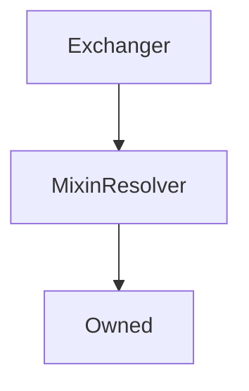

# Exchanger

??? todo "Work In Progress"

    Ongoing...

## Description

Performs all the heavy lifting internally of `exchange` and `settle` functionality.

**Source:** [contracts/Exchanger.sol](https://github.com/Synthetixio/synthetix/tree/v2.21.15/contracts/Exchanger.sol)

## Architecture

---
### Inheritance Graph

---
### Related Contracts

<centered-image>
    
</centered-image>

---
### Libraries

- [SafeMath](/libraries/SafeMath) for `uint`
- [SafeDecimalMath](/libraries/SafeDecimalMath) for `uint`

## Constructor

<!-- E.g.
The constructor initialises the various addresses that this contract knows about, as well as the inherited [`ExternStateToken`](ExternStateToken.md) instance.

??? example "Details"

    **Signature**

    `constructor(address _proxy, TokenState _tokenState, SynthetixState _synthetixState, address _owner, ExchangeRates _exchangeRates, FeePool _feePool, SupplySchedule _supplySchedule, SynthetixEscrow _rewardEscrow, SynthetixEscrow _escrow, RewardsDistribution _rewardsDistribution, uint _totalSupply) public`

    **Superconstructors**

    * [`ExternStateToken(_proxy, _tokenState, TOKEN_NAME, TOKEN_SYMBOL, _totalSupply, DECIMALS, _owner)`](ExternStateToken.md#constructor)

-->

## Views

---
### `feeRateForExchange`

Determine the effective fee rate for the exchange, taking into considering swing trading.

??? example "Details"

    **Signature**
    
    `feeRateForExchange(bytes32 sourceCurrencyKey, bytes32 destinationCurrencyKey) public view returns (uint)`

---
### `maxSecsLeftInWaitingPeriod`

Returns the maximum number of seconds remaining in the waiting period for all exchanges into the given synth (`currencyKey`) by the account.

This number must be `0` in order for [`settle()`](#settle) to succeed.

??? example "Details"

    **Signature**
    
    `maxSecsLeftInWaitingPeriod(address account, bytes32 currencyKey) public view returns (uint)`

---
### `settlementOwing`

Returns the total amount to be reclaimed or rebated for the given account and synth (`currencyKey`). Note: this function can be called at any time, even while the waiting period has not expired.

??? example "Details"

    **Signature**
    
    `settlementOwing(address account, bytes32 currencyKey) public view returns (uint reclaimAmount, uint rebateAmount)`

## Constants

---
### `CONTRACT_DELEGATEAPPROVALS`

[Source](https://github.com/Synthetixio/synthetix/tree/v2.21.15/contracts/Exchanger.sol#L62)

**Type:** `bytes32`

---
### `CONTRACT_EXCHANGESTATE`

[Source](https://github.com/Synthetixio/synthetix/tree/v2.21.15/contracts/Exchanger.sol#L58)

**Type:** `bytes32`

---
### `CONTRACT_EXRATES`

[Source](https://github.com/Synthetixio/synthetix/tree/v2.21.15/contracts/Exchanger.sol#L59)

**Type:** `bytes32`

---
### `CONTRACT_FEEPOOL`

[Source](https://github.com/Synthetixio/synthetix/tree/v2.21.15/contracts/Exchanger.sol#L61)

**Type:** `bytes32`

---
### `CONTRACT_SYNTHETIX`

[Source](https://github.com/Synthetixio/synthetix/tree/v2.21.15/contracts/Exchanger.sol#L60)

**Type:** `bytes32`

---
### `CONTRACT_SYSTEMSTATUS`

[Source](https://github.com/Synthetixio/synthetix/tree/v2.21.15/contracts/Exchanger.sol#L57)

**Type:** `bytes32`

---
### `sUSD`

[Source](https://github.com/Synthetixio/synthetix/tree/v2.21.15/contracts/Exchanger.sol#L51)

**Type:** `bytes32`

## Variables

---
### `addressesToCache`

[Source](https://github.com/Synthetixio/synthetix/tree/v2.21.15/contracts/Exchanger.sol#L64)

**Type:** `bytes32[24]`

---
### `waitingPeriodSecs`

[Source](https://github.com/Synthetixio/synthetix/tree/v2.21.15/contracts/Exchanger.sol#L53)

**Type:** `uint256`

## Modifiers

---
### `onlySynthetixorSynth`

[Source](https://github.com/Synthetixio/synthetix/tree/v2.21.15/contracts/Exchanger.sol#L445)

<!-- E.g.
---
---
---
### `notFeeAddress`

The transaction is reverted if the given account is the [fee address](FeePool.md#fee_address).

**Signature:** `notFeeAddress(address account)`
-->

## Function (Constructor)

---
### `constructor`

[Source](https://github.com/Synthetixio/synthetix/tree/v2.21.15/contracts/Exchanger.sol#L73)

??? example "Details"

    **Signature**

    `(address _owner, address _resolver)`

    **State Mutability**

    `nonpayable`

    **Modifiers**

    * [Owned](#owned)

    * [MixinResolver](#mixinresolver)

## Functions

---
### `calculateAmountAfterSettlement`

[Source](https://github.com/Synthetixio/synthetix/tree/v2.21.15/contracts/Exchanger.sol#L172)

??? example "Details"

    **Signature**

    `calculateAmountAfterSettlement(address from, bytes32 currencyKey, uint256 amount, uint256 refunded)`

    **State Mutability**

    `view`

---
### `exchange`

[Source](https://github.com/Synthetixio/synthetix/tree/v2.21.15/contracts/Exchanger.sol#L195)

??? example "Details"

    **Signature**

    `exchange(address from, bytes32 sourceCurrencyKey, uint256 sourceAmount, bytes32 destinationCurrencyKey, address destinationAddress)`

    **State Mutability**

    `nonpayable`

    **Modifiers**

    * [onlySynthetixorSynth](#onlysynthetixorsynth)

---
### `exchangeOnBehalf`

[Source](https://github.com/Synthetixio/synthetix/tree/v2.21.15/contracts/Exchanger.sol#L205)

??? example "Details"

    **Signature**

    `exchangeOnBehalf(address exchangeForAddress, address from, bytes32 sourceCurrencyKey, uint256 sourceAmount, bytes32 destinationCurrencyKey)`

    **State Mutability**

    `nonpayable`

    **Requires**

    * [require(..., Not approved to act on behalf)](https://github.com/Synthetixio/synthetix/tree/v2.21.15/contracts/Exchanger.sol#L212)

    **Modifiers**

    * [onlySynthetixorSynth](#onlysynthetixorsynth)

---
### `feeRateForExchange`

[Source](https://github.com/Synthetixio/synthetix/tree/v2.21.15/contracts/Exchanger.sol#L108)

??? example "Details"

    **Signature**

    `feeRateForExchange(bytes32 , bytes32 )`

    **State Mutability**

    `view`

---
### `maxSecsLeftInWaitingPeriod`

[Source](https://github.com/Synthetixio/synthetix/tree/v2.21.15/contracts/Exchanger.sol#L103)

??? example "Details"

    **Signature**

    `maxSecsLeftInWaitingPeriod(address account, bytes32 currencyKey)`

    **State Mutability**

    `view`

---
### `settle`

[Source](https://github.com/Synthetixio/synthetix/tree/v2.21.15/contracts/Exchanger.sol#L304)

??? example "Details"

    **Signature**

    `settle(address from, bytes32 currencyKey)`

    **State Mutability**

    `nonpayable`

---
### `settlementOwing`

[Source](https://github.com/Synthetixio/synthetix/tree/v2.21.15/contracts/Exchanger.sol#L118)

??? example "Details"

    **Signature**

    `settlementOwing(address account, bytes32 currencyKey)`

    **State Mutability**

    `view`

## Functions (Internal)

---
### `_exchange`

[Source](https://github.com/Synthetixio/synthetix/tree/v2.21.15/contracts/Exchanger.sol#L222)

??? example "Details"

    **Signature**

    `_exchange(address from, bytes32 sourceCurrencyKey, uint256 sourceAmount, bytes32 destinationCurrencyKey, address destinationAddress)`

    **State Mutability**

    `nonpayable`

    **Requires**

    * [require(..., Can't be same synth)](https://github.com/Synthetixio/synthetix/tree/v2.21.15/contracts/Exchanger.sol#L235)

    * [require(..., Zero amount)](https://github.com/Synthetixio/synthetix/tree/v2.21.15/contracts/Exchanger.sol#L236)

---
### `_internalSettle`

[Source](https://github.com/Synthetixio/synthetix/tree/v2.21.15/contracts/Exchanger.sol#L336)

??? example "Details"

    **Signature**

    `_internalSettle(address from, bytes32 currencyKey)`

    **State Mutability**

    `nonpayable`

    **Requires**

    * [require(..., Cannot settle during waiting period)](https://github.com/Synthetixio/synthetix/tree/v2.21.15/contracts/Exchanger.sol#L344)

---
### `appendExchange`

[Source](https://github.com/Synthetixio/synthetix/tree/v2.21.15/contracts/Exchanger.sol#L406)

??? example "Details"

    **Signature**

    `appendExchange(address account, bytes32 src, uint256 amount, bytes32 dest, uint256 amountReceived)`

    **State Mutability**

    `nonpayable`

---
### `calculateExchangeAmountMinusFees`

[Source](https://github.com/Synthetixio/synthetix/tree/v2.21.15/contracts/Exchanger.sol#L390)

??? example "Details"

    **Signature**

    `calculateExchangeAmountMinusFees(bytes32 sourceCurrencyKey, bytes32 destinationCurrencyKey, uint256 destinationAmount)`

    **State Mutability**

    `view`

---
### `delegateApprovals`

[Source](https://github.com/Synthetixio/synthetix/tree/v2.21.15/contracts/Exchanger.sol#L99)

??? example "Details"

    **Signature**

    `delegateApprovals()`

    **State Mutability**

    `view`

---
### `exchangeRates`

[Source](https://github.com/Synthetixio/synthetix/tree/v2.21.15/contracts/Exchanger.sol#L87)

??? example "Details"

    **Signature**

    `exchangeRates()`

    **State Mutability**

    `view`

---
### `exchangeState`

[Source](https://github.com/Synthetixio/synthetix/tree/v2.21.15/contracts/Exchanger.sol#L83)

??? example "Details"

    **Signature**

    `exchangeState()`

    **State Mutability**

    `view`

---
### `feePool`

[Source](https://github.com/Synthetixio/synthetix/tree/v2.21.15/contracts/Exchanger.sol#L95)

??? example "Details"

    **Signature**

    `feePool()`

    **State Mutability**

    `view`

---
### `getRoundIdsAtPeriodEnd`

[Source](https://github.com/Synthetixio/synthetix/tree/v2.21.15/contracts/Exchanger.sol#L430)

??? example "Details"

    **Signature**

    `getRoundIdsAtPeriodEnd(address account, bytes32 currencyKey, uint256 index)`

    **State Mutability**

    `view`

---
### `reclaim`

[Source](https://github.com/Synthetixio/synthetix/tree/v2.21.15/contracts/Exchanger.sol#L362)

??? example "Details"

    **Signature**

    `reclaim(address from, bytes32 currencyKey, uint256 amount)`

    **State Mutability**

    `nonpayable`

---
### `refund`

[Source](https://github.com/Synthetixio/synthetix/tree/v2.21.15/contracts/Exchanger.sol#L372)

??? example "Details"

    **Signature**

    `refund(address from, bytes32 currencyKey, uint256 amount)`

    **State Mutability**

    `nonpayable`

---
### `remitFee`

[Source](https://github.com/Synthetixio/synthetix/tree/v2.21.15/contracts/Exchanger.sol#L323)

??? example "Details"

    **Signature**

    `remitFee(contract IExchangeRates _exRates, contract ISynthetix _synthetix, uint256 fee, bytes32 currencyKey)`

    **State Mutability**

    `nonpayable`

---
### `secsLeftInWaitingPeriodForExchange`

[Source](https://github.com/Synthetixio/synthetix/tree/v2.21.15/contracts/Exchanger.sol#L382)

??? example "Details"

    **Signature**

    `secsLeftInWaitingPeriodForExchange(uint256 timestamp)`

    **State Mutability**

    `view`

---
### `synthetix`

[Source](https://github.com/Synthetixio/synthetix/tree/v2.21.15/contracts/Exchanger.sol#L91)

??? example "Details"

    **Signature**

    `synthetix()`

    **State Mutability**

    `view`

---
### `systemStatus`

[Source](https://github.com/Synthetixio/synthetix/tree/v2.21.15/contracts/Exchanger.sol#L79)

??? example "Details"

    **Signature**

    `systemStatus()`

    **State Mutability**

    `view`

## Functions (onlyOwner)

---
### `setWaitingPeriodSecs`

[Source](https://github.com/Synthetixio/synthetix/tree/v2.21.15/contracts/Exchanger.sol#L168)

??? example "Details"

    **Signature**

    `setWaitingPeriodSecs(uint256 _waitingPeriodSecs)`

    **State Mutability**

    `nonpayable`

    **Modifiers**

    * [onlyOwner](#onlyowner)

## Internal & Restricted Functions

## Mutative Functions

---
### `settle`

Settle processes all exchanges into the given synth, calculating any `reclaimed` or `refunded` amounts via [`settlementOwing`](#settlementowing) and burning any reclaim and issuing any refund. This function may be called by anyone - the `msg.sender` is irrelevant.

??? example "Details"

    **Signature**
    
    `settle(address from, bytes32 currencyKey) external returns (uint reclaimed, uint refunded)`
    
    **Preconditions**
    
    * That the [waiting period](#maxsecsleftinwaitingperiod) for this synth is `0`

## Owner Functions

<!-- Eg.

---
---
---
### `importAddresses`

Import one or more addresses into the system for the given keys. Note: this function will overrwite any previous entries with the same key names, allowing for inline updates.

??? example "Details"

    **Signature**

    `importAddresses(bytes32[] names, address[] destinations) public`

    **Modifiers**

    * [`Owned.onlyOwner`](Owned.md#onlyowner)

    **Preconditions**

    * The length of `names` must match the length of `destinations`

---

-->

