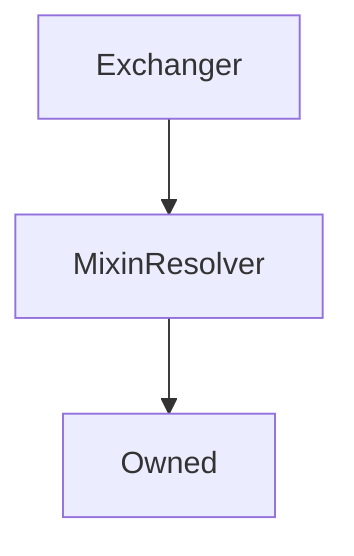

# Exchanger

??? todo "Work In Progress"


```
Ongoing...
```

## Description

Performs all the heavy lifting internally of `exchange` and `settle` functionality.


**Source:** [contracts/Exchanger.sol](https://github.com/Synthetixio/synthetix/tree/develop/contracts/Exchanger.sol)

## Architecture


---
### Inheritance Graph




---
### Related Contracts

<centered-image>
    
</centered-image>


## Constants

<!-- E.g.


---

---

---

---

---
### `TOKEN_NAME`

A constant used to initialise the ERC20 [`ExternStateToken.name`](ExternStateToken.md#name) field upon construction.

**Type:** `string constant`

**Value:** `"Synthetix Network Token"`
-->


## Variables


---
### `waitingPeriodSecs`

<sub>[Source](https://github.com/Synthetixio/synthetix/tree/develop/contracts/Exchanger.sol#L53)</sub>


**Type:** `uint256`

## Constructor

<!-- E.g.
The constructor initialises the various addresses that this contract knows about, as well as the inherited [`ExternStateToken`](ExternStateToken.md) instance.

??? example "Details"

    **Signature**

    `constructor(address _proxy, TokenState _tokenState, SynthetixState _synthetixState, address _owner, ExchangeRates _exchangeRates, FeePool _feePool, SupplySchedule _supplySchedule, SynthetixEscrow _rewardEscrow, SynthetixEscrow _escrow, RewardsDistribution _rewardsDistribution, uint _totalSupply) public`

    **Superconstructors**

    * [`ExternStateToken(_proxy, _tokenState, TOKEN_NAME, TOKEN_SYMBOL, _totalSupply, DECIMALS, _owner)`](ExternStateToken.md#constructor)

-->


## Views


---
### `feeRateForExchange`

Determine the effective fee rate for the exchange, taking into considering swing trading.


??? example "Details"


```
**Signature**

`feeRateForExchange(bytes32 sourceCurrencyKey, bytes32 destinationCurrencyKey) public view returns (uint)`
```


---
### `maxSecsLeftInWaitingPeriod`

Returns the maximum number of seconds remaining in the waiting period for all exchanges into the given synth (`currencyKey`) by the account.


This number must be `0` in order for [`settle()`](#settle) to succeed.


??? example "Details"


```
**Signature**

`maxSecsLeftInWaitingPeriod(address account, bytes32 currencyKey) public view returns (uint)`
```


---
### `settlementOwing`

Returns the total amount to be reclaimed or rebated for the given account and synth (`currencyKey`). Note: this function can be called at any time, even while the waiting period has not expired.


??? example "Details"


```
**Signature**

`settlementOwing(address account, bytes32 currencyKey) public view returns (uint reclaimAmount, uint rebateAmount)`
```

## Mutative Functions


---
### `settle`

Settle processes all exchanges into the given synth, calculating any `reclaimed` or `refunded` amounts via [`settlementOwing`](#settlementowing) and burning any reclaim and issuing any refund. This function may be called by anyone - the `msg.sender` is irrelevant.


??? example "Details"


```
**Signature**

`settle(address from, bytes32 currencyKey) external returns (uint reclaimed, uint refunded)`

**Preconditions**

* That the [waiting period](#maxsecsleftinwaitingperiod) for this synth is `0`
```

## Owner Functions

<!-- Eg.


---

---

---

---

---
### `importAddresses`

Import one or more addresses into the system for the given keys. Note: this function will overrwite any previous entries with the same key names, allowing for inline updates.

??? example "Details"

    **Signature**

    `importAddresses(bytes32[] names, address[] destinations) public`

    **Modifiers**

    * [`Owned.onlyOwner`](Owned.md#onlyowner)

    **Preconditions**

    * The length of `names` must match the length of `destinations`

---


-->


## Internal & Restricted Functions

## Modifiers

<!-- E.g.


---

---

---

---

---
### `notFeeAddress`

The transaction is reverted if the given account is the [fee address](FeePool.md#fee_address).

**Signature:** `notFeeAddress(address account)`
-->


---
### `onlySynthetixorSynth`

<sub>[Source](https://github.com/Synthetixio/synthetix/tree/develop/contracts/Exchanger.sol#L445)</sub>


## Functions


---
### `constructor`

<sub>[Source](https://github.com/Synthetixio/synthetix/tree/develop/contracts/Exchanger.sol#L73)</sub>


??? example "Details"

    **Signature**

    `(address _owner, address _resolver) public`

    **Modifiers**

    * [Owned](#owned)

    * [MixinResolver](#mixinresolver)


---
### `maxSecsLeftInWaitingPeriod`

<sub>[Source](https://github.com/Synthetixio/synthetix/tree/develop/contracts/Exchanger.sol#L103)</sub>


??? example "Details"

    **Signature**

    `maxSecsLeftInWaitingPeriod(address account, bytes32 currencyKey) public`


---
### `feeRateForExchange`

<sub>[Source](https://github.com/Synthetixio/synthetix/tree/develop/contracts/Exchanger.sol#L108)</sub>


??? example "Details"

    **Signature**

    `feeRateForExchange(bytes32 , bytes32 ) public`


---
### `settlementOwing`

<sub>[Source](https://github.com/Synthetixio/synthetix/tree/develop/contracts/Exchanger.sol#L118)</sub>


??? example "Details"

    **Signature**

    `settlementOwing(address account, bytes32 currencyKey) public`


---
### `setWaitingPeriodSecs`

<sub>[Source](https://github.com/Synthetixio/synthetix/tree/develop/contracts/Exchanger.sol#L168)</sub>


??? example "Details"

    **Signature**

    `setWaitingPeriodSecs(uint256 _waitingPeriodSecs) external`

    **Modifiers**

    * [onlyOwner](#onlyowner)


---
### `calculateAmountAfterSettlement`

<sub>[Source](https://github.com/Synthetixio/synthetix/tree/develop/contracts/Exchanger.sol#L172)</sub>


??? example "Details"

    **Signature**

    `calculateAmountAfterSettlement(address from, bytes32 currencyKey, uint256 amount, uint256 refunded) public`


---
### `exchange`

<sub>[Source](https://github.com/Synthetixio/synthetix/tree/develop/contracts/Exchanger.sol#L195)</sub>


??? example "Details"

    **Signature**

    `exchange(address from, bytes32 sourceCurrencyKey, uint256 sourceAmount, bytes32 destinationCurrencyKey, address destinationAddress) external`

    **Modifiers**

    * [onlySynthetixorSynth](#onlysynthetixorsynth)


---
### `exchangeOnBehalf`

<sub>[Source](https://github.com/Synthetixio/synthetix/tree/develop/contracts/Exchanger.sol#L205)</sub>


??? example "Details"

    **Signature**

    `exchangeOnBehalf(address exchangeForAddress, address from, bytes32 sourceCurrencyKey, uint256 sourceAmount, bytes32 destinationCurrencyKey) external`

    **Requires**

    * [require(..., Not approved to act on behalf)](https://github.com/Synthetixio/synthetix/tree/develop/contracts/Exchanger.sol#L212)

    **Modifiers**

    * [onlySynthetixorSynth](#onlysynthetixorsynth)


---
### `settle`

<sub>[Source](https://github.com/Synthetixio/synthetix/tree/develop/contracts/Exchanger.sol#L304)</sub>


??? example "Details"

    **Signature**

    `settle(address from, bytes32 currencyKey) external`

