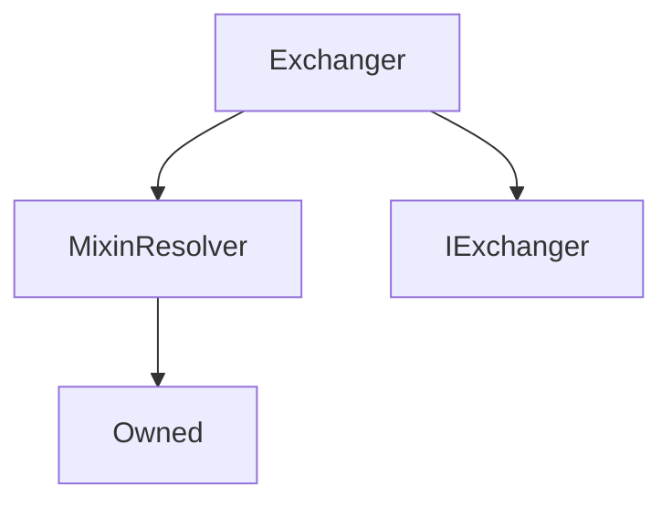

# Exchanger

**Source:** [contracts/Exchanger.sol](https://github.com/Synthetixio/synthetix/tree/develop/contracts/Exchanger.sol)

## Architecture

### Inheritance Graph

---

## Variables

---

### `waitingPeriodSecs`
[Source](https://github.com/Synthetixio/synthetix/tree/develop/contracts/Exchanger.sol#L53)

**Type:** `uint256`

## Functions

---

### `constructor`
[Source](https://github.com/Synthetixio/synthetix/tree/develop/contracts/Exchanger.sol#L73)

??? example "Details"

    **Signature**

    `(address _owner, address _resolver) public`

    **Modifiers**

    * [Owned](#owned)

    * [MixinResolver](#mixinresolver)

---

### `maxSecsLeftInWaitingPeriod`
[Source](https://github.com/Synthetixio/synthetix/tree/develop/contracts/Exchanger.sol#L103)

??? example "Details"

    **Signature**

    `maxSecsLeftInWaitingPeriod(address account, bytes32 currencyKey) public`

---

### `feeRateForExchange`
[Source](https://github.com/Synthetixio/synthetix/tree/develop/contracts/Exchanger.sol#L108)

??? example "Details"

    **Signature**

    `feeRateForExchange(bytes32 , bytes32 ) public`

---

### `settlementOwing`
[Source](https://github.com/Synthetixio/synthetix/tree/develop/contracts/Exchanger.sol#L118)

??? example "Details"

    **Signature**

    `settlementOwing(address account, bytes32 currencyKey) public`

---

### `setWaitingPeriodSecs`
[Source](https://github.com/Synthetixio/synthetix/tree/develop/contracts/Exchanger.sol#L168)

??? example "Details"

    **Signature**

    `setWaitingPeriodSecs(uint256 _waitingPeriodSecs) external`

    **Modifiers**

    * [onlyOwner](#onlyowner)

---

### `calculateAmountAfterSettlement`
[Source](https://github.com/Synthetixio/synthetix/tree/develop/contracts/Exchanger.sol#L172)

??? example "Details"

    **Signature**

    `calculateAmountAfterSettlement(address from, bytes32 currencyKey, uint256 amount, uint256 refunded) public`

---

### `exchange`
[Source](https://github.com/Synthetixio/synthetix/tree/develop/contracts/Exchanger.sol#L195)

??? example "Details"

    **Signature**

    `exchange(address from, bytes32 sourceCurrencyKey, uint256 sourceAmount, bytes32 destinationCurrencyKey, address destinationAddress) external`

    **Modifiers**

    * [onlySynthetixorSynth](#onlysynthetixorsynth)

---

### `exchangeOnBehalf`
[Source](https://github.com/Synthetixio/synthetix/tree/develop/contracts/Exchanger.sol#L205)

??? example "Details"

    **Signature**

    `exchangeOnBehalf(address exchangeForAddress, address from, bytes32 sourceCurrencyKey, uint256 sourceAmount, bytes32 destinationCurrencyKey) external`

    **Requires**

    * [require(..., Not approved to act on behalf)](https://github.com/Synthetixio/synthetix/tree/develop/contracts/Exchanger.sol#L212)

    **Modifiers**

    * [onlySynthetixorSynth](#onlysynthetixorsynth)

---

### `settle`
[Source](https://github.com/Synthetixio/synthetix/tree/develop/contracts/Exchanger.sol#L304)

??? example "Details"

    **Signature**

    `settle(address from, bytes32 currencyKey) external`

---

## Modifiers

---

### `onlySynthetixorSynth`
[Source](https://github.com/Synthetixio/synthetix/tree/develop/contracts/Exchanger.sol#L445)

---

