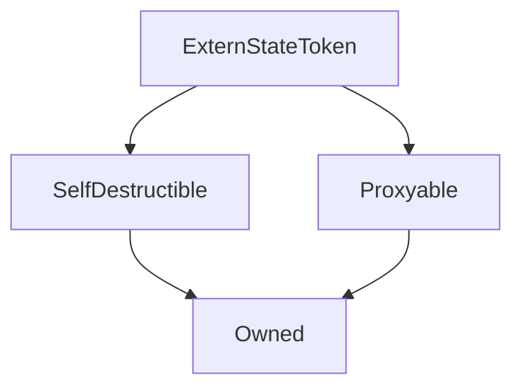

# ExternStateToken

**Source:** [contracts/ExternStateToken.sol](https://github.com/Synthetixio/synthetix/tree/develop/contracts/ExternStateToken.sol)

## Architecture

### Inheritance Graph

---

## Structs

## Variables

---

### `tokenState`
[Source](https://github.com/Synthetixio/synthetix/tree/develop/contracts/ExternStateToken.sol#L23)

**Type:** `contract TokenState`

---

### `name`
[Source](https://github.com/Synthetixio/synthetix/tree/develop/contracts/ExternStateToken.sol#L26)

**Type:** `string`

---

### `symbol`
[Source](https://github.com/Synthetixio/synthetix/tree/develop/contracts/ExternStateToken.sol#L27)

**Type:** `string`

---

### `totalSupply`
[Source](https://github.com/Synthetixio/synthetix/tree/develop/contracts/ExternStateToken.sol#L28)

**Type:** `uint256`

---

### `decimals`
[Source](https://github.com/Synthetixio/synthetix/tree/develop/contracts/ExternStateToken.sol#L29)

**Type:** `uint8`

---

### `TRANSFER_SIG`
[Source](https://github.com/Synthetixio/synthetix/tree/develop/contracts/ExternStateToken.sol#L140)

**Type:** `bytes32`

---

### `APPROVAL_SIG`
[Source](https://github.com/Synthetixio/synthetix/tree/develop/contracts/ExternStateToken.sol#L151)

**Type:** `bytes32`

---

### `TOKENSTATEUPDATED_SIG`
[Source](https://github.com/Synthetixio/synthetix/tree/develop/contracts/ExternStateToken.sol#L162)

**Type:** `bytes32`

## Functions

---

### `constructor`
[Source](https://github.com/Synthetixio/synthetix/tree/develop/contracts/ExternStateToken.sol#L31)

??? example "Details"

    **Signature**

    `(address payable _proxy, contract TokenState _tokenState, string _name, string _symbol, uint256 _totalSupply, uint8 _decimals, address _owner) public`

    **Modifiers**

    * [Owned](#owned)

    * [SelfDestructible](#selfdestructible)

    * [Proxyable](#proxyable)

---

### `allowance`
[Source](https://github.com/Synthetixio/synthetix/tree/develop/contracts/ExternStateToken.sol#L55)

??? example "Details"

    **Signature**

    `allowance(address owner, address spender) public`

---

### `balanceOf`
[Source](https://github.com/Synthetixio/synthetix/tree/develop/contracts/ExternStateToken.sol#L62)

??? example "Details"

    **Signature**

    `balanceOf(address account) external`

---

### `setTokenState`
[Source](https://github.com/Synthetixio/synthetix/tree/develop/contracts/ExternStateToken.sol#L73)

??? example "Details"

    **Signature**

    `setTokenState(contract TokenState _tokenState) external`

    **Modifiers**

    * [optionalProxy_onlyOwner](#optionalproxy_onlyowner)

---

### `approve`
[Source](https://github.com/Synthetixio/synthetix/tree/develop/contracts/ExternStateToken.sol#L126)

??? example "Details"

    **Signature**

    `approve(address spender, uint256 value) public`

    **Modifiers**

    * [optionalProxy](#optionalproxy)

---

## Modifiers

## Events

---

### `Transfer`
[Source](https://github.com/Synthetixio/synthetix/tree/develop/contracts/ExternStateToken.sol#L139)

- `(address from, address to, uint256 value)`

---

### `Approval`
[Source](https://github.com/Synthetixio/synthetix/tree/develop/contracts/ExternStateToken.sol#L150)

- `(address owner, address spender, uint256 value)`

---

### `TokenStateUpdated`
[Source](https://github.com/Synthetixio/synthetix/tree/develop/contracts/ExternStateToken.sol#L161)

- `(address newTokenState)`

---

