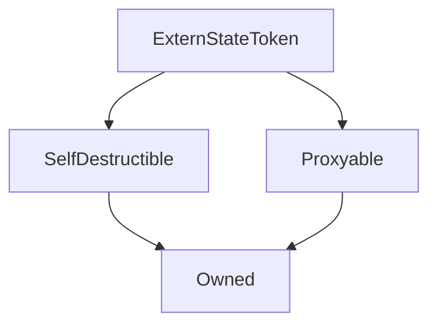

# ExternStateToken

## Description

A partial ERC20 token contract, designed to operate with a proxy.
To produce a complete ERC20 token, `transfer` and `transferFrom`
tokens must be implemented, using the provided \_byProxy internal functions.


For upgradeability, this contract utilises an [external state contract](TokenState.md) to store its balances and allowances.


The main [`Synthetix`](Synthetix.md) contract and all [`Synths`](Synth.md) are ExternStateTokens.


**Source:** [contracts/ExternStateToken.sol](https://github.com/Synthetixio/synthetix/tree/develop/contracts/ExternStateToken.sol)

## Architecture


---
### Inheritance Graph



## Related Contracts

- [`TokenState`](TokenState.md)

## Libraries

- [`SafeMath`](SafeMath.md) for `uint`
- [`SafeDecimalMath`](SafeDecimalMath.md) for `uint`

## Variables


---
### `tokenState`

<sub>[Source](https://github.com/Synthetixio/synthetix/tree/develop/contracts/ExternStateToken.sol#L23)</sub>


The external state contract holding this token's balances and allowances.


**Type:** `contract TokenState`


---
### `name`

<sub>[Source](https://github.com/Synthetixio/synthetix/tree/develop/contracts/ExternStateToken.sol#L26)</sub>


The ERC20 name of this token.


**Type:** `string`


---
### `symbol`

<sub>[Source](https://github.com/Synthetixio/synthetix/tree/develop/contracts/ExternStateToken.sol#L27)</sub>


The ERC20 symbol of this token.


**Type:** `string`


---
### `totalSupply`

<sub>[Source](https://github.com/Synthetixio/synthetix/tree/develop/contracts/ExternStateToken.sol#L28)</sub>


The ERC20 total token supply.


**Type:** `uint256`


---
### `decimals`

<sub>[Source](https://github.com/Synthetixio/synthetix/tree/develop/contracts/ExternStateToken.sol#L29)</sub>


The ERC20 decimal precision of this token. This is usually set to 18 in Synthetix.


**Type:** `uint8`


---
### `TRANSFER_SIG`

<sub>[Source](https://github.com/Synthetixio/synthetix/tree/develop/contracts/ExternStateToken.sol#L140)</sub>


**Type:** `bytes32`


---
### `APPROVAL_SIG`

<sub>[Source](https://github.com/Synthetixio/synthetix/tree/develop/contracts/ExternStateToken.sol#L151)</sub>


**Type:** `bytes32`


---
### `TOKENSTATEUPDATED_SIG`

<sub>[Source](https://github.com/Synthetixio/synthetix/tree/develop/contracts/ExternStateToken.sol#L162)</sub>


**Type:** `bytes32`

## Functions


---
### `constructor`

<sub>[Source](https://github.com/Synthetixio/synthetix/tree/develop/contracts/ExternStateToken.sol#L31)</sub>


Initialises this token's ERC20 fields, its proxy, token state, and its inherited [`SelfDestructible`](SelfDestructible.md) and [`Proxyable`](Proxyable.md) instances.


??? example "Details"

    **Signature**

    `(address payable _proxy, contract TokenState _tokenState, string _name, string _symbol, uint256 _totalSupply, uint8 _decimals, address _owner) public`

    **Modifiers**

    * [Owned](#owned)

    * [SelfDestructible](#selfdestructible)

    * [Proxyable](#proxyable)


---
### `allowance`

<sub>[Source](https://github.com/Synthetixio/synthetix/tree/develop/contracts/ExternStateToken.sol#L55)</sub>


Returns the ERC20 allowance of one party to spend on behalf of another.
This information is retrieved from the [`tokenState`](TokenState.md) contract.


??? example "Details"

    **Signature**

    `allowance(address owner, address spender) public`


---
### `balanceOf`

<sub>[Source](https://github.com/Synthetixio/synthetix/tree/develop/contracts/ExternStateToken.sol#L62)</sub>


Returns the ERC20 token balance of the given address.
This information is retrieved from the [`tokenState`](TokenState.md) contract.


??? example "Details"

    **Signature**

    `balanceOf(address account) external`


---
### `setTokenState`

<sub>[Source](https://github.com/Synthetixio/synthetix/tree/develop/contracts/ExternStateToken.sol#L73)</sub>


Allows the owner to set the address of the `tokenState`(TokenState.md) contract.
Unhooking the token state will pause the contract by causing all transactions to revert.


??? example "Details"

    **Signature**

    `setTokenState(contract TokenState _tokenState) external`

    **Modifiers**

    * [optionalProxy_onlyOwner](#optionalproxy_onlyowner)


---
### `_internalTransfer`

Internal ERC20 transfer function used to implement [`_transfer_byProxy`](#_transfer_byproxy) and [`_transferFrom_byProxy`](#_transferfrom_byproxy).


`_internalTransfer` always returns true if the transaction does not revert.


??? example "Details"


```
**Signature**

`_internalTransfer(address from, address to, uint value, bytes data) internal returns (bool)`

**Preconditions**

* The recipient cannot be the zero address.
* The recipient cannot be the token contract itself.
* The recipient cannot be the proxy.
* The sender's token balance must not be less than `value`.

**Emits**

* [`Transfer(from, to, value)`](#transfer)
```


---
### `approve`

<sub>[Source](https://github.com/Synthetixio/synthetix/tree/develop/contracts/ExternStateToken.sol#L126)</sub>


ERC20 approve function.


??? example "Details"

    **Signature**

    `approve(address spender, uint256 value) public`

    **Modifiers**

    * [optionalProxy](#optionalproxy)

## Events


---
### `Transfer`

<sub>[Source](https://github.com/Synthetixio/synthetix/tree/develop/contracts/ExternStateToken.sol#L139)</sub>


Records that an ERC20 transfer occurred.


This event is emitted from the token's [proxy](Proxy.md#_emit) with the `emitTransfer`.


**Signature:** `Transfer(address indexed from, address indexed to, uint value)`


- `(address from, address to, uint256 value)`


---
### `Approval`

<sub>[Source](https://github.com/Synthetixio/synthetix/tree/develop/contracts/ExternStateToken.sol#L150)</sub>


Records that an ERC20 approval occurred.


This event is emitted from the token's [proxy](Proxy.md#_emit) with the `emitApproval`.


**Signature:** `Approval(address indexed owner, address indexed spender, uint value)`


- `(address owner, address spender, uint256 value)`


---
### `TokenStateUpdated`

<sub>[Source](https://github.com/Synthetixio/synthetix/tree/develop/contracts/ExternStateToken.sol#L161)</sub>


Records that the [token state address](#tokenstate) was updated.


This event is emitted from the token's [proxy](Proxy.md#_emit) with the `emitTokenStateUpdated`.


**Signature:** `TokenStateUpdated(address newTokenState)`


- `(address newTokenState)`

