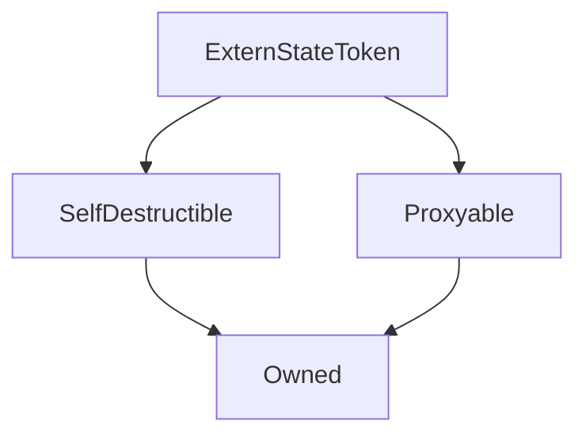

# ExternStateToken

## Description

A partial ERC20 token contract, designed to operate with a proxy.
To produce a complete ERC20 token, `transfer` and `transferFrom`
tokens must be implemented, using the provided \_byProxy internal functions.

For upgradeability, this contract utilises an [external state contract](TokenState.md) to store its balances and allowances.

The main [`Synthetix`](Synthetix.md) contract and all [`Synths`](Synth.md) are ExternStateTokens.

**Source:** [contracts/ExternStateToken.sol](https://github.com/Synthetixio/synthetix/tree/develop/contracts/ExternStateToken.sol)

## Architecture

---
### Inheritance Graph

---
### Libraries

- [SafeMath](/libraries/SafeMath) for `uint`
- [SafeDecimalMath](/libraries/SafeDecimalMath) for `uint`

---
### `APPROVAL_SIG`

[Source](https://github.com/Synthetixio/synthetix/tree/develop/contracts/ExternStateToken.sol#L151)

**Type:** `bytes32`

---
### `TOKENSTATEUPDATED_SIG`

[Source](https://github.com/Synthetixio/synthetix/tree/develop/contracts/ExternStateToken.sol#L162)

**Type:** `bytes32`

---
### `TRANSFER_SIG`

[Source](https://github.com/Synthetixio/synthetix/tree/develop/contracts/ExternStateToken.sol#L140)

**Type:** `bytes32`

## Constants

---
### `APPROVAL_SIG`

[Source](https://github.com/Synthetixio/synthetix/tree/develop/contracts/ExternStateToken.sol#L151)

**Type:** `bytes32`

---
### `TOKENSTATEUPDATED_SIG`

[Source](https://github.com/Synthetixio/synthetix/tree/develop/contracts/ExternStateToken.sol#L162)

**Type:** `bytes32`

---
### `TRANSFER_SIG`

[Source](https://github.com/Synthetixio/synthetix/tree/develop/contracts/ExternStateToken.sol#L140)

**Type:** `bytes32`

## Variables

---
### `decimals`

[Source](https://github.com/Synthetixio/synthetix/tree/develop/contracts/ExternStateToken.sol#L29)

The ERC20 decimal precision of this token. This is usually set to 18 in Synthetix.

**Type:** `uint8`

---
### `name`

[Source](https://github.com/Synthetixio/synthetix/tree/develop/contracts/ExternStateToken.sol#L26)

The ERC20 name of this token.

**Type:** `string`

---
### `symbol`

[Source](https://github.com/Synthetixio/synthetix/tree/develop/contracts/ExternStateToken.sol#L27)

The ERC20 symbol of this token.

**Type:** `string`

---
### `tokenState`

[Source](https://github.com/Synthetixio/synthetix/tree/develop/contracts/ExternStateToken.sol#L23)

The external state contract holding this token's balances and allowances.

**Type:** `contract TokenState`

---
### `totalSupply`

[Source](https://github.com/Synthetixio/synthetix/tree/develop/contracts/ExternStateToken.sol#L28)

The ERC20 total token supply.

**Type:** `uint256`

## Function (Constructor)

---
### `constructor`

[Source](https://github.com/Synthetixio/synthetix/tree/develop/contracts/ExternStateToken.sol#L31)

??? example "Details"

    **Signature**

    `(address payable _proxy, contract TokenState _tokenState, string _name, string _symbol, uint256 _totalSupply, uint8 _decimals, address _owner)`

    **State Mutability**

    `nonpayable`

    **Modifiers**

    * [Owned](#owned)

    * [SelfDestructible](#selfdestructible)

    * [Proxyable](#proxyable)

## Functions

---
### `allowance`

[Source](https://github.com/Synthetixio/synthetix/tree/develop/contracts/ExternStateToken.sol#L55)

Returns the ERC20 allowance of one party to spend on behalf of another.
This information is retrieved from the [`tokenState`](TokenState.md) contract.

??? example "Details"

    **Signature**

    `allowance(address owner, address spender)`

    **State Mutability**

    `view`

---
### `approve`

[Source](https://github.com/Synthetixio/synthetix/tree/develop/contracts/ExternStateToken.sol#L126)

ERC20 approve function.

??? example "Details"

    **Signature**

    `approve(address spender, uint256 value)`

    **State Mutability**

    `nonpayable`

    **Modifiers**

    * [optionalProxy](#optionalproxy)

---
### `balanceOf`

[Source](https://github.com/Synthetixio/synthetix/tree/develop/contracts/ExternStateToken.sol#L62)

Returns the ERC20 token balance of the given address.
This information is retrieved from the [`tokenState`](TokenState.md) contract.

??? example "Details"

    **Signature**

    `balanceOf(address account)`

    **State Mutability**

    `view`

---
### `setTokenState`

[Source](https://github.com/Synthetixio/synthetix/tree/develop/contracts/ExternStateToken.sol#L73)

Allows the owner to set the address of the `tokenState`(TokenState.md) contract.
Unhooking the token state will pause the contract by causing all transactions to revert.

??? example "Details"

    **Signature**

    `setTokenState(contract TokenState _tokenState)`

    **State Mutability**

    `nonpayable`

    **Modifiers**

    * [optionalProxy_onlyOwner](#optionalproxy_onlyowner)

## Functions (Internal)

---
### `_internalTransfer`

[Source](https://github.com/Synthetixio/synthetix/tree/develop/contracts/ExternStateToken.sol#L78)

??? example "Details"

    **Signature**

    `_internalTransfer(address from, address to, uint256 value)`

    **State Mutability**

    `nonpayable`

    **Requires**

    * [require(..., Cannot transfer to this address)](https://github.com/Synthetixio/synthetix/tree/develop/contracts/ExternStateToken.sol#L84)

---
### `_transferByProxy`

[Source](https://github.com/Synthetixio/synthetix/tree/develop/contracts/ExternStateToken.sol#L100)

??? example "Details"

    **Signature**

    `_transferByProxy(address from, address to, uint256 value)`

    **State Mutability**

    `nonpayable`

---
### `_transferFromByProxy`

[Source](https://github.com/Synthetixio/synthetix/tree/develop/contracts/ExternStateToken.sol#L112)

??? example "Details"

    **Signature**

    `_transferFromByProxy(address sender, address from, address to, uint256 value)`

    **State Mutability**

    `nonpayable`

---
### `addressToBytes32`

[Source](https://github.com/Synthetixio/synthetix/tree/develop/contracts/ExternStateToken.sol#L135)

??? example "Details"

    **Signature**

    `addressToBytes32(address input)`

    **State Mutability**

    `pure`

---
### `emitApproval`

[Source](https://github.com/Synthetixio/synthetix/tree/develop/contracts/ExternStateToken.sol#L153)

??? example "Details"

    **Signature**

    `emitApproval(address owner, address spender, uint256 value)`

    **State Mutability**

    `nonpayable`

---
### `emitTokenStateUpdated`

[Source](https://github.com/Synthetixio/synthetix/tree/develop/contracts/ExternStateToken.sol#L164)

??? example "Details"

    **Signature**

    `emitTokenStateUpdated(address newTokenState)`

    **State Mutability**

    `nonpayable`

---
### `emitTransfer`

[Source](https://github.com/Synthetixio/synthetix/tree/develop/contracts/ExternStateToken.sol#L142)

??? example "Details"

    **Signature**

    `emitTransfer(address from, address to, uint256 value)`

    **State Mutability**

    `nonpayable`

## Events

---
### `Approval`

[Source](https://github.com/Synthetixio/synthetix/tree/develop/contracts/ExternStateToken.sol#L150)

Records that an ERC20 approval occurred.

This event is emitted from the token's [proxy](Proxy.md#_emit) with the `emitApproval`.

**Signature:** `Approval(address indexed owner, address indexed spender, uint value)`

- `(address owner, address spender, uint256 value)`

---
### `TokenStateUpdated`

[Source](https://github.com/Synthetixio/synthetix/tree/develop/contracts/ExternStateToken.sol#L161)

Records that the [token state address](#tokenstate) was updated.

This event is emitted from the token's [proxy](Proxy.md#_emit) with the `emitTokenStateUpdated`.

**Signature:** `TokenStateUpdated(address newTokenState)`

- `(address newTokenState)`

---
### `Transfer`

[Source](https://github.com/Synthetixio/synthetix/tree/develop/contracts/ExternStateToken.sol#L139)

Records that an ERC20 transfer occurred.

This event is emitted from the token's [proxy](Proxy.md#_emit) with the `emitTransfer`.

**Signature:** `Transfer(address indexed from, address indexed to, uint value)`

- `(address from, address to, uint256 value)`

