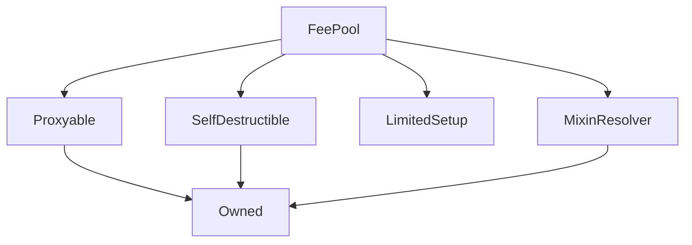

# FeePool

**Source:** [contracts/FeePool.sol](https://github.com/Synthetixio/synthetix/tree/develop/contracts/FeePool.sol)

## Architecture

### Inheritance Graph

---

## Structs

---

### FeePeriod
[Source](https://github.com/Synthetixio/synthetix/tree/develop/contracts/FeePool.sol#L48)

| Field | Type | Description |
| ------ | ------ | ------ |
| feePeriodId | uint64 | TBA |
| startingDebtIndex | uint64 | TBA |
| startTime | uint64 | TBA |
| feesToDistribute | uint256 | TBA |
| feesClaimed | uint256 | TBA |
| rewardsToDistribute | uint256 | TBA |
| rewardsClaimed | uint256 | TBA |

---

## Variables

---

### `exchangeFeeRate`
[Source](https://github.com/Synthetixio/synthetix/tree/develop/contracts/FeePool.sol#L36)

**Type:** `uint256`

---

### `MAX_EXCHANGE_FEE_RATE`
[Source](https://github.com/Synthetixio/synthetix/tree/develop/contracts/FeePool.sol#L39)

**Type:** `uint256`

---

### `FEE_ADDRESS`
[Source](https://github.com/Synthetixio/synthetix/tree/develop/contracts/FeePool.sol#L42)

**Type:** `address`

---

### `FEE_PERIOD_LENGTH`
[Source](https://github.com/Synthetixio/synthetix/tree/develop/contracts/FeePool.sol#L63)

**Type:** `uint8`

---

### `feePeriodDuration`
[Source](https://github.com/Synthetixio/synthetix/tree/develop/contracts/FeePool.sol#L72)

**Type:** `uint256`

---

### `MIN_FEE_PERIOD_DURATION`
[Source](https://github.com/Synthetixio/synthetix/tree/develop/contracts/FeePool.sol#L74)

**Type:** `uint256`

---

### `MAX_FEE_PERIOD_DURATION`
[Source](https://github.com/Synthetixio/synthetix/tree/develop/contracts/FeePool.sol#L75)

**Type:** `uint256`

---

### `targetThreshold`
[Source](https://github.com/Synthetixio/synthetix/tree/develop/contracts/FeePool.sol#L78)

**Type:** `uint256`

---

## Functions

---

### `constructor`
[Source](https://github.com/Synthetixio/synthetix/tree/develop/contracts/FeePool.sol#L110)

??? example "Details"

    **Signature**

    `(address payable _proxy, address _owner, uint256 _exchangeFeeRate, address _resolver) public`

    **Requires**

    * [require(..., Exchange fee rate max exceeded)](https://github.com/Synthetixio/synthetix/tree/develop/contracts/FeePool.sol#L124)

    **Modifiers**

    * [Owned](#owned)

    * [SelfDestructible](#selfdestructible)

    * [Proxyable](#proxyable)

    * [LimitedSetup](#limitedsetup)

    * [MixinResolver](#mixinresolver)

---

### `recentFeePeriods`
[Source](https://github.com/Synthetixio/synthetix/tree/develop/contracts/FeePool.sol#L179)

??? example "Details"

    **Signature**

    `recentFeePeriods(uint256 index) external`

---

### `appendAccountIssuanceRecord`
[Source](https://github.com/Synthetixio/synthetix/tree/develop/contracts/FeePool.sol#L218)

??? example "Details"

    **Signature**

    `appendAccountIssuanceRecord(address account, uint256 debtRatio, uint256 debtEntryIndex) external`

    **Modifiers**

    * [onlyIssuer](#onlyissuer)

---

### `setExchangeFeeRate`
[Source](https://github.com/Synthetixio/synthetix/tree/develop/contracts/FeePool.sol#L237)

??? example "Details"

    **Signature**

    `setExchangeFeeRate(uint256 _exchangeFeeRate) external`

    **Requires**

    * [require(..., rate < MAX_EXCHANGE_FEE_RATE)](https://github.com/Synthetixio/synthetix/tree/develop/contracts/FeePool.sol#L238)

    **Modifiers**

    * [optionalProxy_onlyOwner](#optionalproxy_onlyowner)

---

### `setFeePeriodDuration`
[Source](https://github.com/Synthetixio/synthetix/tree/develop/contracts/FeePool.sol#L245)

??? example "Details"

    **Signature**

    `setFeePeriodDuration(uint256 _feePeriodDuration) external`

    **Requires**

    * [require(..., value < MIN_FEE_PERIOD_DURATION)](https://github.com/Synthetixio/synthetix/tree/develop/contracts/FeePool.sol#L246)

    * [require(..., value > MAX_FEE_PERIOD_DURATION)](https://github.com/Synthetixio/synthetix/tree/develop/contracts/FeePool.sol#L247)

    **Modifiers**

    * [optionalProxy_onlyOwner](#optionalproxy_onlyowner)

---

### `setTargetThreshold`
[Source](https://github.com/Synthetixio/synthetix/tree/develop/contracts/FeePool.sol#L254)

??? example "Details"

    **Signature**

    `setTargetThreshold(uint256 _percent) external`

    **Requires**

    * [require(..., Threshold should be positive)](https://github.com/Synthetixio/synthetix/tree/develop/contracts/FeePool.sol#L255)

    * [require(..., Threshold too high)](https://github.com/Synthetixio/synthetix/tree/develop/contracts/FeePool.sol#L256)

    **Modifiers**

    * [optionalProxy_onlyOwner](#optionalproxy_onlyowner)

---

### `recordFeePaid`
[Source](https://github.com/Synthetixio/synthetix/tree/develop/contracts/FeePool.sol#L264)

??? example "Details"

    **Signature**

    `recordFeePaid(uint256 amount) external`

    **Modifiers**

    * [onlyExchangerOrSynth](#onlyexchangerorsynth)

---

### `setRewardsToDistribute`
[Source](https://github.com/Synthetixio/synthetix/tree/develop/contracts/FeePool.sol#L272)

??? example "Details"

    **Signature**

    `setRewardsToDistribute(uint256 amount) external`

    **Requires**

    * [require(..., Caller is not rewardsAuthority)](https://github.com/Synthetixio/synthetix/tree/develop/contracts/FeePool.sol#L274)

---

### `closeCurrentFeePeriod`
[Source](https://github.com/Synthetixio/synthetix/tree/develop/contracts/FeePool.sol#L282)

??? example "Details"

    **Signature**

    `closeCurrentFeePeriod() external`

    **Requires**

    * [require(..., Too early to close fee period)](https://github.com/Synthetixio/synthetix/tree/develop/contracts/FeePool.sol#L283)

---

### `claimFees`
[Source](https://github.com/Synthetixio/synthetix/tree/develop/contracts/FeePool.sol#L323)

??? example "Details"

    **Signature**

    `claimFees() external`

    **Modifiers**

    * [optionalProxy](#optionalproxy)

---

### `claimOnBehalf`
[Source](https://github.com/Synthetixio/synthetix/tree/develop/contracts/FeePool.sol#L333)

??? example "Details"

    **Signature**

    `claimOnBehalf(address claimingForAddress) external`

    **Requires**

    * [require(..., Not approved to claim on behalf)](https://github.com/Synthetixio/synthetix/tree/develop/contracts/FeePool.sol#L334)

    **Modifiers**

    * [optionalProxy](#optionalproxy)

---

### `importFeePeriod`
[Source](https://github.com/Synthetixio/synthetix/tree/develop/contracts/FeePool.sol#L386)

??? example "Details"

    **Signature**

    `importFeePeriod(uint256 feePeriodIndex, uint256 feePeriodId, uint256 startingDebtIndex, uint256 startTime, uint256 feesToDistribute, uint256 feesClaimed, uint256 rewardsToDistribute, uint256 rewardsClaimed) public`

    **Requires**

    * [require(..., Cannot import bad data)](https://github.com/Synthetixio/synthetix/tree/develop/contracts/FeePool.sol#L396)

    **Modifiers**

    * [optionalProxy_onlyOwner](#optionalproxy_onlyowner)

    * [onlyDuringSetup](#onlyduringsetup)

---

### `appendVestingEntry`
[Source](https://github.com/Synthetixio/synthetix/tree/develop/contracts/FeePool.sol#L414)

??? example "Details"

    **Signature**

    `appendVestingEntry(address account, uint256 quantity) public`

    **Modifiers**

    * [optionalProxy_onlyOwner](#optionalproxy_onlyowner)

---

### `exchangeFeeIncurred`
[Source](https://github.com/Synthetixio/synthetix/tree/develop/contracts/FeePool.sol#L549)

??? example "Details"

    **Signature**

    `exchangeFeeIncurred(uint256 value) public`

---

### `amountReceivedFromExchange`
[Source](https://github.com/Synthetixio/synthetix/tree/develop/contracts/FeePool.sol#L566)

??? example "Details"

    **Signature**

    `amountReceivedFromExchange(uint256 value) external`

---

### `totalFeesAvailable`
[Source](https://github.com/Synthetixio/synthetix/tree/develop/contracts/FeePool.sol#L573)

??? example "Details"

    **Signature**

    `totalFeesAvailable() external`

---

### `totalRewardsAvailable`
[Source](https://github.com/Synthetixio/synthetix/tree/develop/contracts/FeePool.sol#L588)

??? example "Details"

    **Signature**

    `totalRewardsAvailable() external`

---

### `feesAvailable`
[Source](https://github.com/Synthetixio/synthetix/tree/develop/contracts/FeePool.sol#L604)

??? example "Details"

    **Signature**

    `feesAvailable(address account) public`

---

### `isFeesClaimable`
[Source](https://github.com/Synthetixio/synthetix/tree/develop/contracts/FeePool.sol#L626)

??? example "Details"

    **Signature**

    `isFeesClaimable(address account) public`

---

### `feesByPeriod`
[Source](https://github.com/Synthetixio/synthetix/tree/develop/contracts/FeePool.sol#L653)

??? example "Details"

    **Signature**

    `feesByPeriod(address account) public`

---

### `effectiveDebtRatioForPeriod`
[Source](https://github.com/Synthetixio/synthetix/tree/develop/contracts/FeePool.sol#L758)

??? example "Details"

    **Signature**

    `effectiveDebtRatioForPeriod(address account, uint256 period) external`

    **Requires**

    * [require(..., Current period is not closed yet)](https://github.com/Synthetixio/synthetix/tree/develop/contracts/FeePool.sol#L759)

    * [require(..., Exceeds the FEE_PERIOD_LENGTH)](https://github.com/Synthetixio/synthetix/tree/develop/contracts/FeePool.sol#L760)

---

### `getLastFeeWithdrawal`
[Source](https://github.com/Synthetixio/synthetix/tree/develop/contracts/FeePool.sol#L780)

??? example "Details"

    **Signature**

    `getLastFeeWithdrawal(address _claimingAddress) public`

---

### `getPenaltyThresholdRatio`
[Source](https://github.com/Synthetixio/synthetix/tree/develop/contracts/FeePool.sol#L787)

??? example "Details"

    **Signature**

    `getPenaltyThresholdRatio() public`

---

## Modifiers

---

### `onlyExchangerOrSynth`
[Source](https://github.com/Synthetixio/synthetix/tree/develop/contracts/FeePool.sol#L806)

---

### `onlyIssuer`
[Source](https://github.com/Synthetixio/synthetix/tree/develop/contracts/FeePool.sol#L814)

---

### `notFeeAddress`
[Source](https://github.com/Synthetixio/synthetix/tree/develop/contracts/FeePool.sol#L819)

---

## Events

---

### `IssuanceDebtRatioEntry`
[Source](https://github.com/Synthetixio/synthetix/tree/develop/contracts/FeePool.sol#L826)

- `(address account, uint256 debtRatio, uint256 debtEntryIndex, uint256 feePeriodStartingDebtIndex)`

---

### `ExchangeFeeUpdated`
[Source](https://github.com/Synthetixio/synthetix/tree/develop/contracts/FeePool.sol#L852)

- `(uint256 newFeeRate)`

---

### `FeePeriodDurationUpdated`
[Source](https://github.com/Synthetixio/synthetix/tree/develop/contracts/FeePool.sol#L859)

- `(uint256 newFeePeriodDuration)`

---

### `FeePeriodClosed`
[Source](https://github.com/Synthetixio/synthetix/tree/develop/contracts/FeePool.sol#L866)

- `(uint256 feePeriodId)`

---

### `FeesClaimed`
[Source](https://github.com/Synthetixio/synthetix/tree/develop/contracts/FeePool.sol#L873)

- `(address account, uint256 sUSDAmount, uint256 snxRewards)`

---

