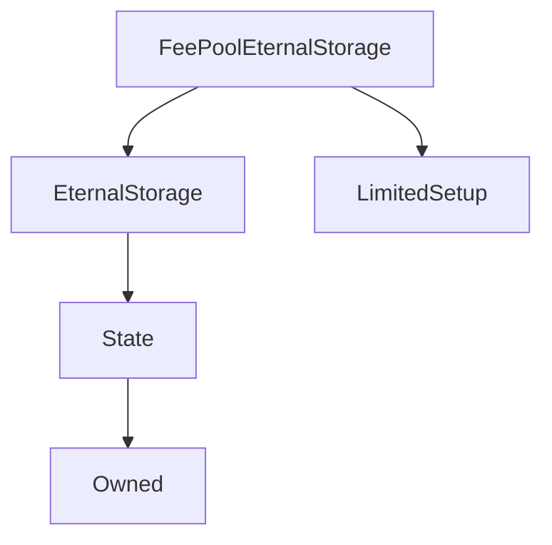

# FeePoolEternalStorage

## Description

FeePoolEternalStorage is currently used only to store the last fee withdrawal timestamp for each address. See [`FeePool._claimFees`](FeePool.md#_claimFees) and [`FeePool.feesByPeriod`](FeePool.md#feesbyperiod) for details of what this information is used for.

This contract is just wrapper around [EternalStorage](EternalStorage.md) with a limited setup period and a setup function that sets each account's last fee withdrawal times.

**Source:** [contracts/FeePoolEternalStorage.sol](https://github.com/Synthetixio/synthetix/tree/v2.21.15/contracts/FeePoolEternalStorage.sol)

## Architecture

---
### Inheritance Graph

## Constants

---
### `LAST_FEE_WITHDRAWAL`

[Source](https://github.com/Synthetixio/synthetix/tree/v2.21.15/contracts/FeePoolEternalStorage.sol#L10)

**Type:** `bytes32`

## Function (Constructor)

---
### `constructor`

[Source](https://github.com/Synthetixio/synthetix/tree/v2.21.15/contracts/FeePoolEternalStorage.sol#L12)

??? example "Details"

    **Signature**

    `(address _owner, address _feePool)`

    **State Mutability**

    `nonpayable`

    **Modifiers**

    * [EternalStorage](#eternalstorage)

    * [LimitedSetup](#limitedsetup)

## Functions (onlyOwner)

---
### `importFeeWithdrawalData`

[Source](https://github.com/Synthetixio/synthetix/tree/v2.21.15/contracts/FeePoolEternalStorage.sol#L14)

??? example "Details"

    **Signature**

    `importFeeWithdrawalData(address[] accounts, uint256[] feePeriodIDs)`

    **State Mutability**

    `nonpayable`

    **Requires**

    * [require(..., Length mismatch)](https://github.com/Synthetixio/synthetix/tree/v2.21.15/contracts/FeePoolEternalStorage.sol#L19)

    **Modifiers**

    * [onlyOwner](#onlyowner)

    * [onlyDuringSetup](#onlyduringsetup)

