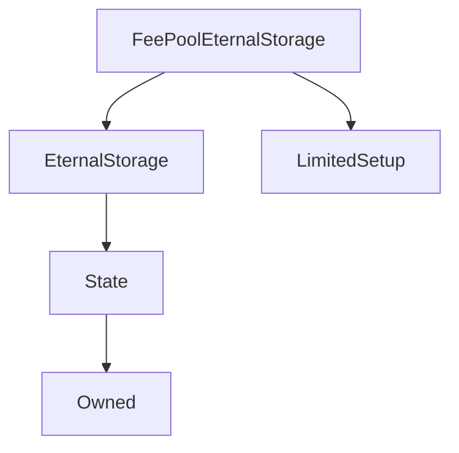

# FeePoolEternalStorage

## Description

FeePoolEternalStorage is currently used only to store the last fee withdrawal timestamp for each address. See [`FeePool._claimFees`](FeePool.md#_claimFees) and [`FeePool.feesByPeriod`](FeePool.md#feesbyperiod) for details of what this information is used for.

This contract is just wrapper around [EternalStorage](EternalStorage.md) with a limited setup period and a setup function that sets each account's last fee withdrawal times.

**Source:** [contracts/FeePoolEternalStorage.sol](https://github.com/Synthetixio/synthetix/tree/develop/contracts/FeePoolEternalStorage.sol)

## Architecture

---
### Inheritance Graph

## Variables

---
### `LAST_FEE_WITHDRAWAL`

[Source](https://github.com/Synthetixio/synthetix/tree/develop/contracts/FeePoolEternalStorage.sol#L10)

This constant is an arbitrary string to be used to access the correct slot in the eternal storage [`uint` map](EternalStorage.md#storage) where an account's last withdrawal time is kept.

This is hashed together with the address to obtain the correct key. Its value must be the same as [`FeePool.LAST_FEE_WITHDRAWAL`](FeePool.md#last_fee_withdrawal).

**Value:** `"last_fee_withdrawal"`

**Type:** `bytes32`

## Functions

---
### `constructor`

[Source](https://github.com/Synthetixio/synthetix/tree/develop/contracts/FeePoolEternalStorage.sol#L12)

Initialises the inherited [`EternalStorage`](EternalStorage.md) instance, and sets a [limited setup period](LimitedSetup.md) of six weeks.

??? example "Details"

    **Signature**

    `(address _owner, address _feePool) public`

    **Modifiers**

    * [EternalStorage](#eternalstorage)

    * [LimitedSetup](#limitedsetup)

---
### `importFeeWithdrawalData`

[Source](https://github.com/Synthetixio/synthetix/tree/develop/contracts/FeePoolEternalStorage.sol#L14)

This is a helper to import fee withdrawal information from a previous version of the system during the setup period.

??? example "Details"

    **Signature**

    `importFeeWithdrawalData(address[] accounts, uint256[] feePeriodIDs) external`

    **Requires**

    * [require(..., Length mismatch)](https://github.com/Synthetixio/synthetix/tree/develop/contracts/FeePoolEternalStorage.sol#L19)

    **Modifiers**

    * [onlyOwner](#onlyowner)

    * [onlyDuringSetup](#onlyduringsetup)

