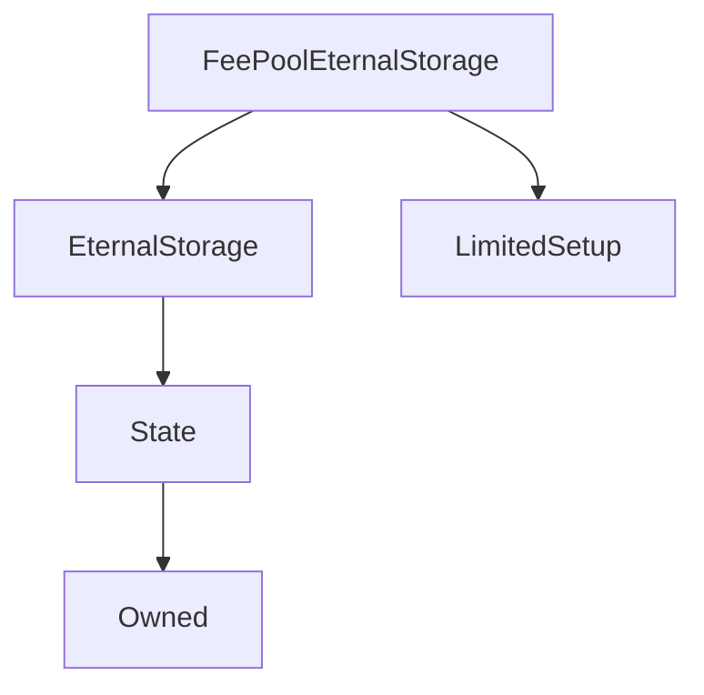

# FeePoolEternalStorage

**Source:** [contracts/FeePoolEternalStorage.sol](https://github.com/Synthetixio/synthetix/tree/develop/contracts/FeePoolEternalStorage.sol)

## Architecture

### Inheritance Graph

---

## Variables

---

### `LAST_FEE_WITHDRAWAL`
[Source](https://github.com/Synthetixio/synthetix/tree/develop/contracts/FeePoolEternalStorage.sol#L10)

**Type:** `bytes32`

## Functions

---

### `constructor`
[Source](https://github.com/Synthetixio/synthetix/tree/develop/contracts/FeePoolEternalStorage.sol#L12)

??? example "Details"

    **Signature**

    `(address _owner, address _feePool) public`

    **Modifiers**

    * [EternalStorage](#eternalstorage)

    * [LimitedSetup](#limitedsetup)

---

### `importFeeWithdrawalData`
[Source](https://github.com/Synthetixio/synthetix/tree/develop/contracts/FeePoolEternalStorage.sol#L14)

??? example "Details"

    **Signature**

    `importFeeWithdrawalData(address[] accounts, uint256[] feePeriodIDs) external`

    **Requires**

    * [require(..., Length mismatch)](https://github.com/Synthetixio/synthetix/tree/develop/contracts/FeePoolEternalStorage.sol#L19)

    **Modifiers**

    * [onlyOwner](#onlyowner)

    * [onlyDuringSetup](#onlyduringsetup)

---

