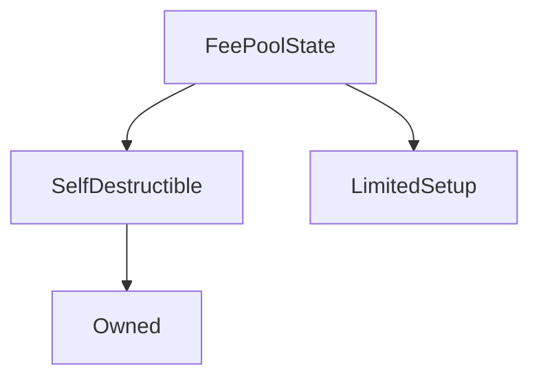

# FeePoolState

**Source:** [contracts/FeePoolState.sol](https://github.com/Synthetixio/synthetix/tree/develop/contracts/FeePoolState.sol)

## Architecture

### Inheritance Graph

---

## Structs

---

### IssuanceData
[Source](https://github.com/Synthetixio/synthetix/tree/develop/contracts/FeePoolState.sol#L27)

| Field | Type | Description |
| ------ | ------ | ------ |
| debtPercentage | uint256 | TBA |
| debtEntryIndex | uint256 | TBA |

---

## Variables

---

### `FEE_PERIOD_LENGTH`
[Source](https://github.com/Synthetixio/synthetix/tree/develop/contracts/FeePoolState.sol#L22)

**Type:** `uint8`

---

### `feePool`
[Source](https://github.com/Synthetixio/synthetix/tree/develop/contracts/FeePoolState.sol#L24)

**Type:** `address`

---

### `accountIssuanceLedger`
[Source](https://github.com/Synthetixio/synthetix/tree/develop/contracts/FeePoolState.sol#L33)

**Type:** `mapping(address => struct FeePoolState.IssuanceData[6])`

---

## Functions

---

### `constructor`
[Source](https://github.com/Synthetixio/synthetix/tree/develop/contracts/FeePoolState.sol#L35)

??? example "Details"

    **Signature**

    `(address _owner, contract IFeePool _feePool) public`

    **Modifiers**

    * [Owned](#owned)

    * [SelfDestructible](#selfdestructible)

    * [LimitedSetup](#limitedsetup)

---

### `setFeePool`
[Source](https://github.com/Synthetixio/synthetix/tree/develop/contracts/FeePoolState.sol#L46)

??? example "Details"

    **Signature**

    `setFeePool(contract IFeePool _feePool) external`

    **Modifiers**

    * [onlyOwner](#onlyowner)

---

### `getAccountsDebtEntry`
[Source](https://github.com/Synthetixio/synthetix/tree/develop/contracts/FeePoolState.sol#L57)

??? example "Details"

    **Signature**

    `getAccountsDebtEntry(address account, uint256 index) public`

    **Requires**

    * [require(..., index exceeds the FEE_PERIOD_LENGTH)](https://github.com/Synthetixio/synthetix/tree/develop/contracts/FeePoolState.sol#L62)

---

### `applicableIssuanceData`
[Source](https://github.com/Synthetixio/synthetix/tree/develop/contracts/FeePoolState.sol#L73)

??? example "Details"

    **Signature**

    `applicableIssuanceData(address account, uint256 closingDebtIndex) external`

---

### `appendAccountIssuanceRecord`
[Source](https://github.com/Synthetixio/synthetix/tree/develop/contracts/FeePoolState.sol#L98)

??? example "Details"

    **Signature**

    `appendAccountIssuanceRecord(address account, uint256 debtRatio, uint256 debtEntryIndex, uint256 currentPeriodStartDebtIndex) external`

    **Modifiers**

    * [onlyFeePool](#onlyfeepool)

---

### `issuanceDataIndexOrder`
[Source](https://github.com/Synthetixio/synthetix/tree/develop/contracts/FeePoolState.sol#L118)

??? example "Details"

    **Signature**

    `issuanceDataIndexOrder(address account) private`

---

### `importIssuerData`
[Source](https://github.com/Synthetixio/synthetix/tree/develop/contracts/FeePoolState.sol#L137)

??? example "Details"

    **Signature**

    `importIssuerData(address[] accounts, uint256[] ratios, uint256 periodToInsert, uint256 feePeriodCloseIndex) external`

    **Requires**

    * [require(..., Length mismatch)](https://github.com/Synthetixio/synthetix/tree/develop/contracts/FeePoolState.sol#L143)

    **Modifiers**

    * [onlyOwner](#onlyowner)

    * [onlyDuringSetup](#onlyduringsetup)

---

## Modifiers

---

### `onlyFeePool`
[Source](https://github.com/Synthetixio/synthetix/tree/develop/contracts/FeePoolState.sol#L154)

---

## Events

---

### `IssuanceDebtRatioEntry`
[Source](https://github.com/Synthetixio/synthetix/tree/develop/contracts/FeePoolState.sol#L160)

- `(address account, uint256 debtRatio, uint256 feePeriodCloseIndex)`

---

