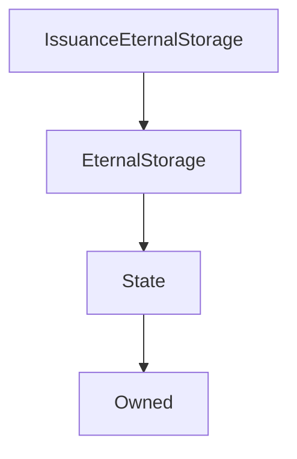

# IssuanceEternalStorage

**Source:** [IssuanceEternalStorage.sol](https://github.com/Synthetixio/synthetix/blob/master/contracts/IssuanceEternalStorage.sol)

!!! todo "Work in Progress"

    This needs filling in

## Description

... todo.

**Source:** [contracts/IssuanceEternalStorage.sol](https://github.com/Synthetixio/synthetix/tree/develop/contracts/IssuanceEternalStorage.sol)

## Architecture

... todo.

<!--centered-image>
    
</centered-image-->

---
### Inheritance Graph

---
### Related Contracts

- ?

## Views

## Constants

## Variables

.. (need to pull these from the functions below)

## Function (Constructor)

---
### `constructor`

[Source](https://github.com/Synthetixio/synthetix/tree/develop/contracts/IssuanceEternalStorage.sol#L11)

??? example "Details"

    **Signature**

    `(address _owner, address _issuer)`

    **State Mutability**

    `nonpayable`

    **Modifiers**

    * [EternalStorage](#eternalstorage)

## Internal & Restricted Mutative Functions

## Owner Mutative Functions

## Public Mutative Functions

