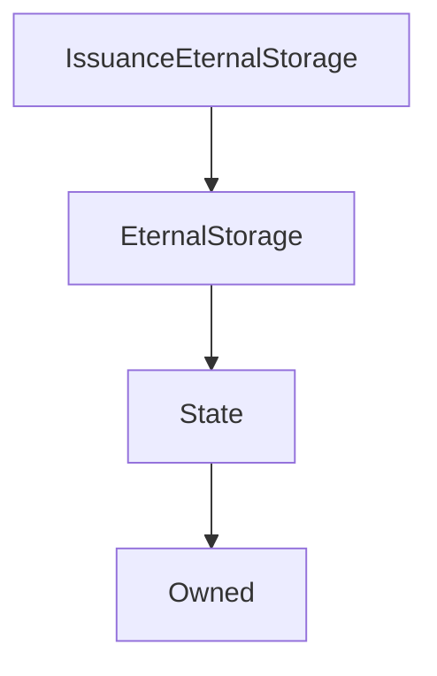

# IssuanceEternalStorage

**Source:** [contracts/IssuanceEternalStorage.sol](https://github.com/Synthetixio/synthetix/tree/develop/contracts/IssuanceEternalStorage.sol)

## Architecture

### Inheritance Graph

---

## Functions

---

### `constructor`
[Source](https://github.com/Synthetixio/synthetix/tree/develop/contracts/IssuanceEternalStorage.sol#L11)

??? example "Details"

    **Signature**

    `(address _owner, address _issuer) public`

    **Modifiers**

    * [EternalStorage](#eternalstorage)

---

