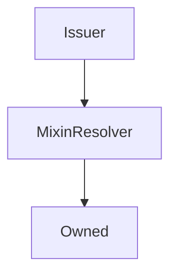

# Issuer

??? todo "Work In Progress"

    Ongoing...

## Description

This contract does all the heavy lifting of issuing and burning `sUSD`. It's used primarily to reduce the size of the `Synthetix` contract

**Source:** [contracts/Issuer.sol](https://github.com/Synthetixio/synthetix/tree/develop/contracts/Issuer.sol)

## Architecture

---
### Inheritance Graph

---
### Related Contracts

<centered-image>
    
</centered-image>

??? example "Details"

    - [`FeePool`](FeePool.md): The Synthetix contract remits exchange fees as sUSD to the fee pool, and also uses it to keep track of historical issuance records for each issuer.
    - [`SynthetixState`](SynthetixState.md): This state contract stores the debt ledger and the current issuance information for synth issuers.

<!--
If any, see:

<centered-image>
    
</centered-image>
--->

---
### Libraries

- [SafeMath](/libraries/SafeMath) for `uint`
- [SafeDecimalMath](/libraries/SafeDecimalMath) for `uint`

---
### `CONTRACT_DELEGATEAPPROVALS`

[Source](https://github.com/Synthetixio/synthetix/tree/develop/contracts/Issuer.sol#L39)

**Type:** `bytes32`

---
### `CONTRACT_EXCHANGER`

[Source](https://github.com/Synthetixio/synthetix/tree/develop/contracts/Issuer.sol#L36)

**Type:** `bytes32`

---
### `CONTRACT_FEEPOOL`

[Source](https://github.com/Synthetixio/synthetix/tree/develop/contracts/Issuer.sol#L38)

**Type:** `bytes32`

---
### `CONTRACT_ISSUANCEETERNALSTORAGE`

[Source](https://github.com/Synthetixio/synthetix/tree/develop/contracts/Issuer.sol#L40)

**Type:** `bytes32`

---
### `CONTRACT_SYNTHETIX`

[Source](https://github.com/Synthetixio/synthetix/tree/develop/contracts/Issuer.sol#L35)

**Type:** `bytes32`

---
### `CONTRACT_SYNTHETIXSTATE`

[Source](https://github.com/Synthetixio/synthetix/tree/develop/contracts/Issuer.sol#L37)

**Type:** `bytes32`

---
### `LAST_ISSUE_EVENT`

[Source](https://github.com/Synthetixio/synthetix/tree/develop/contracts/Issuer.sol#L26)

**Type:** `bytes32`

---
### `MAX_MINIMUM_STAKING_TIME`

[Source](https://github.com/Synthetixio/synthetix/tree/develop/contracts/Issuer.sol#L29)

**Type:** `uint256`

---
### `sUSD`

[Source](https://github.com/Synthetixio/synthetix/tree/develop/contracts/Issuer.sol#L25)

**Type:** `bytes32`

## Constants

---
### `CONTRACT_DELEGATEAPPROVALS`

[Source](https://github.com/Synthetixio/synthetix/tree/develop/contracts/Issuer.sol#L39)

**Type:** `bytes32`

---
### `CONTRACT_EXCHANGER`

[Source](https://github.com/Synthetixio/synthetix/tree/develop/contracts/Issuer.sol#L36)

**Type:** `bytes32`

---
### `CONTRACT_FEEPOOL`

[Source](https://github.com/Synthetixio/synthetix/tree/develop/contracts/Issuer.sol#L38)

**Type:** `bytes32`

---
### `CONTRACT_ISSUANCEETERNALSTORAGE`

[Source](https://github.com/Synthetixio/synthetix/tree/develop/contracts/Issuer.sol#L40)

**Type:** `bytes32`

---
### `CONTRACT_SYNTHETIX`

[Source](https://github.com/Synthetixio/synthetix/tree/develop/contracts/Issuer.sol#L35)

**Type:** `bytes32`

---
### `CONTRACT_SYNTHETIXSTATE`

[Source](https://github.com/Synthetixio/synthetix/tree/develop/contracts/Issuer.sol#L37)

**Type:** `bytes32`

---
### `LAST_ISSUE_EVENT`

[Source](https://github.com/Synthetixio/synthetix/tree/develop/contracts/Issuer.sol#L26)

**Type:** `bytes32`

---
### `MAX_MINIMUM_STAKING_TIME`

[Source](https://github.com/Synthetixio/synthetix/tree/develop/contracts/Issuer.sol#L29)

**Type:** `uint256`

---
### `sUSD`

[Source](https://github.com/Synthetixio/synthetix/tree/develop/contracts/Issuer.sol#L25)

**Type:** `bytes32`

## Variables

---
### `addressesToCache`

[Source](https://github.com/Synthetixio/synthetix/tree/develop/contracts/Issuer.sol#L42)

**Type:** `bytes32[24]`

---
### `minimumStakeTime`

[Source](https://github.com/Synthetixio/synthetix/tree/develop/contracts/Issuer.sol#L31)

**Type:** `uint256`

## Modifiers

---
### `onlySynthetix`

[Source](https://github.com/Synthetixio/synthetix/tree/develop/contracts/Issuer.sol#L359)

<!-- E.g.

---

---

---

---

---

---
### `notFeeAddress`

The transaction is reverted if the given account is the [fee address](FeePool.md#fee_address).

**Signature:** `notFeeAddress(address account)`
-->

## Function (Constructor)

---
### `constructor`

[Source](https://github.com/Synthetixio/synthetix/tree/develop/contracts/Issuer.sol#L51)

??? example "Details"

    **Signature**

    `(address _owner, address _resolver)`

    **State Mutability**

    `nonpayable`

    **Modifiers**

    * [Owned](#owned)

    * [MixinResolver](#mixinresolver)

## Functions

---
### `burnSynths`

[Source](https://github.com/Synthetixio/synthetix/tree/develop/contracts/Issuer.sol#L170)

??? example "Details"

    **Signature**

    `burnSynths(address from, uint256 amount)`

    **State Mutability**

    `nonpayable`

    **Modifiers**

    * [onlySynthetix](#onlysynthetix)

---
### `burnSynthsOnBehalf`

[Source](https://github.com/Synthetixio/synthetix/tree/develop/contracts/Issuer.sol#L161)

??? example "Details"

    **Signature**

    `burnSynthsOnBehalf(address burnForAddress, address from, uint256 amount)`

    **State Mutability**

    `nonpayable`

    **Requires**

    * [require(..., Not approved to act on behalf)](https://github.com/Synthetixio/synthetix/tree/develop/contracts/Issuer.sol#L166)

    **Modifiers**

    * [onlySynthetix](#onlysynthetix)

---
### `burnSynthsToTarget`

[Source](https://github.com/Synthetixio/synthetix/tree/develop/contracts/Issuer.sol#L200)

??? example "Details"

    **Signature**

    `burnSynthsToTarget(address from)`

    **State Mutability**

    `nonpayable`

    **Modifiers**

    * [onlySynthetix](#onlysynthetix)

---
### `burnSynthsToTargetOnBehalf`

[Source](https://github.com/Synthetixio/synthetix/tree/develop/contracts/Issuer.sol#L195)

??? example "Details"

    **Signature**

    `burnSynthsToTargetOnBehalf(address burnForAddress, address from)`

    **State Mutability**

    `nonpayable`

    **Requires**

    * [require(..., Not approved to act on behalf)](https://github.com/Synthetixio/synthetix/tree/develop/contracts/Issuer.sol#L196)

    **Modifiers**

    * [onlySynthetix](#onlysynthetix)

---
### `canBurnSynths`

[Source](https://github.com/Synthetixio/synthetix/tree/develop/contracts/Issuer.sol#L83)

??? example "Details"

    **Signature**

    `canBurnSynths(address account)`

    **State Mutability**

    `view`

---
### `issueMaxSynths`

[Source](https://github.com/Synthetixio/synthetix/tree/develop/contracts/Issuer.sol#L134)

??? example "Details"

    **Signature**

    `issueMaxSynths(address from)`

    **State Mutability**

    `nonpayable`

    **Modifiers**

    * [onlySynthetix](#onlysynthetix)

---
### `issueMaxSynthsOnBehalf`

[Source](https://github.com/Synthetixio/synthetix/tree/develop/contracts/Issuer.sol#L119)

??? example "Details"

    **Signature**

    `issueMaxSynthsOnBehalf(address issueForAddress, address from)`

    **State Mutability**

    `nonpayable`

    **Requires**

    * [require(..., Not approved to act on behalf)](https://github.com/Synthetixio/synthetix/tree/develop/contracts/Issuer.sol#L120)

    **Modifiers**

    * [onlySynthetix](#onlysynthetix)

---
### `issueSynths`

[Source](https://github.com/Synthetixio/synthetix/tree/develop/contracts/Issuer.sol#L126)

??? example "Details"

    **Signature**

    `issueSynths(address from, uint256 amount)`

    **State Mutability**

    `nonpayable`

    **Requires**

    * [require(..., Amount too large)](https://github.com/Synthetixio/synthetix/tree/develop/contracts/Issuer.sol#L129)

    **Modifiers**

    * [onlySynthetix](#onlysynthetix)

---
### `issueSynthsOnBehalf`

[Source](https://github.com/Synthetixio/synthetix/tree/develop/contracts/Issuer.sol#L107)

??? example "Details"

    **Signature**

    `issueSynthsOnBehalf(address issueForAddress, address from, uint256 amount)`

    **State Mutability**

    `nonpayable`

    **Requires**

    * [require(..., Not approved to act on behalf)](https://github.com/Synthetixio/synthetix/tree/develop/contracts/Issuer.sol#L112)

    * [require(..., Amount too large)](https://github.com/Synthetixio/synthetix/tree/develop/contracts/Issuer.sol#L115)

    **Modifiers**

    * [onlySynthetix](#onlysynthetix)

---
### `lastIssueEvent`

[Source](https://github.com/Synthetixio/synthetix/tree/develop/contracts/Issuer.sol#L87)

??? example "Details"

    **Signature**

    `lastIssueEvent(address account)`

    **State Mutability**

    `view`

## Functions (Internal)

---
### `_addToDebtRegister`

[Source](https://github.com/Synthetixio/synthetix/tree/develop/contracts/Issuer.sol#L265)

??? example "Details"

    **Signature**

    `_addToDebtRegister(address from, uint256 amount, uint256 existingDebt, uint256 totalDebtIssued)`

    **State Mutability**

    `nonpayable`

---
### `_appendAccountIssuanceRecord`

[Source](https://github.com/Synthetixio/synthetix/tree/develop/contracts/Issuer.sol#L252)

??? example "Details"

    **Signature**

    `_appendAccountIssuanceRecord(address from)`

    **State Mutability**

    `nonpayable`

---
### `_burnSynths`

[Source](https://github.com/Synthetixio/synthetix/tree/develop/contracts/Issuer.sol#L175)

??? example "Details"

    **Signature**

    `_burnSynths(address from, uint256 amount)`

    **State Mutability**

    `nonpayable`

    **Requires**

    * [require(..., Minimum stake time not reached)](https://github.com/Synthetixio/synthetix/tree/develop/contracts/Issuer.sol#L176)

    * [require(..., No debt to forgive)](https://github.com/Synthetixio/synthetix/tree/develop/contracts/Issuer.sol#L184)

---
### `_burnSynthsToTarget`

[Source](https://github.com/Synthetixio/synthetix/tree/develop/contracts/Issuer.sol#L206)

??? example "Details"

    **Signature**

    `_burnSynthsToTarget(address from)`

    **State Mutability**

    `nonpayable`

    **Requires**

    * [require(..., No debt to forgive)](https://github.com/Synthetixio/synthetix/tree/develop/contracts/Issuer.sol#L210)

---
### `_internalBurnSynths`

[Source](https://github.com/Synthetixio/synthetix/tree/develop/contracts/Issuer.sol#L223)

??? example "Details"

    **Signature**

    `_internalBurnSynths(address from, uint256 amount, uint256 existingDebt, uint256 totalSystemValue)`

    **State Mutability**

    `nonpayable`

---
### `_internalIssueSynths`

[Source](https://github.com/Synthetixio/synthetix/tree/develop/contracts/Issuer.sol#L142)

??? example "Details"

    **Signature**

    `_internalIssueSynths(address from, uint256 amount, uint256 existingDebt, uint256 totalSystemDebt)`

    **State Mutability**

    `nonpayable`

---
### `_removeFromDebtRegister`

[Source](https://github.com/Synthetixio/synthetix/tree/develop/contracts/Issuer.sol#L313)

??? example "Details"

    **Signature**

    `_removeFromDebtRegister(address from, uint256 amount, uint256 existingDebt, uint256 totalDebtIssued)`

    **State Mutability**

    `nonpayable`

---
### `_setLastIssueEvent`

[Source](https://github.com/Synthetixio/synthetix/tree/develop/contracts/Issuer.sol#L102)

??? example "Details"

    **Signature**

    `_setLastIssueEvent(address account)`

    **State Mutability**

    `nonpayable`

---
### `delegateApprovals`

[Source](https://github.com/Synthetixio/synthetix/tree/develop/contracts/Issuer.sol#L70)

??? example "Details"

    **Signature**

    `delegateApprovals()`

    **State Mutability**

    `view`

---
### `exchanger`

[Source](https://github.com/Synthetixio/synthetix/tree/develop/contracts/Issuer.sol#L58)

??? example "Details"

    **Signature**

    `exchanger()`

    **State Mutability**

    `view`

---
### `feePool`

[Source](https://github.com/Synthetixio/synthetix/tree/develop/contracts/Issuer.sol#L66)

??? example "Details"

    **Signature**

    `feePool()`

    **State Mutability**

    `view`

---
### `issuanceEternalStorage`

[Source](https://github.com/Synthetixio/synthetix/tree/develop/contracts/Issuer.sol#L74)

??? example "Details"

    **Signature**

    `issuanceEternalStorage()`

    **State Mutability**

    `view`

---
### `synthetix`

[Source](https://github.com/Synthetixio/synthetix/tree/develop/contracts/Issuer.sol#L54)

??? example "Details"

    **Signature**

    `synthetix()`

    **State Mutability**

    `view`

---
### `synthetixState`

[Source](https://github.com/Synthetixio/synthetix/tree/develop/contracts/Issuer.sol#L62)

??? example "Details"

    **Signature**

    `synthetixState()`

    **State Mutability**

    `view`

## Functions (onlyOwner)

---
### `setMinimumStakeTime`

[Source](https://github.com/Synthetixio/synthetix/tree/develop/contracts/Issuer.sol#L94)

??? example "Details"

    **Signature**

    `setMinimumStakeTime(uint256 _seconds)`

    **State Mutability**

    `nonpayable`

    **Requires**

    * [require(..., stake time exceed maximum 1 week)](https://github.com/Synthetixio/synthetix/tree/develop/contracts/Issuer.sol#L96)

    **Modifiers**

    * [onlyOwner](#onlyowner)

    **Emits**

    * [MinimumStakeTimeUpdated](#minimumstaketimeupdated)

## Internal & Restricted Functions

## Mutative Functions

<!-- E.g.

---

---

---

---

---

---
### `burnSynths`

[Burns](Synth.md#burn) a quantity of `sUSD` in the calling address, in order to free up its locked SNX supply.

If the caller attempts to burn more synths than their SNX debt is worth, this function will only burn sufficiently many tokens to cover the debt and leave the rest untouched.

The new debt position of the caller is recorded with [`_appendAccountIssuanceRecord`](#appendaccountissuancerecord), and the adjustment to global debt recorded with [`_removeFromDebtRegister`](#_removefromdebtregister).

??? example "Details"

    **Signature**

    `burnSynths(uint amount) external`

    **Modifiers**

    * [`Proxyable.optionalProxy`](Proxyable.md#optionalproxy)

    **Preconditions**

    * The [existing debt](#debtbalanceof) the caller must be nonzero.

--->

## Owner Functions

<!-- Eg.

---

---

---

---

---

---
### `importAddresses`

Import one or more addresses into the system for the given keys. Note: this function will overrwite any previous entries with the same key names, allowing for inline updates.

??? example "Details"

    **Signature**

    `importAddresses(bytes32[] names, address[] destinations) public`

    **Modifiers**

    * [`Owned.onlyOwner`](Owned.md#onlyowner)

    **Preconditions**

    * The length of `names` must match the length of `destinations`

---

-->

## Events

---
### `MinimumStakeTimeUpdated`

[Source](https://github.com/Synthetixio/synthetix/tree/develop/contracts/Issuer.sol#L366)

- `(uint256 minimumStakeTime)`

