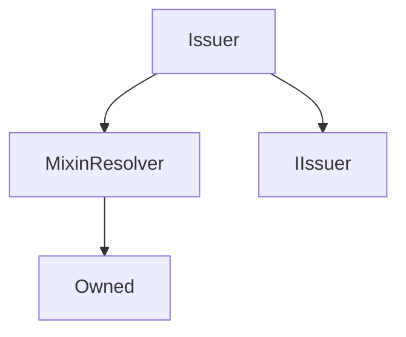

# Issuer

**Source:** [contracts/Issuer.sol](https://github.com/Synthetixio/synthetix/tree/develop/contracts/Issuer.sol)

## Architecture

### Inheritance Graph

---

## Variables

---

### `LAST_ISSUE_EVENT`
[Source](https://github.com/Synthetixio/synthetix/tree/develop/contracts/Issuer.sol#L26)

**Type:** `bytes32`

---

### `MAX_MINIMUM_STAKING_TIME`
[Source](https://github.com/Synthetixio/synthetix/tree/develop/contracts/Issuer.sol#L29)

**Type:** `uint256`

---

### `minimumStakeTime`
[Source](https://github.com/Synthetixio/synthetix/tree/develop/contracts/Issuer.sol#L31)

**Type:** `uint256`

## Functions

---

### `constructor`
[Source](https://github.com/Synthetixio/synthetix/tree/develop/contracts/Issuer.sol#L51)

??? example "Details"

    **Signature**

    `(address _owner, address _resolver) public`

    **Modifiers**

    * [Owned](#owned)

    * [MixinResolver](#mixinresolver)

---

### `canBurnSynths`
[Source](https://github.com/Synthetixio/synthetix/tree/develop/contracts/Issuer.sol#L83)

??? example "Details"

    **Signature**

    `canBurnSynths(address account) public`

---

### `lastIssueEvent`
[Source](https://github.com/Synthetixio/synthetix/tree/develop/contracts/Issuer.sol#L87)

??? example "Details"

    **Signature**

    `lastIssueEvent(address account) public`

---

### `setMinimumStakeTime`
[Source](https://github.com/Synthetixio/synthetix/tree/develop/contracts/Issuer.sol#L94)

??? example "Details"

    **Signature**

    `setMinimumStakeTime(uint256 _seconds) external`

    **Requires**

    * [require(..., stake time exceed maximum 1 week)](https://github.com/Synthetixio/synthetix/tree/develop/contracts/Issuer.sol#L96)

    **Modifiers**

    * [onlyOwner](#onlyowner)

    **Emits**

    * [MinimumStakeTimeUpdated](#minimumstaketimeupdated)

---

### `issueSynthsOnBehalf`
[Source](https://github.com/Synthetixio/synthetix/tree/develop/contracts/Issuer.sol#L107)

??? example "Details"

    **Signature**

    `issueSynthsOnBehalf(address issueForAddress, address from, uint256 amount) external`

    **Requires**

    * [require(..., Not approved to act on behalf)](https://github.com/Synthetixio/synthetix/tree/develop/contracts/Issuer.sol#L112)

    * [require(..., Amount too large)](https://github.com/Synthetixio/synthetix/tree/develop/contracts/Issuer.sol#L115)

    **Modifiers**

    * [onlySynthetix](#onlysynthetix)

---

### `issueMaxSynthsOnBehalf`
[Source](https://github.com/Synthetixio/synthetix/tree/develop/contracts/Issuer.sol#L119)

??? example "Details"

    **Signature**

    `issueMaxSynthsOnBehalf(address issueForAddress, address from) external`

    **Requires**

    * [require(..., Not approved to act on behalf)](https://github.com/Synthetixio/synthetix/tree/develop/contracts/Issuer.sol#L120)

    **Modifiers**

    * [onlySynthetix](#onlysynthetix)

---

### `issueSynths`
[Source](https://github.com/Synthetixio/synthetix/tree/develop/contracts/Issuer.sol#L126)

??? example "Details"

    **Signature**

    `issueSynths(address from, uint256 amount) external`

    **Requires**

    * [require(..., Amount too large)](https://github.com/Synthetixio/synthetix/tree/develop/contracts/Issuer.sol#L129)

    **Modifiers**

    * [onlySynthetix](#onlysynthetix)

---

### `issueMaxSynths`
[Source](https://github.com/Synthetixio/synthetix/tree/develop/contracts/Issuer.sol#L134)

??? example "Details"

    **Signature**

    `issueMaxSynths(address from) external`

    **Modifiers**

    * [onlySynthetix](#onlysynthetix)

---

### `burnSynthsOnBehalf`
[Source](https://github.com/Synthetixio/synthetix/tree/develop/contracts/Issuer.sol#L161)

??? example "Details"

    **Signature**

    `burnSynthsOnBehalf(address burnForAddress, address from, uint256 amount) external`

    **Requires**

    * [require(..., Not approved to act on behalf)](https://github.com/Synthetixio/synthetix/tree/develop/contracts/Issuer.sol#L166)

    **Modifiers**

    * [onlySynthetix](#onlysynthetix)

---

### `burnSynths`
[Source](https://github.com/Synthetixio/synthetix/tree/develop/contracts/Issuer.sol#L170)

??? example "Details"

    **Signature**

    `burnSynths(address from, uint256 amount) external`

    **Modifiers**

    * [onlySynthetix](#onlysynthetix)

---

### `burnSynthsToTargetOnBehalf`
[Source](https://github.com/Synthetixio/synthetix/tree/develop/contracts/Issuer.sol#L195)

??? example "Details"

    **Signature**

    `burnSynthsToTargetOnBehalf(address burnForAddress, address from) external`

    **Requires**

    * [require(..., Not approved to act on behalf)](https://github.com/Synthetixio/synthetix/tree/develop/contracts/Issuer.sol#L196)

    **Modifiers**

    * [onlySynthetix](#onlysynthetix)

---

### `burnSynthsToTarget`
[Source](https://github.com/Synthetixio/synthetix/tree/develop/contracts/Issuer.sol#L200)

??? example "Details"

    **Signature**

    `burnSynthsToTarget(address from) external`

    **Modifiers**

    * [onlySynthetix](#onlysynthetix)

---

## Modifiers

---

### `onlySynthetix`
[Source](https://github.com/Synthetixio/synthetix/tree/develop/contracts/Issuer.sol#L359)

---

## Events

---

### `MinimumStakeTimeUpdated`
[Source](https://github.com/Synthetixio/synthetix/tree/develop/contracts/Issuer.sol#L366)

- `(uint256 minimumStakeTime)`

---

