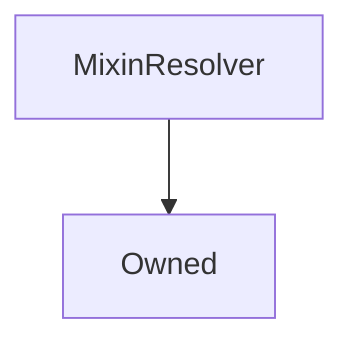

# MixinResolver

## Description

A utility that gives the inheritor access to the [`AddressResolver`](AddressResolver.md)


**Source:** [contracts/MixinResolver.sol](https://github.com/Synthetixio/synthetix/tree/develop/contracts/MixinResolver.sol)


---
### Inheritance Graph

<!--centered-image>
    ![[name] inheritance graph](../img/graphs/MixinResolver.svg)
</centered-image-->


## Variables


---
### `resolver`

<sub>[Source](https://github.com/Synthetixio/synthetix/tree/develop/contracts/MixinResolver.sol#L12)</sub>


The `AddressResolver` instance


**Type:** `contract AddressResolver`


---
### `resolverAddressesRequired`

<sub>[Source](https://github.com/Synthetixio/synthetix/tree/develop/contracts/MixinResolver.sol#L16)</sub>


**Type:** `bytes32[]`


---
### `MAX_ADDRESSES_FROM_RESOLVER`

<sub>[Source](https://github.com/Synthetixio/synthetix/tree/develop/contracts/MixinResolver.sol#L18)</sub>


**Type:** `uint256`

## Owner Functions


---
### `setResolver`

Set the address resolver


??? example "Details"


```
**Signature**

`setResolver(AddressResolver _resolver) public`

**Modifiers**

* [`Owned.onlyOwner`](Owned.md#onlyowner)
```

## Architecture


---
### Inheritance Graph



## Functions


---
### `setResolverAndSyncCache`

<sub>[Source](https://github.com/Synthetixio/synthetix/tree/develop/contracts/MixinResolver.sol#L38)</sub>


??? example "Details"

    **Signature**

    `setResolverAndSyncCache(contract AddressResolver _resolver) external`

    **Modifiers**

    * [onlyOwner](#onlyowner)


---
### `isResolverCached`

<sub>[Source](https://github.com/Synthetixio/synthetix/tree/develop/contracts/MixinResolver.sol#L58)</sub>


??? example "Details"

    **Signature**

    `isResolverCached(contract AddressResolver _resolver) external`


---
### `getResolverAddressesRequired`

<sub>[Source](https://github.com/Synthetixio/synthetix/tree/develop/contracts/MixinResolver.sol#L76)</sub>


??? example "Details"

    **Signature**

    `getResolverAddressesRequired() external`

