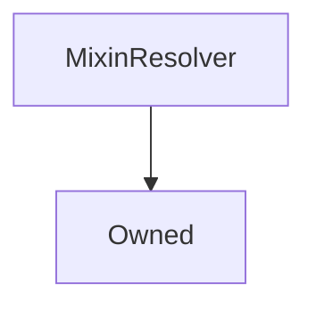

# MixinResolver

## Description

A utility that gives the inheritor access to the [`AddressResolver`](AddressResolver.md)

**Source:** [contracts/MixinResolver.sol](https://github.com/Synthetixio/synthetix/tree/v2.21.15contracts/MixinResolver.sol)

---
### Inheritance Graph

<!--centered-image>
    ![[name] inheritance graph](../img/graphs/MixinResolver.svg)
</centered-image-->

## Architecture

---
### Inheritance Graph

## Constants

---
### `MAX_ADDRESSES_FROM_RESOLVER`

[Source](https://github.com/Synthetixio/synthetix/tree/v2.21.15contracts/MixinResolver.sol#L18)

**Type:** `uint256`

## Variables

---
### `addressCache`

[Source](https://github.com/Synthetixio/synthetix/tree/v2.21.15contracts/MixinResolver.sol#L14)

**Type:** `mapping(bytes32 => address)`

---
### `resolver`

[Source](https://github.com/Synthetixio/synthetix/tree/v2.21.15contracts/MixinResolver.sol#L12)

The `AddressResolver` instance

**Type:** `contract AddressResolver`

---
### `resolverAddressesRequired`

[Source](https://github.com/Synthetixio/synthetix/tree/v2.21.15contracts/MixinResolver.sol#L16)

**Type:** `bytes32[]`

## Function (Constructor)

---
### `constructor`

[Source](https://github.com/Synthetixio/synthetix/tree/v2.21.15contracts/MixinResolver.sol#L20)

??? example "Details"

    **Signature**

    `(address _resolver, bytes32[24] _addressesToCache)`

    **State Mutability**

    `nonpayable`

    **Requires**

    * [require(..., Owner must be set)](https://github.com/Synthetixio/synthetix/tree/v2.21.15contracts/MixinResolver.sol#L22)

## Functions

---
### `getResolverAddressesRequired`

[Source](https://github.com/Synthetixio/synthetix/tree/v2.21.15contracts/MixinResolver.sol#L76)

??? example "Details"

    **Signature**

    `getResolverAddressesRequired()`

    **State Mutability**

    `view`

---
### `isResolverCached`

[Source](https://github.com/Synthetixio/synthetix/tree/v2.21.15contracts/MixinResolver.sol#L58)

??? example "Details"

    **Signature**

    `isResolverCached(contract AddressResolver _resolver)`

    **State Mutability**

    `view`

## Functions (Internal)

---
### `appendToAddressCache`

[Source](https://github.com/Synthetixio/synthetix/tree/v2.21.15contracts/MixinResolver.sol#L87)

??? example "Details"

    **Signature**

    `appendToAddressCache(bytes32 name)`

    **State Mutability**

    `nonpayable`

    **Requires**

    * [require(..., Max resolver cache size met)](https://github.com/Synthetixio/synthetix/tree/v2.21.15contracts/MixinResolver.sol#L89)

---
### `constructor`

[Source](https://github.com/Synthetixio/synthetix/tree/v2.21.15contracts/MixinResolver.sol#L20)

??? example "Details"

    **Signature**

    `(address _resolver, bytes32[24] _addressesToCache)`

    **State Mutability**

    `nonpayable`

    **Requires**

    * [require(..., Owner must be set)](https://github.com/Synthetixio/synthetix/tree/v2.21.15contracts/MixinResolver.sol#L22)

---
### `requireAndGetAddress`

[Source](https://github.com/Synthetixio/synthetix/tree/v2.21.15contracts/MixinResolver.sol#L50)

??? example "Details"

    **Signature**

    `requireAndGetAddress(bytes32 name, string reason)`

    **State Mutability**

    `view`

    **Requires**

    * [require(..., memory)](https://github.com/Synthetixio/synthetix/tree/v2.21.15contracts/MixinResolver.sol#L52)

## Functions (onlyOwner)

---
### `setResolverAndSyncCache`

[Source](https://github.com/Synthetixio/synthetix/tree/v2.21.15contracts/MixinResolver.sol#L38)

??? example "Details"

    **Signature**

    `setResolverAndSyncCache(contract AddressResolver _resolver)`

    **State Mutability**

    `nonpayable`

    **Modifiers**

    * [onlyOwner](#onlyowner)

## Owner Functions

---
### `setResolver`

Set the address resolver

??? example "Details"

    **Signature**
    
    `setResolver(AddressResolver _resolver) public`
    
    **Modifiers**
    
    * [`Owned.onlyOwner`](Owned.md#onlyowner)

