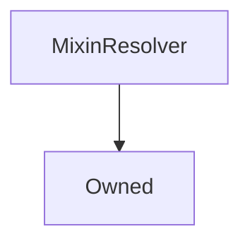

# MixinResolver

**Source:** [contracts/MixinResolver.sol](https://github.com/Synthetixio/synthetix/tree/develop/contracts/MixinResolver.sol)

## Architecture

### Inheritance Graph

---

## Variables

---

### `resolver`
[Source](https://github.com/Synthetixio/synthetix/tree/develop/contracts/MixinResolver.sol#L12)

**Type:** `contract AddressResolver`

---

### `resolverAddressesRequired`
[Source](https://github.com/Synthetixio/synthetix/tree/develop/contracts/MixinResolver.sol#L16)

**Type:** `bytes32[]`

---

### `MAX_ADDRESSES_FROM_RESOLVER`
[Source](https://github.com/Synthetixio/synthetix/tree/develop/contracts/MixinResolver.sol#L18)

**Type:** `uint256`

## Functions

---

### `setResolverAndSyncCache`
[Source](https://github.com/Synthetixio/synthetix/tree/develop/contracts/MixinResolver.sol#L38)

??? example "Details"

    **Signature**

    `setResolverAndSyncCache(contract AddressResolver _resolver) external`

    **Modifiers**

    * [onlyOwner](#onlyowner)

---

### `isResolverCached`
[Source](https://github.com/Synthetixio/synthetix/tree/develop/contracts/MixinResolver.sol#L58)

??? example "Details"

    **Signature**

    `isResolverCached(contract AddressResolver _resolver) external`

---

### `getResolverAddressesRequired`
[Source](https://github.com/Synthetixio/synthetix/tree/develop/contracts/MixinResolver.sol#L76)

??? example "Details"

    **Signature**

    `getResolverAddressesRequired() external`

---

