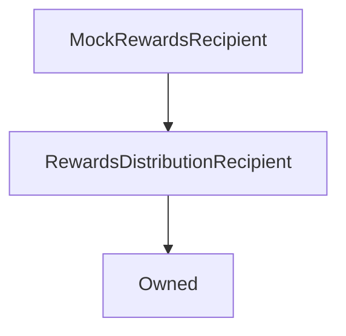

# MockRewardsRecipient

## Description

**Source:** [contracts/test-helpers/MockRewardsRecipient.sol](https://github.com/Synthetixio/synthetix/tree/develop/contracts/test-helpers/MockRewardsRecipient.sol)

## Architecture

---
### Inheritance Graph

## Variables

---
### `rewardsAvailable`

[Source](https://github.com/Synthetixio/synthetix/tree/develop/contracts/test-helpers/MockRewardsRecipient.sol#L8)

**Type:** `uint256`

## Function (Constructor)

---
### `constructor`

[Source](https://github.com/Synthetixio/synthetix/tree/develop/contracts/test-helpers/MockRewardsRecipient.sol#L10)

??? example "Details"

    **Signature**

    `(address _owner)`

    **State Mutability**

    `nonpayable`

    **Modifiers**

    * [Owned](#owned)

## Functions

---
### `notifyRewardAmount`

[Source](https://github.com/Synthetixio/synthetix/tree/develop/contracts/test-helpers/MockRewardsRecipient.sol#L12)

??? example "Details"

    **Signature**

    `notifyRewardAmount(uint256 reward)`

    **State Mutability**

    `nonpayable`

    **Modifiers**

    * [onlyRewardsDistribution](#onlyrewardsdistribution)

    **Emits**

    * [RewardAdded](#rewardadded)

## Events

---
### `RewardAdded`

[Source](https://github.com/Synthetixio/synthetix/tree/develop/contracts/test-helpers/MockRewardsRecipient.sol#L17)

- `(uint256 amount)`

