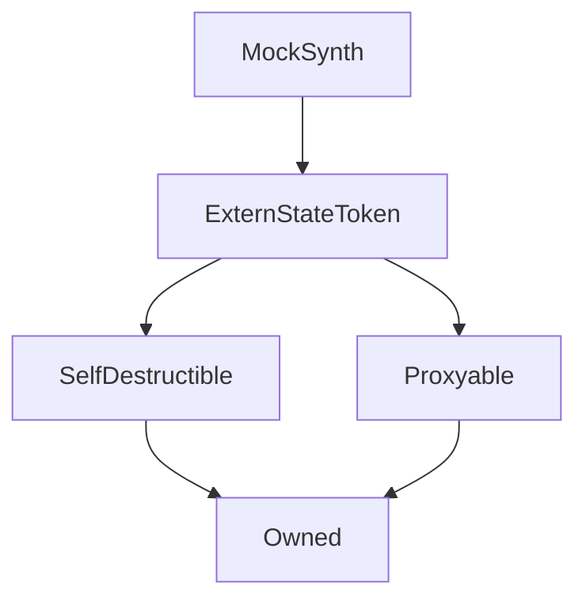

# MockSynth

## Description

**Source:** [contracts/test-helpers/MockSynth.sol](https://github.com/Synthetixio/synthetix/tree/develop/contracts/test-helpers/MockSynth.sol)

## Architecture

---
### Inheritance Graph

## Variables

---
### `currencyKey`

[Source](https://github.com/Synthetixio/synthetix/tree/develop/contracts/test-helpers/MockSynth.sol#L11)

**Type:** `bytes32`

---
### `systemStatus`

[Source](https://github.com/Synthetixio/synthetix/tree/develop/contracts/test-helpers/MockSynth.sol#L10)

**Type:** `contract ISystemStatus`

## Function (Constructor)

---
### `constructor`

[Source](https://github.com/Synthetixio/synthetix/tree/develop/contracts/test-helpers/MockSynth.sol#L13)

??? example "Details"

    **Signature**

    `(address payable _proxy, contract TokenState _tokenState, string _name, string _symbol, uint256 _totalSupply, address _owner, bytes32 _currencyKey)`

    **State Mutability**

    `nonpayable`

    **Modifiers**

    * [ExternStateToken](#externstatetoken)

## Functions

---
### `burn`

[Source](https://github.com/Synthetixio/synthetix/tree/develop/contracts/test-helpers/MockSynth.sol#L62)

??? example "Details"

    **Signature**

    `burn(address account, uint256 amount)`

    **State Mutability**

    `nonpayable`

    **Emits**

    * [Burned](#burned)

---
### `issue`

[Source](https://github.com/Synthetixio/synthetix/tree/develop/contracts/test-helpers/MockSynth.sol#L56)

??? example "Details"

    **Signature**

    `issue(address account, uint256 amount)`

    **State Mutability**

    `nonpayable`

    **Emits**

    * [Issued](#issued)

---
### `setSystemStatus`

[Source](https://github.com/Synthetixio/synthetix/tree/develop/contracts/test-helpers/MockSynth.sol#L26)

??? example "Details"

    **Signature**

    `setSystemStatus(contract ISystemStatus _status)`

    **State Mutability**

    `nonpayable`

---
### `setTotalSupply`

[Source](https://github.com/Synthetixio/synthetix/tree/develop/contracts/test-helpers/MockSynth.sol#L31)

??? example "Details"

    **Signature**

    `setTotalSupply(uint256 _totalSupply)`

    **State Mutability**

    `nonpayable`

---
### `transfer`

[Source](https://github.com/Synthetixio/synthetix/tree/develop/contracts/test-helpers/MockSynth.sol#L35)

??? example "Details"

    **Signature**

    `transfer(address to, uint256 value)`

    **State Mutability**

    `nonpayable`

    **Modifiers**

    * [optionalProxy](#optionalproxy)

---
### `transferFrom`

[Source](https://github.com/Synthetixio/synthetix/tree/develop/contracts/test-helpers/MockSynth.sol#L41)

??? example "Details"

    **Signature**

    `transferFrom(address from, address to, uint256 value)`

    **State Mutability**

    `nonpayable`

    **Modifiers**

    * [optionalProxy](#optionalproxy)

## Events

---
### `Burned`

[Source](https://github.com/Synthetixio/synthetix/tree/develop/contracts/test-helpers/MockSynth.sol#L53)

- `(address account, uint256 value)`

---
### `Issued`

[Source](https://github.com/Synthetixio/synthetix/tree/develop/contracts/test-helpers/MockSynth.sol#L51)

- `(address account, uint256 value)`

