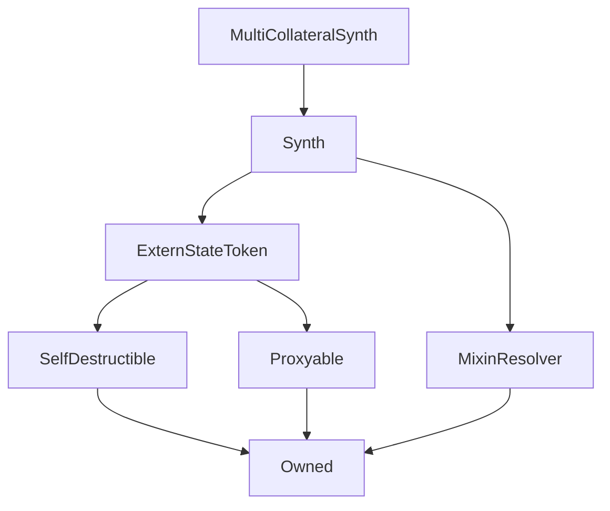

# MultiCollateralSynth

**Source:** [MultiCollateralSynth.sol](https://github.com/Synthetixio/synthetix/blob/master/contracts/MultiCollateralSynth.sol)

!!! todo "Work in Progress"

    This needs filling in

## Description

... todo.

**Source:** [contracts/MultiCollateralSynth.sol](https://github.com/Synthetixio/synthetix/tree/develop/contracts/MultiCollateralSynth.sol)

## Architecture

... todo.

<!--centered-image>
    
</centered-image-->

---
### Inheritance Graph

---
### Related Contracts

- ?

## Views

## Variables

---
### `multiCollateralKey`

[Source](https://github.com/Synthetixio/synthetix/tree/develop/contracts/MultiCollateralSynth.sol#L9)

**Type:** `bytes32`

## Modifiers

---
### `onlyInternalContracts`

[Source](https://github.com/Synthetixio/synthetix/tree/develop/contracts/MultiCollateralSynth.sol#L58)

## Function (Constructor)

---
### `constructor`

[Source](https://github.com/Synthetixio/synthetix/tree/develop/contracts/MultiCollateralSynth.sol#L13)

??? example "Details"

    **Signature**

    `(address payable _proxy, contract TokenState _tokenState, string _tokenName, string _tokenSymbol, address _owner, bytes32 _currencyKey, uint256 _totalSupply, address _resolver, bytes32 _multiCollateralKey)`

    **State Mutability**

    `nonpayable`

    **Modifiers**

    * [Synth](#synth)

## Functions

---
### `burn`

[Source](https://github.com/Synthetixio/synthetix/tree/develop/contracts/MultiCollateralSynth.sol#L51)

??? example "Details"

    **Signature**

    `burn(address account, uint256 amount)`

    **State Mutability**

    `nonpayable`

    **Modifiers**

    * [onlyInternalContracts](#onlyinternalcontracts)

---
### `issue`

[Source](https://github.com/Synthetixio/synthetix/tree/develop/contracts/MultiCollateralSynth.sol#L42)

??? example "Details"

    **Signature**

    `issue(address account, uint256 amount)`

    **State Mutability**

    `nonpayable`

    **Modifiers**

    * [onlyInternalContracts](#onlyinternalcontracts)

## Functions (Internal)

---
### `multiCollateral`

[Source](https://github.com/Synthetixio/synthetix/tree/develop/contracts/MultiCollateralSynth.sol#L31)

??? example "Details"

    **Signature**

    `multiCollateral()`

    **State Mutability**

    `view`

## Internal & Restricted Mutative Functions

## Owner Mutative Functions

## Public Mutative Functions

