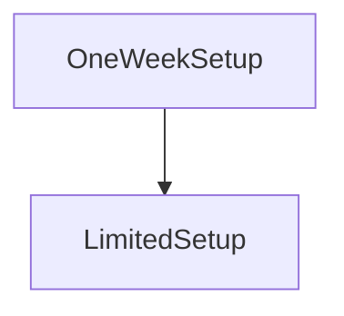

# OneWeekSetup

## Description

**Source:** [contracts/test-helpers/OneWeekSetup.sol](https://github.com/Synthetixio/synthetix/tree/develop/contracts/test-helpers/OneWeekSetup.sol)

## Architecture

---
### Inheritance Graph

## Constants

## Functions

---
### `publicSetupExpiryTime`

[Source](https://github.com/Synthetixio/synthetix/tree/develop/contracts/test-helpers/OneWeekSetup.sol#L11)

??? example "Details"

    **Signature**

    `publicSetupExpiryTime()`

    **State Mutability**

    `view`

---
### `testFunc`

[Source](https://github.com/Synthetixio/synthetix/tree/develop/contracts/test-helpers/OneWeekSetup.sol#L7)

??? example "Details"

    **Signature**

    `testFunc()`

    **State Mutability**

    `view`

    **Modifiers**

    * [onlyDuringSetup](#onlyduringsetup)

## Variables

