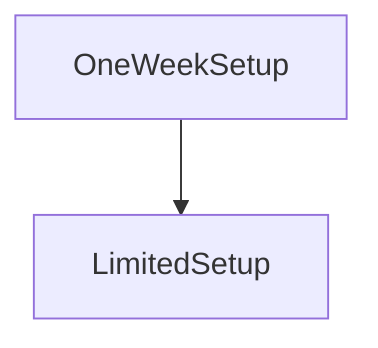

# OneWeekSetup

**Source:** [contracts/test-helpers/OneWeekSetup.sol](https://github.com/Synthetixio/synthetix/tree/develop/contracts/test-helpers/OneWeekSetup.sol)

## Architecture

### Inheritance Graph

---

## Structs

## Variables

## Functions

---

### `testFunc`
[Source](https://github.com/Synthetixio/synthetix/tree/develop/contracts/test-helpers/OneWeekSetup.sol#L7)

??? example "Details"

    **Signature**

    `testFunc() public`

    **Modifiers**

    * [onlyDuringSetup](#onlyduringsetup)

---

### `publicSetupExpiryTime`
[Source](https://github.com/Synthetixio/synthetix/tree/develop/contracts/test-helpers/OneWeekSetup.sol#L11)

??? example "Details"

    **Signature**

    `publicSetupExpiryTime() public`

---

## Modifiers

## Events

