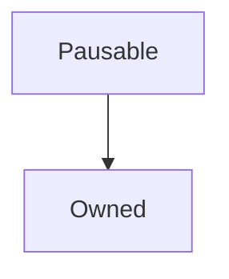

# Pausable

**Source:** [contracts/Pausable.sol](https://github.com/Synthetixio/synthetix/tree/develop/contracts/Pausable.sol)

## Architecture

### Inheritance Graph

---

## Structs

## Variables

---

### `lastPauseTime`
[Source](https://github.com/Synthetixio/synthetix/tree/develop/contracts/Pausable.sol#L9)

**Type:** `uint256`

---

### `paused`
[Source](https://github.com/Synthetixio/synthetix/tree/develop/contracts/Pausable.sol#L10)

**Type:** `bool`

## Functions

---

### `setPaused`
[Source](https://github.com/Synthetixio/synthetix/tree/develop/contracts/Pausable.sol#L22)

??? example "Details"

    **Signature**

    `setPaused(bool _paused) external`

    **Modifiers**

    * [onlyOwner](#onlyowner)

    **Emits**

    * [PauseChanged](#pausechanged)

---

## Modifiers

---

### `notPaused`
[Source](https://github.com/Synthetixio/synthetix/tree/develop/contracts/Pausable.sol#L42)

---

## Events

---

### `PauseChanged`
[Source](https://github.com/Synthetixio/synthetix/tree/develop/contracts/Pausable.sol#L40)

- `(bool isPaused)`

---

