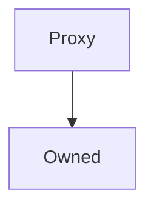

# Proxy

**Source:** [contracts/Proxy.sol](https://github.com/Synthetixio/synthetix/tree/develop/contracts/Proxy.sol)

## Architecture

### Inheritance Graph

---

## Variables

---

### `target`
[Source](https://github.com/Synthetixio/synthetix/tree/develop/contracts/Proxy.sol#L12)

**Type:** `contract Proxyable`

---

### `useDELEGATECALL`
[Source](https://github.com/Synthetixio/synthetix/tree/develop/contracts/Proxy.sol#L13)

**Type:** `bool`

## Functions

---

### `constructor`
[Source](https://github.com/Synthetixio/synthetix/tree/develop/contracts/Proxy.sol#L15)

??? example "Details"

    **Signature**

    `(address _owner) public`

    **Modifiers**

    * [Owned](#owned)

---

### `setTarget`
[Source](https://github.com/Synthetixio/synthetix/tree/develop/contracts/Proxy.sol#L17)

??? example "Details"

    **Signature**

    `setTarget(contract Proxyable _target) external`

    **Modifiers**

    * [onlyOwner](#onlyowner)

    **Emits**

    * [TargetUpdated](#targetupdated)

---

### `setUseDELEGATECALL`
[Source](https://github.com/Synthetixio/synthetix/tree/develop/contracts/Proxy.sol#L22)

??? example "Details"

    **Signature**

    `setUseDELEGATECALL(bool value) external`

    **Modifiers**

    * [onlyOwner](#onlyowner)

---

### `_emit`
[Source](https://github.com/Synthetixio/synthetix/tree/develop/contracts/Proxy.sol#L26)

??? example "Details"

    **Signature**

    `_emit(bytes callData, uint256 numTopics, bytes32 topic1, bytes32 topic2, bytes32 topic3, bytes32 topic4) external`

    **Modifiers**

    * [onlyTarget](#onlytarget)

---

### `fallback`
[Source](https://github.com/Synthetixio/synthetix/tree/develop/contracts/Proxy.sol#L62)

??? example "Details"

    **Signature**

    `() external`

---

## Modifiers

---

### `onlyTarget`
[Source](https://github.com/Synthetixio/synthetix/tree/develop/contracts/Proxy.sol#L99)

---

## Events

---

### `TargetUpdated`
[Source](https://github.com/Synthetixio/synthetix/tree/develop/contracts/Proxy.sol#L104)

- `(contract Proxyable newTarget)`

---

