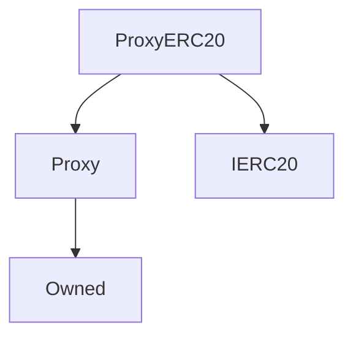

# ProxyERC20

**Source:** [contracts/ProxyERC20.sol](https://github.com/Synthetixio/synthetix/tree/develop/contracts/ProxyERC20.sol)

## Architecture

### Inheritance Graph

---

## Functions

---

### `constructor`
[Source](https://github.com/Synthetixio/synthetix/tree/develop/contracts/ProxyERC20.sol#L10)

??? example "Details"

    **Signature**

    `(address _owner) public`

    **Modifiers**

    * [Proxy](#proxy)

---

### `name`
[Source](https://github.com/Synthetixio/synthetix/tree/develop/contracts/ProxyERC20.sol#L14)

??? example "Details"

    **Signature**

    `name() public`

---

### `symbol`
[Source](https://github.com/Synthetixio/synthetix/tree/develop/contracts/ProxyERC20.sol#L19)

??? example "Details"

    **Signature**

    `symbol() public`

---

### `decimals`
[Source](https://github.com/Synthetixio/synthetix/tree/develop/contracts/ProxyERC20.sol#L24)

??? example "Details"

    **Signature**

    `decimals() public`

---

### `totalSupply`
[Source](https://github.com/Synthetixio/synthetix/tree/develop/contracts/ProxyERC20.sol#L34)

??? example "Details"

    **Signature**

    `totalSupply() public`

---

### `balanceOf`
[Source](https://github.com/Synthetixio/synthetix/tree/develop/contracts/ProxyERC20.sol#L44)

??? example "Details"

    **Signature**

    `balanceOf(address account) public`

---

### `allowance`
[Source](https://github.com/Synthetixio/synthetix/tree/develop/contracts/ProxyERC20.sol#L55)

??? example "Details"

    **Signature**

    `allowance(address owner, address spender) public`

---

### `transfer`
[Source](https://github.com/Synthetixio/synthetix/tree/develop/contracts/ProxyERC20.sol#L65)

??? example "Details"

    **Signature**

    `transfer(address to, uint256 value) public`

---

### `approve`
[Source](https://github.com/Synthetixio/synthetix/tree/develop/contracts/ProxyERC20.sol#L85)

??? example "Details"

    **Signature**

    `approve(address spender, uint256 value) public`

---

### `transferFrom`
[Source](https://github.com/Synthetixio/synthetix/tree/develop/contracts/ProxyERC20.sol#L102)

??? example "Details"

    **Signature**

    `transferFrom(address from, address to, uint256 value) public`

---

