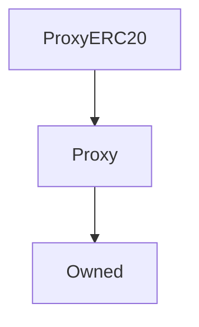

# ProxyERC20

This is a wrapper around [`Proxy`](Proxy.md) which explicitly implements the [ERC20 token standard](https://docs.openzeppelin.com/contracts/2.x/api/token/erc20#ERC20Detailed).

As a result this proxy can verifiably support token functionality in its ABI if it sits in front of an ERC20-compliant smart contract. Apart from these functions, ProxyERC20 operates identically to the [proxy it inherits](Proxy.md).

In the Synthetix system, an ERC20 proxy operates in front of the main [SNX token contract](Synthetix.md), alongside the pre-existing standard proxy. Thus clients can choose to use either of these two proxies to interact with the system.

**Source:** [ProxyERC20.sol](https://github.com/Synthetixio/synthetix/blob/master/contracts/ProxyERC20.sol)

## Architecture

---
### Inheritance Graph

## Description

**Source:** [contracts/ProxyERC20.sol](https://github.com/Synthetixio/synthetix/tree/develop/contracts/ProxyERC20.sol)

## Function (Constructor)

---
### `constructor`

[Source](https://github.com/Synthetixio/synthetix/tree/develop/contracts/ProxyERC20.sol#L10)

??? example "Details"

    **Signature**

    `(address _owner)`

    **State Mutability**

    `nonpayable`

    **Modifiers**

    * [Proxy](#proxy)

## Functions

---
### `allowance`

[Source](https://github.com/Synthetixio/synthetix/tree/develop/contracts/ProxyERC20.sol#L55)

??? example "Details"

    **Signature**

    `allowance(address owner, address spender)`

    **State Mutability**

    `view`

---
### `approve`

[Source](https://github.com/Synthetixio/synthetix/tree/develop/contracts/ProxyERC20.sol#L85)

??? example "Details"

    **Signature**

    `approve(address spender, uint256 value)`

    **State Mutability**

    `nonpayable`

---
### `balanceOf`

[Source](https://github.com/Synthetixio/synthetix/tree/develop/contracts/ProxyERC20.sol#L44)

??? example "Details"

    **Signature**

    `balanceOf(address account)`

    **State Mutability**

    `view`

---
### `decimals`

[Source](https://github.com/Synthetixio/synthetix/tree/develop/contracts/ProxyERC20.sol#L24)

??? example "Details"

    **Signature**

    `decimals()`

    **State Mutability**

    `view`

---
### `name`

[Source](https://github.com/Synthetixio/synthetix/tree/develop/contracts/ProxyERC20.sol#L14)

??? example "Details"

    **Signature**

    `name()`

    **State Mutability**

    `view`

---
### `symbol`

[Source](https://github.com/Synthetixio/synthetix/tree/develop/contracts/ProxyERC20.sol#L19)

??? example "Details"

    **Signature**

    `symbol()`

    **State Mutability**

    `view`

---
### `totalSupply`

[Source](https://github.com/Synthetixio/synthetix/tree/develop/contracts/ProxyERC20.sol#L34)

??? example "Details"

    **Signature**

    `totalSupply()`

    **State Mutability**

    `view`

---
### `transfer`

[Source](https://github.com/Synthetixio/synthetix/tree/develop/contracts/ProxyERC20.sol#L65)

??? example "Details"

    **Signature**

    `transfer(address to, uint256 value)`

    **State Mutability**

    `nonpayable`

---
### `transferFrom`

[Source](https://github.com/Synthetixio/synthetix/tree/develop/contracts/ProxyERC20.sol#L102)

??? example "Details"

    **Signature**

    `transferFrom(address from, address to, uint256 value)`

    **State Mutability**

    `nonpayable`

## Variables

