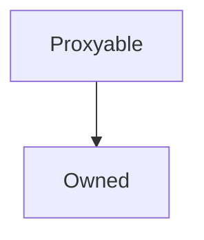

# Proxyable

**Source:** [contracts/Proxyable.sol](https://github.com/Synthetixio/synthetix/tree/develop/contracts/Proxyable.sol)

## Architecture

### Inheritance Graph

---

## Structs

## Variables

---

### `proxy`
[Source](https://github.com/Synthetixio/synthetix/tree/develop/contracts/Proxyable.sol#L15)

**Type:** `contract Proxy`

---

### `integrationProxy`
[Source](https://github.com/Synthetixio/synthetix/tree/develop/contracts/Proxyable.sol#L16)

**Type:** `contract Proxy`

---

### `messageSender`
[Source](https://github.com/Synthetixio/synthetix/tree/develop/contracts/Proxyable.sol#L21)

**Type:** `address`

## Functions

---

### `setProxy`
[Source](https://github.com/Synthetixio/synthetix/tree/develop/contracts/Proxyable.sol#L31)

??? example "Details"

    **Signature**

    `setProxy(address payable _proxy) external`

    **Modifiers**

    * [onlyOwner](#onlyowner)

    **Emits**

    * [ProxyUpdated](#proxyupdated)

---

### `setIntegrationProxy`
[Source](https://github.com/Synthetixio/synthetix/tree/develop/contracts/Proxyable.sol#L36)

??? example "Details"

    **Signature**

    `setIntegrationProxy(address payable _integrationProxy) external`

    **Modifiers**

    * [onlyOwner](#onlyowner)

---

### `setMessageSender`
[Source](https://github.com/Synthetixio/synthetix/tree/develop/contracts/Proxyable.sol#L40)

??? example "Details"

    **Signature**

    `setMessageSender(address sender) external`

    **Modifiers**

    * [onlyProxy](#onlyproxy)

---

## Modifiers

---

### `onlyProxy`
[Source](https://github.com/Synthetixio/synthetix/tree/develop/contracts/Proxyable.sol#L44)

---

### `optionalProxy`
[Source](https://github.com/Synthetixio/synthetix/tree/develop/contracts/Proxyable.sol#L49)

---

### `optionalProxy_onlyOwner`
[Source](https://github.com/Synthetixio/synthetix/tree/develop/contracts/Proxyable.sol#L56)

---

## Events

---

### `ProxyUpdated`
[Source](https://github.com/Synthetixio/synthetix/tree/develop/contracts/Proxyable.sol#L64)

- `(address proxyAddress)`

---

