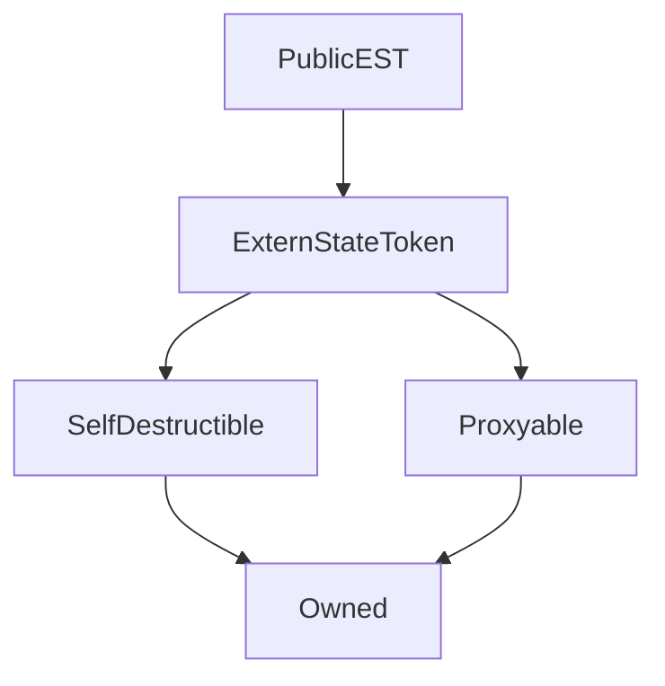

# PublicEST

## Description

**Source:** [contracts/test-helpers/PublicEST.sol](https://github.com/Synthetixio/synthetix/tree/develop/contracts/test-helpers/PublicEST.sol)

## Architecture

---
### Inheritance Graph

## Constants

---
### `DECIMALS`

[Source](https://github.com/Synthetixio/synthetix/tree/develop/contracts/test-helpers/PublicEST.sol#L7)

**Type:** `uint8`

## Events

---
### `Received`

[Source](https://github.com/Synthetixio/synthetix/tree/develop/contracts/test-helpers/PublicEST.sol#L31)

- `(address sender, uint256 inputA, bytes32 inputB)`

## Function (Constructor)

---
### `constructor`

[Source](https://github.com/Synthetixio/synthetix/tree/develop/contracts/test-helpers/PublicEST.sol#L9)

??? example "Details"

    **Signature**

    `(address payable _proxy, contract TokenState _tokenState, string _name, string _symbol, uint256 _totalSupply, address _owner)`

    **State Mutability**

    `nonpayable`

    **Modifiers**

    * [ExternStateToken](#externstatetoken)

## Functions

---
### `somethingToBeProxied`

[Source](https://github.com/Synthetixio/synthetix/tree/develop/contracts/test-helpers/PublicEST.sol#L33)

??? example "Details"

    **Signature**

    `somethingToBeProxied(uint256 inputA, bytes32 inputB)`

    **State Mutability**

    `nonpayable`

    **Emits**

    * [Received](#received)

---
### `transfer`

[Source](https://github.com/Synthetixio/synthetix/tree/develop/contracts/test-helpers/PublicEST.sol#L18)

??? example "Details"

    **Signature**

    `transfer(address to, uint256 value)`

    **State Mutability**

    `nonpayable`

    **Modifiers**

    * [optionalProxy](#optionalproxy)

---
### `transferFrom`

[Source](https://github.com/Synthetixio/synthetix/tree/develop/contracts/test-helpers/PublicEST.sol#L22)

??? example "Details"

    **Signature**

    `transferFrom(address from, address to, uint256 value)`

    **State Mutability**

    `nonpayable`

    **Modifiers**

    * [optionalProxy](#optionalproxy)

