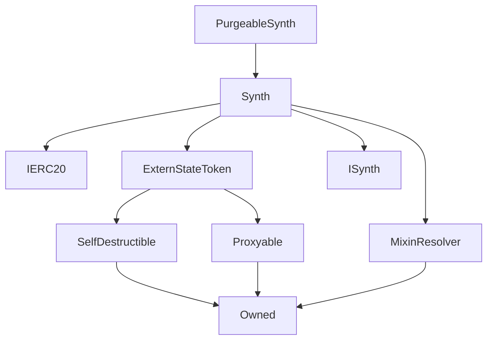

# PurgeableSynth

**Source:** [contracts/PurgeableSynth.sol](https://github.com/Synthetixio/synthetix/tree/develop/contracts/PurgeableSynth.sol)

## Architecture

### Inheritance Graph

---

## Variables

---

### `maxSupplyToPurgeInUSD`
[Source](https://github.com/Synthetixio/synthetix/tree/develop/contracts/PurgeableSynth.sol#L18)

**Type:** `uint256`

## Functions

---

### `constructor`
[Source](https://github.com/Synthetixio/synthetix/tree/develop/contracts/PurgeableSynth.sol#L24)

??? example "Details"

    **Signature**

    `(address payable _proxy, contract TokenState _tokenState, string _tokenName, string _tokenSymbol, address payable _owner, bytes32 _currencyKey, uint256 _totalSupply, address _resolver) public`

    **Modifiers**

    * [Synth](#synth)

---

### `purge`
[Source](https://github.com/Synthetixio/synthetix/tree/develop/contracts/PurgeableSynth.sol#L49)

??? example "Details"

    **Signature**

    `purge(address[] addresses) external`

    **Requires**

    * [require(..., Cannot purge as total supply is above threshold and rate is not frozen.)](https://github.com/Synthetixio/synthetix/tree/develop/contracts/PurgeableSynth.sol#L55)

    **Modifiers**

    * [optionalProxy_onlyOwner](#optionalproxy_onlyowner)

---

## Events

---

### `Purged`
[Source](https://github.com/Synthetixio/synthetix/tree/develop/contracts/PurgeableSynth.sol#L73)

- `(address account, uint256 value)`

---

