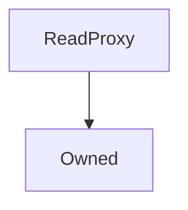

# ReadProxy

**Source:** [contracts/ReadProxy.sol](https://github.com/Synthetixio/synthetix/tree/develop/contracts/ReadProxy.sol)

## Architecture

### Inheritance Graph

---

## Structs

## Variables

---

### `target`
[Source](https://github.com/Synthetixio/synthetix/tree/develop/contracts/ReadProxy.sol#L10)

**Type:** `address`

## Functions

---

### `constructor`
[Source](https://github.com/Synthetixio/synthetix/tree/develop/contracts/ReadProxy.sol#L12)

??? example "Details"

    **Signature**

    `(address _owner) public`

    **Modifiers**

    * [Owned](#owned)

---

### `setTarget`
[Source](https://github.com/Synthetixio/synthetix/tree/develop/contracts/ReadProxy.sol#L14)

??? example "Details"

    **Signature**

    `setTarget(address _target) external`

    **Modifiers**

    * [onlyOwner](#onlyowner)

    **Emits**

    * [TargetUpdated](#targetupdated)

---

### `fallback`
[Source](https://github.com/Synthetixio/synthetix/tree/develop/contracts/ReadProxy.sol#L19)

??? example "Details"

    **Signature**

    `() external`

---

## Modifiers

## Events

---

### `TargetUpdated`
[Source](https://github.com/Synthetixio/synthetix/tree/develop/contracts/ReadProxy.sol#L36)

- `(address newTarget)`

---

