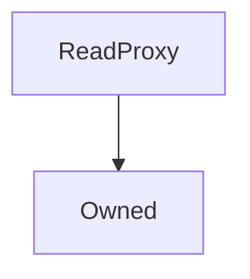

# ReadProxy

**Source:** [ReadProxy.sol](https://github.com/Synthetixio/synthetix/blob/master/contracts/ReadProxy.sol)


!!! todo "Work in Progress"


```
This needs filling in
```

## Description

... todo.


**Source:** [contracts/ReadProxy.sol](https://github.com/Synthetixio/synthetix/tree/develop/contracts/ReadProxy.sol)

## Architecture

... todo.


<!--centered-image>
    
</centered-image-->


---
### Inheritance Graph




---
### Related Contracts

- ?

## Constants

## Variables


---
### `target`

<sub>[Source](https://github.com/Synthetixio/synthetix/tree/develop/contracts/ReadProxy.sol#L10)</sub>


**Type:** `address`

## Views

## Public Mutative Functions

## Owner Mutative Functions

## Internal & Restricted Mutative Functions

## Events

--


---
### `TargetUpdated`

<sub>[Source](https://github.com/Synthetixio/synthetix/tree/develop/contracts/ReadProxy.sol#L36)</sub>


- `(address newTarget)`

## Functions


---
### `constructor`

<sub>[Source](https://github.com/Synthetixio/synthetix/tree/develop/contracts/ReadProxy.sol#L12)</sub>


??? example "Details"

    **Signature**

    `(address _owner) public`

    **Modifiers**

    * [Owned](#owned)


---
### `setTarget`

<sub>[Source](https://github.com/Synthetixio/synthetix/tree/develop/contracts/ReadProxy.sol#L14)</sub>


??? example "Details"

    **Signature**

    `setTarget(address _target) external`

    **Modifiers**

    * [onlyOwner](#onlyowner)

    **Emits**

    * [TargetUpdated](#targetupdated)


---
### `fallback`

<sub>[Source](https://github.com/Synthetixio/synthetix/tree/develop/contracts/ReadProxy.sol#L19)</sub>


??? example "Details"

    **Signature**

    `() external`

