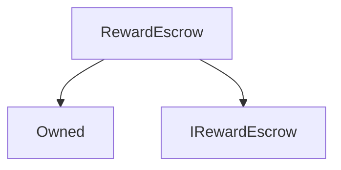

# RewardEscrow

**Source:** [contracts/RewardEscrow.sol](https://github.com/Synthetixio/synthetix/tree/develop/contracts/RewardEscrow.sol)

## Architecture

### Inheritance Graph

---

## Variables

---

### `synthetix`
[Source](https://github.com/Synthetixio/synthetix/tree/develop/contracts/RewardEscrow.sol#L21)

**Type:** `contract ISynthetix`

---

### `feePool`
[Source](https://github.com/Synthetixio/synthetix/tree/develop/contracts/RewardEscrow.sol#L23)

**Type:** `contract IFeePool`

---

### `vestingSchedules`
[Source](https://github.com/Synthetixio/synthetix/tree/develop/contracts/RewardEscrow.sol#L27)

**Type:** `mapping(address => uint256[2][])`

---

### `totalEscrowedAccountBalance`
[Source](https://github.com/Synthetixio/synthetix/tree/develop/contracts/RewardEscrow.sol#L30)

**Type:** `mapping(address => uint256)`

---

### `totalVestedAccountBalance`
[Source](https://github.com/Synthetixio/synthetix/tree/develop/contracts/RewardEscrow.sol#L33)

**Type:** `mapping(address => uint256)`

---

### `totalEscrowedBalance`
[Source](https://github.com/Synthetixio/synthetix/tree/develop/contracts/RewardEscrow.sol#L36)

**Type:** `uint256`

---

### `TIME_INDEX`
[Source](https://github.com/Synthetixio/synthetix/tree/develop/contracts/RewardEscrow.sol#L38)

**Type:** `uint256`

---

### `QUANTITY_INDEX`
[Source](https://github.com/Synthetixio/synthetix/tree/develop/contracts/RewardEscrow.sol#L39)

**Type:** `uint256`

---

### `MAX_VESTING_ENTRIES`
[Source](https://github.com/Synthetixio/synthetix/tree/develop/contracts/RewardEscrow.sol#L43)

**Type:** `uint256`

## Functions

---

### `constructor`
[Source](https://github.com/Synthetixio/synthetix/tree/develop/contracts/RewardEscrow.sol#L47)

??? example "Details"

    **Signature**

    `(address _owner, contract ISynthetix _synthetix, contract IFeePool _feePool) public`

    **Modifiers**

    * [Owned](#owned)

---

### `setSynthetix`
[Source](https://github.com/Synthetixio/synthetix/tree/develop/contracts/RewardEscrow.sol#L61)

??? example "Details"

    **Signature**

    `setSynthetix(contract ISynthetix _synthetix) external`

    **Modifiers**

    * [onlyOwner](#onlyowner)

    **Emits**

    * [SynthetixUpdated](#synthetixupdated)

---

### `setFeePool`
[Source](https://github.com/Synthetixio/synthetix/tree/develop/contracts/RewardEscrow.sol#L70)

??? example "Details"

    **Signature**

    `setFeePool(contract IFeePool _feePool) external`

    **Modifiers**

    * [onlyOwner](#onlyowner)

    **Emits**

    * [FeePoolUpdated](#feepoolupdated)

---

### `balanceOf`
[Source](https://github.com/Synthetixio/synthetix/tree/develop/contracts/RewardEscrow.sol#L80)

??? example "Details"

    **Signature**

    `balanceOf(address account) public`

---

### `numVestingEntries`
[Source](https://github.com/Synthetixio/synthetix/tree/develop/contracts/RewardEscrow.sol#L91)

??? example "Details"

    **Signature**

    `numVestingEntries(address account) external`

---

### `getVestingScheduleEntry`
[Source](https://github.com/Synthetixio/synthetix/tree/develop/contracts/RewardEscrow.sol#L99)

??? example "Details"

    **Signature**

    `getVestingScheduleEntry(address account, uint256 index) public`

---

### `getVestingTime`
[Source](https://github.com/Synthetixio/synthetix/tree/develop/contracts/RewardEscrow.sol#L106)

??? example "Details"

    **Signature**

    `getVestingTime(address account, uint256 index) public`

---

### `getVestingQuantity`
[Source](https://github.com/Synthetixio/synthetix/tree/develop/contracts/RewardEscrow.sol#L113)

??? example "Details"

    **Signature**

    `getVestingQuantity(address account, uint256 index) public`

---

### `getNextVestingIndex`
[Source](https://github.com/Synthetixio/synthetix/tree/develop/contracts/RewardEscrow.sol#L120)

??? example "Details"

    **Signature**

    `getNextVestingIndex(address account) public`

---

### `getNextVestingEntry`
[Source](https://github.com/Synthetixio/synthetix/tree/develop/contracts/RewardEscrow.sol#L133)

??? example "Details"

    **Signature**

    `getNextVestingEntry(address account) public`

---

### `getNextVestingTime`
[Source](https://github.com/Synthetixio/synthetix/tree/develop/contracts/RewardEscrow.sol#L144)

??? example "Details"

    **Signature**

    `getNextVestingTime(address account) external`

---

### `getNextVestingQuantity`
[Source](https://github.com/Synthetixio/synthetix/tree/develop/contracts/RewardEscrow.sol#L151)

??? example "Details"

    **Signature**

    `getNextVestingQuantity(address account) external`

---

### `checkAccountSchedule`
[Source](https://github.com/Synthetixio/synthetix/tree/develop/contracts/RewardEscrow.sol#L161)

??? example "Details"

    **Signature**

    `checkAccountSchedule(address account) public`

---

### `appendVestingEntry`
[Source](https://github.com/Synthetixio/synthetix/tree/develop/contracts/RewardEscrow.sol#L218)

??? example "Details"

    **Signature**

    `appendVestingEntry(address account, uint256 quantity) external`

    **Modifiers**

    * [onlyFeePool](#onlyfeepool)

---

### `vest`
[Source](https://github.com/Synthetixio/synthetix/tree/develop/contracts/RewardEscrow.sol#L225)

??? example "Details"

    **Signature**

    `vest() external`

---

## Modifiers

---

### `onlyFeePool`
[Source](https://github.com/Synthetixio/synthetix/tree/develop/contracts/RewardEscrow.sol#L254)

---

## Events

---

### `SynthetixUpdated`
[Source](https://github.com/Synthetixio/synthetix/tree/develop/contracts/RewardEscrow.sol#L263)

- `(address newSynthetix)`

---

### `FeePoolUpdated`
[Source](https://github.com/Synthetixio/synthetix/tree/develop/contracts/RewardEscrow.sol#L265)

- `(address newFeePool)`

---

### `Vested`
[Source](https://github.com/Synthetixio/synthetix/tree/develop/contracts/RewardEscrow.sol#L267)

- `(address beneficiary, uint256 time, uint256 value)`

---

### `VestingEntryCreated`
[Source](https://github.com/Synthetixio/synthetix/tree/develop/contracts/RewardEscrow.sol#L269)

- `(address beneficiary, uint256 time, uint256 value)`

---

