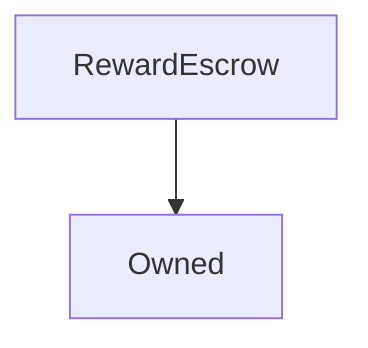

# RewardEscrow

This is the mechanism for distributing SNX rewards from the inflationary supply. When an SNX staker claims fees, the inflationary reward component is escrowed in this contract and an entry is added to an escrow schedule for that staker for them to claim after a year. These vesting schedules can only be appended to by the [FeePool](FeePool.md) contract.

The logic of RewardEscrow is derived from the [SynthetixEscrow](SynthetixEscrow.md) contract.

**Source:** [RewardEscrow.sol](https://github.com/Synthetixio/synthetix/blob/master/contracts/RewardEscrow.sol)

## Architecture

---
### Inheritance Graph

---
### Related Contracts

- <>[Synthetix](Synthetix.md)
- <>[FeePool](FeePool.md)

---
### Libraries

- [`SafeMath`](SafeMath.md) for `uint`

## Variables

---
### `synthetix`

[Source](https://github.com/Synthetixio/synthetix/tree/develop/contracts/RewardEscrow.sol#L21)

The address of the main [`Synthetix`](Synthetix.md) contract.

**Type:** `contract ISynthetix`

---
### `feePool`

[Source](https://github.com/Synthetixio/synthetix/tree/develop/contracts/RewardEscrow.sol#L23)

The address of the [`FeePool`](FeePool.md) contract.

**Type:** `contract IFeePool`

---
### `vestingSchedules`

[Source](https://github.com/Synthetixio/synthetix/tree/develop/contracts/RewardEscrow.sol#L27)

Stores the vesting schedule for each for each account. Each schedule is a list of `(vesting timestamp, quantity)` pairs in ascending time order.

**Type:** `mapping(address => uint256[2][])`

---
### `totalEscrowedAccountBalance`

[Source](https://github.com/Synthetixio/synthetix/tree/develop/contracts/RewardEscrow.sol#L30)

The quantity of remaining tokens for each account; it saves the recomputation involved in summing over [`vestingSchedules`](#vestingschedules) entries.

**Type:** `mapping(address => uint256)`

---
### `totalVestedAccountBalance`

[Source](https://github.com/Synthetixio/synthetix/tree/develop/contracts/RewardEscrow.sol#L33)

The quantity of tokens that have already been vested for each account.

**Type:** `mapping(address => uint256)`

---
### `totalEscrowedBalance`

[Source](https://github.com/Synthetixio/synthetix/tree/develop/contracts/RewardEscrow.sol#L36)

A record of the total remaining vested balance in this contract, which should be equal to the actual SNX balance.

**Type:** `uint256`

---
### `TIME_INDEX`

[Source](https://github.com/Synthetixio/synthetix/tree/develop/contracts/RewardEscrow.sol#L38)

The vesting timestamp is the first entry in vesting schedule entry pairs.

**Value:** `0`

**Type:** `uint256`

---
### `QUANTITY_INDEX`

[Source](https://github.com/Synthetixio/synthetix/tree/develop/contracts/RewardEscrow.sol#L39)

The vesting quantity is the second entry in vesting schedule entry pairs.

**Value:** `1`

**Type:** `uint256`

---
### `MAX_VESTING_ENTRIES`

[Source](https://github.com/Synthetixio/synthetix/tree/develop/contracts/RewardEscrow.sol#L43)

This constant limits vesting schedules to be shorter than 260 entries long so that iteration is bounded. This allows up to five years of vesting entries to be handled, if one is generated per weekly fee period.

**Value:** `52 * 5`

**Type:** `uint256`

## Functions

---
### `constructor`

[Source](https://github.com/Synthetixio/synthetix/tree/develop/contracts/RewardEscrow.sol#L47)

Initialises the [`Synthetix`](Synthetix.md) and [`FeePool`](FeePool.md) contract addresses, and the inherited [`Owned`](Owned.md) instance.

??? example "Details"

    **Signature**

    `(address _owner, contract ISynthetix _synthetix, contract IFeePool _feePool) public`

    **Modifiers**

    * [Owned](#owned)

---
### `setSynthetix`

[Source](https://github.com/Synthetixio/synthetix/tree/develop/contracts/RewardEscrow.sol#L61)

Sets the address of the [`Synthetix`](Synthetix.md) contract, so that escrowed SNX can be transferred to accounts claiming them.

??? example "Details"

    **Signature**

    `setSynthetix(contract ISynthetix _synthetix) external`

    **Modifiers**

    * [onlyOwner](#onlyowner)

    **Emits**

    * [SynthetixUpdated](#synthetixupdated)

---
### `setFeePool`

[Source](https://github.com/Synthetixio/synthetix/tree/develop/contracts/RewardEscrow.sol#L70)

Sets the address of the [`FeePool`](FeePool.md) contract, so that new vesting entries can be generated.

??? example "Details"

    **Signature**

    `setFeePool(contract IFeePool _feePool) external`

    **Modifiers**

    * [onlyOwner](#onlyowner)

    **Emits**

    * [FeePoolUpdated](#feepoolupdated)

---
### `balanceOf`

[Source](https://github.com/Synthetixio/synthetix/tree/develop/contracts/RewardEscrow.sol#L80)

An alias to [`totalEscrowedAccountBalance[account]`](#totalescrowedaccountbalance) for ERC20 integration.

??? example "Details"

    **Signature**

    `balanceOf(address account) public`

---
### `numVestingEntries`

[Source](https://github.com/Synthetixio/synthetix/tree/develop/contracts/RewardEscrow.sol#L91)

The number of entries in an account's vesting schedule, including those already claimed.

??? example "Details"

    **Signature**

    `numVestingEntries(address account) external`

---
### `getVestingScheduleEntry`

[Source](https://github.com/Synthetixio/synthetix/tree/develop/contracts/RewardEscrow.sol#L99)

Returns a particular schedule entry for an account, which is a pair of uints: `(vesting timestamp, SNX quantity)`.

This is here because the public function generated for [`vestingSchedules`](#vestingschedules) awkwardly requires the index into the pair as its third argument.

??? example "Details"

    **Signature**

    `getVestingScheduleEntry(address account, uint256 index) public`

---
### `getVestingTime`

[Source](https://github.com/Synthetixio/synthetix/tree/develop/contracts/RewardEscrow.sol#L106)

Returns the time at which a given schedule entry will vest.

??? example "Details"

    **Signature**

    `getVestingTime(address account, uint256 index) public`

---
### `getVestingQuantity`

[Source](https://github.com/Synthetixio/synthetix/tree/develop/contracts/RewardEscrow.sol#L113)

Returns the quantity of SNX a given schedule entry will yield.

??? example "Details"

    **Signature**

    `getVestingQuantity(address account, uint256 index) public`

---
### `getNextVestingIndex`

[Source](https://github.com/Synthetixio/synthetix/tree/develop/contracts/RewardEscrow.sol#L120)

Returns the index of the next vesting entry that will vest for a given account. Returns one past the end if there are none remaining.

The function iterates until it finds the first nonzero vesting entry timestamp, so the gas cost increases slightly as more entries vest. A full schedule of 260 entries would cost a little over $50\,000$ gas to iterate over.

??? example "Details"

    **Signature**

    `getNextVestingIndex(address account) public`

---
### `getNextVestingEntry`

[Source](https://github.com/Synthetixio/synthetix/tree/develop/contracts/RewardEscrow.sol#L133)

Returns the next vesting entry in the same manner as [`getNextVestingIndex`](#getnextvestingindex). Returns `[0,0]` if there is no next vesting entry.

??? example "Details"

    **Signature**

    `getNextVestingEntry(address account) public`

---
### `getNextVestingTime`

[Source](https://github.com/Synthetixio/synthetix/tree/develop/contracts/RewardEscrow.sol#L144)

Returns the timestamp of the next vesting entry. Returns `0` if there is no such entry.

??? example "Details"

    **Signature**

    `getNextVestingTime(address account) external`

---
### `getNextVestingQuantity`

[Source](https://github.com/Synthetixio/synthetix/tree/develop/contracts/RewardEscrow.sol#L151)

Returns the SNX quantity of the next vesting entry. Returns `0` if there is no such entry.

??? example "Details"

    **Signature**

    `getNextVestingQuantity(address account) external`

---
### `checkAccountSchedule`

[Source](https://github.com/Synthetixio/synthetix/tree/develop/contracts/RewardEscrow.sol#L161)

Returns the full vesting schedule for a given account.

??? example "Details"

    **Signature**

    `checkAccountSchedule(address account) public`

---
### `appendVestingEntry`

[Source](https://github.com/Synthetixio/synthetix/tree/develop/contracts/RewardEscrow.sol#L218)

This function allows the [`FeePool`](FeePool.md) contract to add a new entry to a given account's vesting schedule when it claims its fees. All new entries are set to vest after one year.

??? example "Details"

    **Signature**

    `appendVestingEntry(address account, uint256 quantity) external`

    **Modifiers**

    * [onlyFeePool](#onlyfeepool)

---
### `vest`

[Source](https://github.com/Synthetixio/synthetix/tree/develop/contracts/RewardEscrow.sol#L225)

Finds all vesting schedule entries that have come due for the caller and transfers the total quantity of tokens to them. Vested entries are overwritten with `[0,0]`.

??? example "Details"

    **Signature**

    `vest() external`

## Modifiers

---
### `onlyFeePool`

[Source](https://github.com/Synthetixio/synthetix/tree/develop/contracts/RewardEscrow.sol#L254)

Reverts the transaction if the `msg.sender` is not the [`FeePool`](FeePool.md).

## Events

---
### `SynthetixUpdated`

[Source](https://github.com/Synthetixio/synthetix/tree/develop/contracts/RewardEscrow.sol#L263)

Records that the SNX contract address was altered.

**Signature:** `SynthetixUpdated(address newSynthetix)`

- `(address newSynthetix)`

---
### `FeePoolUpdated`

[Source](https://github.com/Synthetixio/synthetix/tree/develop/contracts/RewardEscrow.sol#L265)

Records that the fee pool contract address was altered.

**Signature:** `FeePoolUpdated(address newFeePool)`

- `(address newFeePool)`

---
### `Vested`

[Source](https://github.com/Synthetixio/synthetix/tree/develop/contracts/RewardEscrow.sol#L267)

Records that an account vested a quantity of tokens.

**Signature:** `Vested(address indexed beneficiary, uint time, uint value)`

- `(address beneficiary, uint256 time, uint256 value)`

---
### `VestingEntryCreated`

[Source](https://github.com/Synthetixio/synthetix/tree/develop/contracts/RewardEscrow.sol#L269)

Records that the fee pool created a vesting entry.

**Signature:** `VestingEntryCreated(address indexed beneficiary, uint time, uint value)`

- `(address beneficiary, uint256 time, uint256 value)`

## Description

**Source:** [contracts/RewardEscrow.sol](https://github.com/Synthetixio/synthetix/tree/develop/contracts/RewardEscrow.sol)

