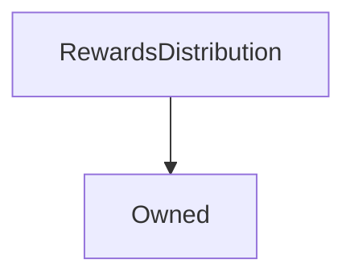

# RewardsDistribution

**Source:** [contracts/RewardsDistribution.sol](https://github.com/Synthetixio/synthetix/tree/develop/contracts/RewardsDistribution.sol)

## Architecture

### Inheritance Graph

---

## Structs

---

### DistributionData
[Source](https://github.com/Synthetixio/synthetix/tree/develop/contracts/RewardsDistribution.sol#L44)

| Field | Type | Description |
| ------ | ------ | ------ |
| destination | address | TBA |
| amount | uint256 | TBA |

---

## Variables

---

### `authority`
[Source](https://github.com/Synthetixio/synthetix/tree/develop/contracts/RewardsDistribution.sol#L23)

**Type:** `address`

---

### `synthetixProxy`
[Source](https://github.com/Synthetixio/synthetix/tree/develop/contracts/RewardsDistribution.sol#L28)

**Type:** `address`

---

### `rewardEscrow`
[Source](https://github.com/Synthetixio/synthetix/tree/develop/contracts/RewardsDistribution.sol#L33)

**Type:** `address`

---

### `feePoolProxy`
[Source](https://github.com/Synthetixio/synthetix/tree/develop/contracts/RewardsDistribution.sol#L38)

**Type:** `address`

---

### `distributions`
[Source](https://github.com/Synthetixio/synthetix/tree/develop/contracts/RewardsDistribution.sol#L52)

**Type:** `struct RewardsDistribution.DistributionData[]`

---

## Functions

---

### `constructor`
[Source](https://github.com/Synthetixio/synthetix/tree/develop/contracts/RewardsDistribution.sol#L58)

??? example "Details"

    **Signature**

    `(address _owner, address _authority, address _synthetixProxy, address _rewardEscrow, address _feePoolProxy) public`

    **Modifiers**

    * [Owned](#owned)

---

### `setSynthetixProxy`
[Source](https://github.com/Synthetixio/synthetix/tree/develop/contracts/RewardsDistribution.sol#L73)

??? example "Details"

    **Signature**

    `setSynthetixProxy(address _synthetixProxy) external`

    **Modifiers**

    * [onlyOwner](#onlyowner)

---

### `setRewardEscrow`
[Source](https://github.com/Synthetixio/synthetix/tree/develop/contracts/RewardsDistribution.sol#L77)

??? example "Details"

    **Signature**

    `setRewardEscrow(address _rewardEscrow) external`

    **Modifiers**

    * [onlyOwner](#onlyowner)

---

### `setFeePoolProxy`
[Source](https://github.com/Synthetixio/synthetix/tree/develop/contracts/RewardsDistribution.sol#L81)

??? example "Details"

    **Signature**

    `setFeePoolProxy(address _feePoolProxy) external`

    **Modifiers**

    * [onlyOwner](#onlyowner)

---

### `setAuthority`
[Source](https://github.com/Synthetixio/synthetix/tree/develop/contracts/RewardsDistribution.sol#L89)

??? example "Details"

    **Signature**

    `setAuthority(address _authority) external`

    **Modifiers**

    * [onlyOwner](#onlyowner)

---

### `addRewardDistribution`
[Source](https://github.com/Synthetixio/synthetix/tree/develop/contracts/RewardsDistribution.sol#L103)

??? example "Details"

    **Signature**

    `addRewardDistribution(address destination, uint256 amount) external`

    **Requires**

    * [require(..., Cant add a zero address)](https://github.com/Synthetixio/synthetix/tree/develop/contracts/RewardsDistribution.sol#L104)

    * [require(..., Cant add a zero amount)](https://github.com/Synthetixio/synthetix/tree/develop/contracts/RewardsDistribution.sol#L105)

    **Modifiers**

    * [onlyOwner](#onlyowner)

    **Emits**

    * [RewardDistributionAdded](#rewarddistributionadded)

---

### `removeRewardDistribution`
[Source](https://github.com/Synthetixio/synthetix/tree/develop/contracts/RewardsDistribution.sol#L119)

??? example "Details"

    **Signature**

    `removeRewardDistribution(uint256 index) external`

    **Requires**

    * [require(..., index out of bounds)](https://github.com/Synthetixio/synthetix/tree/develop/contracts/RewardsDistribution.sol#L120)

    **Modifiers**

    * [onlyOwner](#onlyowner)

---

### `editRewardDistribution`
[Source](https://github.com/Synthetixio/synthetix/tree/develop/contracts/RewardsDistribution.sol#L140)

??? example "Details"

    **Signature**

    `editRewardDistribution(uint256 index, address destination, uint256 amount) external`

    **Requires**

    * [require(..., index out of bounds)](https://github.com/Synthetixio/synthetix/tree/develop/contracts/RewardsDistribution.sol#L145)

    **Modifiers**

    * [onlyOwner](#onlyowner)

---

### `distributeRewards`
[Source](https://github.com/Synthetixio/synthetix/tree/develop/contracts/RewardsDistribution.sol#L153)

??? example "Details"

    **Signature**

    `distributeRewards(uint256 amount) external`

    **Requires**

    * [require(..., Caller is not authorised)](https://github.com/Synthetixio/synthetix/tree/develop/contracts/RewardsDistribution.sol#L154)

    * [require(..., RewardEscrow is not set)](https://github.com/Synthetixio/synthetix/tree/develop/contracts/RewardsDistribution.sol#L155)

    * [require(..., SynthetixProxy is not set)](https://github.com/Synthetixio/synthetix/tree/develop/contracts/RewardsDistribution.sol#L156)

    * [require(..., FeePoolProxy is not set)](https://github.com/Synthetixio/synthetix/tree/develop/contracts/RewardsDistribution.sol#L157)

    * [require(..., Nothing to distribute)](https://github.com/Synthetixio/synthetix/tree/develop/contracts/RewardsDistribution.sol#L158)

    * [require(..., RewardsDistribution contract does not have enough tokens to distribute)](https://github.com/Synthetixio/synthetix/tree/develop/contracts/RewardsDistribution.sol#L159)

    **Emits**

    * [RewardsDistributed](#rewardsdistributed)

---

### `distributionsLength`
[Source](https://github.com/Synthetixio/synthetix/tree/develop/contracts/RewardsDistribution.sol#L201)

??? example "Details"

    **Signature**

    `distributionsLength() external`

---

## Events

---

### `RewardDistributionAdded`
[Source](https://github.com/Synthetixio/synthetix/tree/develop/contracts/RewardsDistribution.sol#L207)

- `(uint256 index, address destination, uint256 amount)`

---

### `RewardsDistributed`
[Source](https://github.com/Synthetixio/synthetix/tree/develop/contracts/RewardsDistribution.sol#L208)

- `(uint256 amount)`

---

