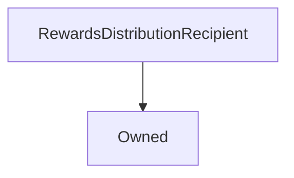

# RewardsDistributionRecipient

**Source:** [contracts/RewardsDistributionRecipient.sol](https://github.com/Synthetixio/synthetix/tree/develop/contracts/RewardsDistributionRecipient.sol)

## Architecture

### Inheritance Graph

---

## Variables

---

### `rewardsDistribution`
[Source](https://github.com/Synthetixio/synthetix/tree/develop/contracts/RewardsDistributionRecipient.sol#L9)

**Type:** `address`

## Functions

---

### `notifyRewardAmount`
[Source](https://github.com/Synthetixio/synthetix/tree/develop/contracts/RewardsDistributionRecipient.sol#L11)

??? example "Details"

    **Signature**

    `notifyRewardAmount(uint256 reward) external`

---

### `setRewardsDistribution`
[Source](https://github.com/Synthetixio/synthetix/tree/develop/contracts/RewardsDistributionRecipient.sol#L18)

??? example "Details"

    **Signature**

    `setRewardsDistribution(address _rewardsDistribution) external`

    **Modifiers**

    * [onlyOwner](#onlyowner)

---

## Modifiers

---

### `onlyRewardsDistribution`
[Source](https://github.com/Synthetixio/synthetix/tree/develop/contracts/RewardsDistributionRecipient.sol#L13)

---

