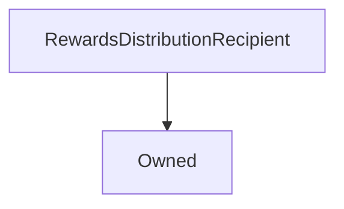

# RewardsDistributionRecipient

**Source:** [RewardsDistributionRecipient.sol](https://github.com/Synthetixio/synthetix/blob/master/contracts/RewardsDistributionRecipient.sol)


!!! todo "Work in Progress"


```
This needs filling in
```

## Description

... todo.


**Source:** [contracts/RewardsDistributionRecipient.sol](https://github.com/Synthetixio/synthetix/tree/develop/contracts/RewardsDistributionRecipient.sol)

## Architecture

... todo.


<!--centered-image>
    
</centered-image-->


---
### Inheritance Graph




---
### Related Contracts

- ?

## Constants

## Variables


---
### `rewardsDistribution`

<sub>[Source](https://github.com/Synthetixio/synthetix/tree/develop/contracts/RewardsDistributionRecipient.sol#L9)</sub>


**Type:** `address`

## Views

## Public Mutative Functions

## Owner Mutative Functions

## Internal & Restricted Mutative Functions

## Modifiers


---
### `onlyRewardsDistribution`

<sub>[Source](https://github.com/Synthetixio/synthetix/tree/develop/contracts/RewardsDistributionRecipient.sol#L13)</sub>


## Functions


---
### `notifyRewardAmount`

<sub>[Source](https://github.com/Synthetixio/synthetix/tree/develop/contracts/RewardsDistributionRecipient.sol#L11)</sub>


??? example "Details"

    **Signature**

    `notifyRewardAmount(uint256 reward) external`


---
### `setRewardsDistribution`

<sub>[Source](https://github.com/Synthetixio/synthetix/tree/develop/contracts/RewardsDistributionRecipient.sol#L18)</sub>


??? example "Details"

    **Signature**

    `setRewardsDistribution(address _rewardsDistribution) external`

    **Modifiers**

    * [onlyOwner](#onlyowner)

