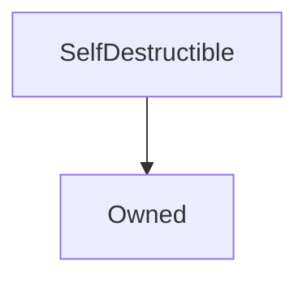

# SelfDestructible

**Source:** [contracts/SelfDestructible.sol](https://github.com/Synthetixio/synthetix/tree/develop/contracts/SelfDestructible.sol)

## Architecture

### Inheritance Graph

---

## Structs

## Variables

---

### `SELFDESTRUCT_DELAY`
[Source](https://github.com/Synthetixio/synthetix/tree/develop/contracts/SelfDestructible.sol#L9)

**Type:** `uint256`

---

### `initiationTime`
[Source](https://github.com/Synthetixio/synthetix/tree/develop/contracts/SelfDestructible.sol#L11)

**Type:** `uint256`

---

### `selfDestructInitiated`
[Source](https://github.com/Synthetixio/synthetix/tree/develop/contracts/SelfDestructible.sol#L12)

**Type:** `bool`

---

### `selfDestructBeneficiary`
[Source](https://github.com/Synthetixio/synthetix/tree/develop/contracts/SelfDestructible.sol#L14)

**Type:** `address`

## Functions

---

### `setSelfDestructBeneficiary`
[Source](https://github.com/Synthetixio/synthetix/tree/develop/contracts/SelfDestructible.sol#L28)

??? example "Details"

    **Signature**

    `setSelfDestructBeneficiary(address payable _beneficiary) external`

    **Modifiers**

    * [onlyOwner](#onlyowner)

    **Emits**

    * [SelfDestructBeneficiaryUpdated](#selfdestructbeneficiaryupdated)

---

### `initiateSelfDestruct`
[Source](https://github.com/Synthetixio/synthetix/tree/develop/contracts/SelfDestructible.sol#L39)

??? example "Details"

    **Signature**

    `initiateSelfDestruct() external`

    **Modifiers**

    * [onlyOwner](#onlyowner)

    **Emits**

    * [SelfDestructInitiated](#selfdestructinitiated)

---

### `terminateSelfDestruct`
[Source](https://github.com/Synthetixio/synthetix/tree/develop/contracts/SelfDestructible.sol#L49)

??? example "Details"

    **Signature**

    `terminateSelfDestruct() external`

    **Modifiers**

    * [onlyOwner](#onlyowner)

    **Emits**

    * [SelfDestructTerminated](#selfdestructterminated)

---

### `selfDestruct`
[Source](https://github.com/Synthetixio/synthetix/tree/develop/contracts/SelfDestructible.sol#L60)

??? example "Details"

    **Signature**

    `selfDestruct() external`

    **Modifiers**

    * [onlyOwner](#onlyowner)

    **Emits**

    * [SelfDestructed](#selfdestructed)

---

## Modifiers

## Events

---

### `SelfDestructTerminated`
[Source](https://github.com/Synthetixio/synthetix/tree/develop/contracts/SelfDestructible.sol#L67)

- `()`

---

### `SelfDestructed`
[Source](https://github.com/Synthetixio/synthetix/tree/develop/contracts/SelfDestructible.sol#L68)

- `(address beneficiary)`

---

### `SelfDestructInitiated`
[Source](https://github.com/Synthetixio/synthetix/tree/develop/contracts/SelfDestructible.sol#L69)

- `(uint256 selfDestructDelay)`

---

### `SelfDestructBeneficiaryUpdated`
[Source](https://github.com/Synthetixio/synthetix/tree/develop/contracts/SelfDestructible.sol#L70)

- `(address newBeneficiary)`

---

